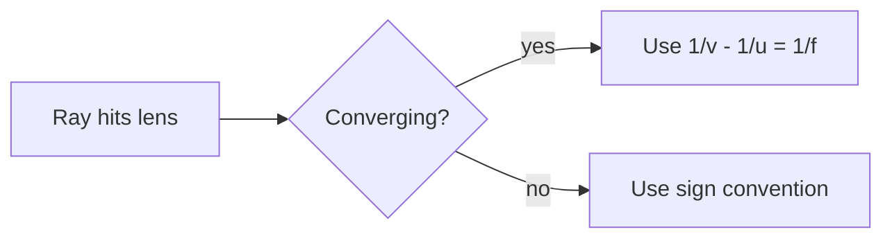

# 🧰 Diagrams & Graphs Without Desktop-Only Plugins

Molren, Ketcher, Plot Vectors & Graphs and Circuit Sketcher cannot run on a phone
([why](PLUGIN-COMPATIBILITY.md)). **Nothing you actually need them for is unavailable.**
There are four levels, from "no install at all" to "automated in this repo":

| Level | Approach | Works on phone | Offline | Effort |
|---|---|---|---|---|
| **0** | Obsidian built-ins: MathJax, Mermaid, Canvas | ✅ | ✅ | lowest |
| **1** | Phone-browser tools (Ketcher demo, PubChem, CircuitJS, Desmos, GeoGebra) | ✅ | ❌ (needs data) | low |
| **2** | **This repo's pipeline** — commit the picture, phone just views it | ✅ | ✅ | write a 3-line fence |
| **3** | Mobile-capable community-plugin swaps | ✅ | mixed | install once |

---

## Level 0 — Built-ins that are already on your phone

Nothing to install. All of these render in Obsidian Mobile.

### Math & formulas — MathJax (core)

```markdown
Inline: $\oint \vec B\cdot d\vec l = \mu_0 I_{enc}$

Display:
$$
\Delta G = \Delta H - T\Delta S
$$
```

This handles 95 % of "Numerals" usage: type the expression, read the result. (Numerals
*itself* also works on mobile — see [Level 3](#level-3--mobile-capable-plugin-swaps).)

### Flowcharts, sequence & state diagrams — Mermaid (core plugin, now enabled)

````markdown

````

Mermaid also does `sequenceDiagram`, `stateDiagram-v2`, `classDiagram`, `pie`, `gantt`,
`mindmap` and `timeline`. Great for organic-reaction flowcharts and physics workflows.

### Freehand diagrams and mind maps — Canvas (core plugin, now enabled)

The built-in **Canvas** works on mobile: drag cards, draw arrows between them, drop images
in. It is the phone-friendly replacement for Excalidraw when you just want a force/ray
diagram you can actually edit with a finger. Embed an Excalidraw file on the phone only if
Excalidraw is installed (it *is* mobile-capable — see [Level 3](#level-3--mobile-capable-plugin-swaps)).

### Tables as "diagrams"

For circuit analysis, a well-made table beats a picture: component | value | voltage |
current. No plugin, no rendering risk, and it reflows on a narrow screen.

---

## Level 1 — Tools that run in the phone's browser (no install)

Open these in Chrome/Safari on the phone. They are the direct functional replacements for
the blocked plugins. Bookmark them; on Android you can add them to the home screen so they
behave like apps.

| Blocked plugin | Browser replacement | What you get |
|---|---|---|
| **Ketcher** | **Ketcher demo** — [lifescience.opensource.epam.com/KetcherDemoSA](https://lifescience.opensource.epam.com/KetcherDemoSA/index.html) | The *same* Ketcher editor: draw molecules + reactions, export `.ket`, SMILES, molfile, SVG/PNG |
| **Ketcher / ChemEdit** | **PubChem structure editor** — [pubchem.ncbi.nlm.nih.gov/edit3](https://pubchem.ncbi.nlm.nih.gov/edit3/index.html) | Draw by hand or paste SMILES → export SVG/PNG; PubChem search in the same tab |
| **Ketcher** | **MolView** — [molview.org](https://molview.org/) | Draw / search a compound, then flip to 3D ball-and-stick |
| **Circuit Sketcher / circuitikz** | **Falstad Circuit Simulator (CircuitJS)** — [falstad.com/circuit](https://www.falstad.com/circuit/circuitjs.html) | Draw a circuit **and simulate it**: animated current, voltage scopes, RC transients. Exports PNG |
| **Desmos / Plot Vectors & Graphs** | **Desmos** — [desmos.com/calculator](https://www.desmos.com/calculator) | Interactive plots with sliders, tangents, derivatives — the thing a static image cannot do |
| **Plot Vectors & Graphs / pgfplots** | **GeoGebra Classic** — [geogebra.org/classic](https://www.geogebra.org/classic) | Graphs, **vectors**, geometry, 3D, CAS — ideal for coordinate geometry and vector algebra |

Workflow: draw it in the browser → export PNG/SVG → in Obsidian, **Add attachment** into
`assets/` → embed with `![[assets/diagrams/my-circuit.png]]`. That picture now renders on
every device and in every export.

> [!tip] Ketcher is the same code the plugin wraps
> The plugin is just Ketcher embedded in Obsidian. The demo page is Ketcher. So "Ketcher
> is unavailable on my phone" becomes "Ketcher is one bookmark away" — your drawing stays
> in the browser; only the exported picture travels into the vault.

---

## Level 2 — This repo's offline pipeline (recommended for the vault)

Browser tools need internet and lose your work between tabs. For a study vault you want
figures that are **in the repo, versioned, offline and instant on the phone**. That is what
`tools/render_figures.py` does: it turns three fence types into committed SVG at authoring
time.

| Fence | Rendered by | Replaces |
|---|---|---|
| ```` ```smiles ```` | Indigo (RDKit fallback) | Molren, Ketcher, chemfig |
| ```` ```plot ```` | matplotlib | Plot Vectors & Graphs, Desmos (static), pgfplots |
| ```` ```circuit ```` | schemdraw | Circuit Sketcher, circuitikz |

You write a 3-line fence; the build writes the picture; the phone only reads an SVG file.

````markdown
```smiles
CC(=O)Oc1ccccc1C(=O)O Aspirin (acetylsalicylic acid)
```
````

→ `![[assets/diagrams/smiles-fe9a034e22.svg]]`

Live proof and full syntax: **[`examples/figures-demo.md`](../examples/figures-demo.md)**.

### Working from the phone only

You do not need a laptop to add a figure:

1. Write the fence in the note (Obsidian Mobile editor).
2. Commit/push (Git or Obsidian Git plugin), or run the workflow manually:
   **GitHub → Actions → "Render vault figures" → Run workflow**.
3. CI renders the SVGs, commits them, and your phone pulls the finished pictures.
   `--check` in CI fails the build if a committed SVG is stale, so the vault can never
   drift from its sources.

### Or skip the fence entirely

Drop any exported `.png`/`.svg`/`.excalidraw.md` into `assets/diagrams/` and embed it:
`![[assets/diagrams/my-figure.png]]`. The pipeline only manages the fences above; manual
files are left alone.

---

## Level 3 — Mobile-capable plugin swaps

If you want a live plugin experience *in* Obsidian on the phone, these are in the official
registry with `isDesktopOnly: false`. Install IDs are given exactly as Obsidian's search
expects them (**Settings → Community plugins → Browse**).

| Instead of | Install this (ID) | Notes |
|---|---|---|
| Molren (SMILES → SVG) | **Chem** — `chem` | Chemistry support for Obsidian: renders `chem`/`smiles` code blocks, 100+ stars |
| Molren / Ketcher | **ChemEdit Universal** — `chemedit-universal` | Editor + viewer, mobile ✓ (already enabled in this vault) |
| Molren / Ketcher | **Chemtrails** — `chemtrails` | Renders SMILES → crisp SVG diagrams |
| Molren / Ketcher | **Chemical Structure Renderer** — `chemical-structure-renderer` | SMILES → PNG/SVG (needs an Indigo service URL for full features) |
| Plot Vectors & Graphs | **Plotly** — `obsidian-plotly` | `plotly` code blocks, interactive HTML charts; mobile ✓ |
| Desmos | `obsidian-desmos` | Already enabled here — Desmos **is** mobile-capable |
| circuitikz / Circuit Sketcher | `obsidian-tikzjax` (already enabled) | circuitikz, chemfig, pgfplots all work on mobile for light diagrams; heavy ones get slow on a phone |
| tikzjax on iPhone | **TikZJax Next** — `tikzjax-next` | Newer WASM TeX engine, explicitly tested on iPhone/iPad (slower first render) |
| circuitikz (heavy use) | **CircuitJS** — `obsidian-circuitjs` | ❌ desktop-only — use the [browser version](https://www.falstad.com/circuit/circuitjs.html) instead |
| Excalidraw (freehand) | `obsidian-excalidraw-plugin` | Mobile-capable; already enabled here |
| Callout Manager | **Callout Manager** — `callout-manager` | Correct ID (this vault previously had the wrong one) |
| Numerals | **Numerals** — `numerals` | Correct ID; mobile-capable |

> [!warning] How to install a plugin on Android/iOS
> `Settings → Community plugins → Turn on community plugins → Browse → search the ID`
> → **Install** → it appears under *Installed plugins* → toggle on. Plugins that the store
> refuses to show you are the desktop-only ones; there is no mobile workaround for those,
> which is exactly why Levels 0–2 exist.

---

## Decision tree (phone-first)

```
Need a figure?
│
├── Right now, with internet ──────────► Level 1 browser tool, export PNG/SVG, embed
│
├── For the vault / offline / revision
│   ├── Molecule ──────────────────────► ```smiles fence  →  SVG
│   ├── Function graph ────────────────► ```plot fence    →  SVG
│   ├── Circuit or vector diagram ─────► ```circuit fence →  SVG
│   ├── Hand-drawn ray/force diagram ──► Canvas (core) or Excalidraw (mobile ✓)
│   ├── Flowchart / reaction scheme ───► Mermaid (core)
│   └── Precise TikZ / chemfig ────────► TikZJax (mobile ✓, slow) or build a PNG on desktop
│
└── Live exploration with sliders ─────► Desmos / GeoGebra in the browser
```

---

## Cheat sheet

````bash
python3 tools/render_figures.py            # fences -> SVG, rewrites the notes in place
python3 tools/render_figures.py --check    # CI guard: exit 1 if a figure is stale
python3 tools/render_figures.py --restore  # back to the source fences
python3 tools/render_figures.py --prune    # drop SVGs no note references
make figures                               # same thing via make
````

The three source forms, all one-liners plus a fence:

````markdown
```smiles
C[C@H](N)C(=O)O L-Alanine
```

```plot
y = x^3 - 3x + 1
y = 3x - 3   @ tangent at x = 2
x: [-4, 4]
```

```circuit
d += elm.SourceV().up().label('12 V')
d += elm.Resistor().right().label('R = 4 Ω')
d += elm.Line().down()
d += elm.Line().left()
```
````
