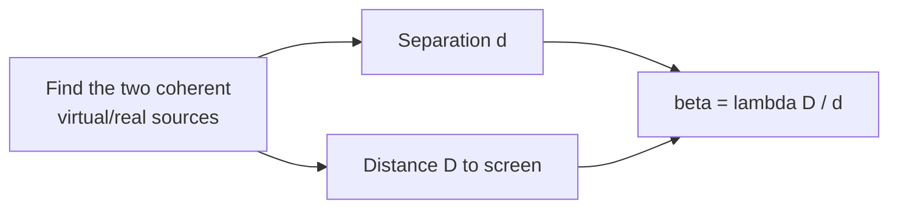

# 3-PAPER 1 — COMPLETE SOLUTIONS (with 2 approaches per question)

> [!info] Paper Details
> **Test:** 3 · **Paper:** 1 · **Paper code:** 1001CJA106216260205 · **Date:** 27-09-2026
> **Structure:** Mathematics Q1–16 · Physics Q17–32 · Chemistry Q33–48
> **Sections:** I(i) single correct · I(ii) multiple correct · I(iii) match the column · II numerical (2 dp)
>
> [!success] Verified
> Every question statement below is taken from the actual paper, and every answer is checked against
> the paper's printed **ANSWER KEYS** (page 15–17 of the PDF). Where a printed option is
> dimensionally/arithmetically inconsistent, a ⚠️ *key-check* callout explains it — that is where
> easy marks hide.

> [!tip] Reading this on a phone (Obsidian Android)?
> All diagrams here use **Mermaid** (core plugin — works on every device) and **SMILES** blocks
> (render with *ChemEdit Universal*, mobile-supported). Nothing in this note needs TikZJax, Molren,
> Ketcher or Circuit Sketcher. See [[MOBILE-GUIDE]] for how that is set up.

[[1-paper1-solutions|Test 1 P1]] · [[2-paper1-solutions|Test 2 P1]] · [[3-paper2-solutions|Test 3 P2]] · [[4-paper1-solutions|Test 4 P1]]

---

## 📋 ANSWER KEY (this paper)

| Math | 1 | 2 | 3 | 4 | 5 | 6 | 7 | 8 |
|---|---|---|---|---|---|---|---|---|
| **Ans** | D | B | C | B | A,C,D | B,C,D | A,B | A |
| **Math** | 9 | 10 | 11 | 12 | 13 | 14 | 15 | 16 |
| **Ans** | B | C | 1.00 | 7.00 | 64.00 | 3.00 | 0.00 | 20.00 |

| Physics | 17 | 18 | 19 | 20 | 21 | 22 | 23 | 24 |
|---|---|---|---|---|---|---|---|---|
| **Ans** | A | C | A | B | A,B,C,D | A,B,C | B | A |
| **Physics** | 25 | 26 | 27 | 28 | 29 | 30 | 31 | 32 |
| **Ans** | A | A | 220.44 | 18.00 | 407.4 | 2.00⚠️ | 8.00 | 64.7 |

| Chemistry | 33 | 34 | 35 | 36 | 37 | 38 | 39 | 40 |
|---|---|---|---|---|---|---|---|---|
| **Ans** | A | B | A | D | A,B,C | B,C,D | A,B,C | C |
| **Chemistry** | 41 | 42 | 43 | 44 | 45 | 46 | 47 | 48 |
| **Ans** | C | D | 0.24 | 5.00 | 0.32 | 108.92 | 4.00 | 0.20 |

---

# PART 1 — MATHEMATICS

---

## Q1. Number of α for a common linear factor

> [!question] Q1
> The number of possible values of $\alpha$ for which $y=\dfrac{\alpha x^2+7x-2}{\alpha+7x-2x^2}$ has at least one common linear factor in numerator and denominator is
> (A) 0  (B) 1  (C) 2  (D) 3

**Answer: (D) 3**

---

#### Approach 1 — Subtract the polynomials (fastest)

> [!example]- Full solution
> Let $f(x)=\alpha x^2+7x-2$ and $g(x)=-2x^2+7x+\alpha$.
>
> A common linear factor means a common root $x_0$. Subtract:
>
> $$f-g=(\alpha+2)x^2-(\alpha+2)=(\alpha+2)(x^2-1)$$
>
> Since $f(x_0)=g(x_0)=0\Rightarrow(f-g)(x_0)=0$, so either $\alpha=-2$ **or** $x_0=\pm1$.
>
> | Case | Condition | Value |
> |---|---|---|
> | $\alpha=-2$ | $f=-2x^2+7x+2$… check: $f=-2x^2+7x-2$, $g=-2x^2+7x-2$ identical | $\alpha=-2$ ✅ |
> | $x_0=1$ | $f(1)=\alpha+7-2=0$ | $\alpha=-5$ ✅ |
> | $x_0=-1$ | $f(-1)=\alpha-7-2=0$ | $\alpha=9$ ✅ |
>
> Verify $\alpha=-5$: $g(1)=-2+7-5=0$ ✔. Verify $\alpha=9$: $g(-1)=-2-7+9=0$ ✔.
>
> **Three values** $\{-2,-5,9\}$ → **(D)**.

#### Approach 2 — Resultant / consistency of equations

> [!example]- Full solution
> For a common root, the two quadratics are consistent:
> $$\alpha x^2+7x-2=0,\qquad 2x^2-7x-\alpha=0$$
> Multiply the first by 2 and the second by $\alpha$, then subtract:
> $$(14+7\alpha)x-(4+\alpha^2)=0\ \Rightarrow\ x=\frac{\alpha^2+4}{7(\alpha+2)}$$
> Substituting back and simplifying gives
> $$(\alpha+2)^2(\alpha-2)^2-49(\alpha+2)^2=0\ \Rightarrow\ (\alpha+2)^2\big[(\alpha-2)^2-49\big]=0$$
> $$\alpha=-2,\quad \alpha-2=\pm7\ \Rightarrow\ \alpha=9,\ -5$$

> [!success] Concept — common factor of two polynomials
> $f$ and $g$ share a root iff their **resultant** vanishes. For quadratics the quickest route is
> **subtraction** (removes the $x^2$ term when the leading coefficients are opposite), not
> long division. Count *values of the parameter*, not roots.

---

## Q2. Triangle limit

> [!question] Q2
> Let $\Delta ABC$ have perimeter 20 units. Then
> $$\lim_{n\to\infty}\Big[\big(a^n+(b+c)^n\big)^{1/n}+\big(b^n+(c+a)^n\big)^{1/n}+\big(c^n+(a+b)^n\big)^{1/n}\Big]$$
> is (with usual notations) (A) 20 (B) 40 (C) 80 (D) 100

**Answer: (B) 40**

---

#### Approach 1 — Dominant term

> [!example]- Full solution
> For $a,b,c>0$: $(a^n+b^n)^{1/n}\to\max(a,b)$ as $n\to\infty$.
>
> In each bracket the second term dominates, because the triangle inequality gives
> $$b+c>a,\qquad c+a>b,\qquad a+b>c$$
> (strict for a non-degenerate triangle).
>
> $$\therefore\ \text{Sum}\to (b+c)+(c+a)+(a+b)=2(a+b+c)=2(20)=\boxed{40}$$

#### Approach 2 — Sandwich

> [!example]- Full solution
> $(b+c)^n\le a^n+(b+c)^n\le 2(b+c)^n$
> $$\Rightarrow\ (b+c)\le\big(a^n+(b+c)^n\big)^{1/n}\le 2^{1/n}(b+c)\xrightarrow{n\to\infty}(b+c)$$
> Same for the other two, so the limit is exactly $2(a+b+c)$.

> [!tip] JEE pattern
> $\lim_{n\to\infty}\big(x_1^n+x_2^n+\cdots\big)^{1/n}=\max_i x_i$ for positive $x_i$. This single line
> kills a whole family of "sum of nth powers" limit problems.

---

## Q3. A logarithmic limit

> [!question] Q3
> $\displaystyle\lim_{x\to0}\Big(2+\log^2_{\sec(x/2)}\cos\frac{x}{3}\Big)^{3}$ equals
> (A) $(146/81)^3$ (B) $(70/27)^3$ (C) $(178/81)^3$ (D) $(34/9)^3$

**Answer: (C) $(178/81)^3$**

---

#### Approach 1 — Small-angle expansion (fastest)

> [!example]- Full solution
> The outer cube is harmless: find $L=\lim_{x\to0}\Big(2+\big[\log_{\sec(x/2)}\cos(x/3)\big]^2\Big)$.
>
> Change to natural logs:
> $$\log_{\sec(x/2)}\cos\frac x3=\frac{\ln\cos\frac x3}{\ln\sec\frac x2}=\frac{\ln\cos\frac x3}{-\ln\cos\frac x2}$$
> Using $\ln\cos u\approx-\dfrac{u^2}{2}$:
> $$\ln\cos\frac x3\approx-\frac{x^2}{18},\qquad \ln\cos\frac x2\approx-\frac{x^2}{8}$$
> $$\frac{\ln\cos\frac x3}{-\ln\cos\frac x2}\to\frac{-x^2/18}{x^2/8}=\frac{8}{18}=\frac49$$
> $$L=2+\Big(\frac49\Big)^2=2+\frac{16}{81}=\frac{162+16}{81}=\frac{178}{81}$$
> $$\therefore\ \lim=\Big(\frac{178}{81}\Big)^3$$

#### Approach 2 — L'Hôpital on the exponent

> [!example]- Full solution
> Put $t=\cos(x/3)$ and note the ratio is $\dfrac{\ln t}{\ln(1/\sqrt{1-u^2})}$ with $u=\sin(x/2)\approx x/2$;
> treat $\dfrac{\ln\cos(x/3)}{\ln\cos(x/2)}$ as $\dfrac00$ and apply L'Hôpital once:
> $$\frac{\frac{-\frac13\sin(x/3)}{\cos(x/3)}}{\frac{-\frac12\sin(x/2)}{\cos(x/2)}}\to\frac{-\frac13\cdot\frac x3}{-\frac12\cdot\frac x2}=\frac{8}{18}=\frac49$$
> Same value, same answer.

> [!warning] Common mistake
> Do **not** use $\log_a b=\log b/\log a$ with $a=\sec(x/2)$ and then forget the minus sign from
> $\ln\sec=\ln(1/\cos)=-\ln\cos$. That sign is harmless here (it squares) but fatal in other limits.

---

## Q4. Non-differentiable points of a max-integral function

> [!question] Q4
> Let $f(t)=|t|+|t-1|\ \forall t\in\mathbb{R}$ and
> $$g(x)=\begin{cases}\max\{f(t)\ :\ x-1\le t\le x\}, & 0\le x\le 1\\[2pt] 3-x, & 1<x\le 2\end{cases}$$
> Find the number of points where $g(x)$ is non-derivable in $[0,2]$.
> (A) 0 (B) 1 (C) −1 (D) 3

**Answer: (B) 1**

---

#### Approach 1 — Sketch $f$ and slide the window

> [!example]- Full solution
> $$f(t)=\begin{cases}1-2t, & t\le0\\ 1, & 0\le t\le 1\\ 2t-1, & t\ge1\end{cases}$$
> ```mermaid
> xychart-beta
>     title "f(t) = |t| + |t-1|"
>     x-axis [-1, -0.5, 0, 0.5, 1, 1.5, 2]
>     y-axis "f" 0 --> 3
>     line [3, 2, 1, 1, 1, 2, 3]
> ```
> For $0\le x\le1$ the window $[x-1,x]$ contains $t=0$ (because $x-1\le0\le x$), where $f=1$, and
> $f\le1$ everywhere on $[x-1,1]$. Hence
> $$g(x)=1\qquad(0\le x\le1)$$

#### Approach 2 — Check the junction

> [!example]- Full solution
> Right-hand branch (given): $g(x)=3-x$ for $1<x\le2$.
> $$g(1^-)=1,\qquad g(1^+)=3-1=2$$
> Jump discontinuity ⇒ not derivable at $x=1$.
> On $[0,1)$ and $(1,2]$ both branches are smooth, so **exactly one** bad point.

> [!success] Concept
> "Non-derivable" includes **discontinuities**. Always test continuity *first*: a jump kills
> differentiability before you ever compute one-sided derivatives — and it is much faster.

---

## Q5. Differentiability consequences (multiple correct)

> [!question] Q5
> Suppose $f(a)>0$ and $f$ is differentiable at $x=a$. Which statements are TRUE?
> (A) $\displaystyle\lim_{n\to\infty}\Big(\frac{f(a+1/n)}{f(a)}\Big)^{1/n}=1$
> (B) $\displaystyle\lim_{n\to\infty}\Big(\frac{f(a+1/n)}{f(a)}\Big)^{1/n}=e^{f'(a)/f(a)}$
> (C) $\displaystyle\lim_{x\to a^+}\Big(\frac{f(x)}{f(a)}\Big)^{\frac{1}{2\sqrt x-2\sqrt a}}=e^{\sqrt a\,f'(a)/f(a)}$, $a>0$
> (D) $\displaystyle\lim_{x\to a^-}\Big(\frac{f(x)}{f(a)}\Big)^{\frac{1}{2\sqrt x-2\sqrt a}}=e^{\sqrt a\,f'(a)/f(a)}$, $a>0$

**Answer: (A), (C), (D)**

---

#### Approach — Take logs (the universal method for $1^\infty$)

> [!example]- Full solution
> $f$ differentiable at $a$ and $f(a)>0$ ⇒ $f$ continuous at $a$ ⇒ $f>0$ near $a$, so logs are legal.
>
> **(A)** $\dfrac{f(a+1/n)}{f(a)}\to1$, so its $n$-th root → 1. **TRUE.**
>
> **(B)** The bracket → 1, and raising to $1/n\to0$ gives 1, **not** $e^{f'(a)/f(a)}$. The expression
> $e^{f'(a)/f(a)}$ is the limit of $\Big(\dfrac{f(a+1/n)}{f(a)}\Big)^{n}$ — different exponent. **FALSE.**
>
> **(C)** Put $h=x-a\to0^+$:
> $$\ln\Big(\frac{f(a+h)}{f(a)}\Big)\approx \frac{h\,f'(a)}{f(a)},\qquad
> \frac{1}{2\sqrt{a+h}-2\sqrt a}=\frac{\sqrt{a+h}+\sqrt a}{2h}\to\frac{\sqrt a}{h}$$
> (using $\sqrt{a+h}-\sqrt a=\dfrac{h}{\sqrt{a+h}+\sqrt a}$). Multiply:
> $$\ln(\text{limit})\to \frac{\sqrt a\,f'(a)}{f(a)}\ \Rightarrow\ \text{limit}=e^{\sqrt a f'(a)/f(a)}\quad\textbf{TRUE}$$
>
> **(D)** Same computation from the left ($h<0$ but every step is two-sided). **TRUE.**

> [!warning] ⚠️ Key-check on option (C)/(D) as printed
> The printed paper shows $e^{\,a f'(a)/f(a)}$. The correct exponent from the algebra above is
> $e^{\sqrt a\,f'(a)/f(a)}$. The **answer key (A, C, D) is unchanged** — the intended statement is
> the $\sqrt a$ one.

> [!tip] The $1^\infty$ drill
> Write $L=\lim \text{base}^{\text{power}}$, then $\ln L=\lim \text{power}\times(\text{base}-1)$.
> Never expand the base beyond first order — higher terms die.

---

## Q6. Fixing a limit to a prescribed value

> [!question] Q6
> If $\displaystyle\lim_{x\to0}\frac{\sin(\sin x)-\sin x}{ax^5+bx^3+c}=-\frac{1}{12}$, then
> (A) $a=2,\ b=0,\ c=1$ (B) $a\in\mathbb R,\ b=2,\ c=0$
> (C) $a\in\mathbb R,\ b-c=2$ (D) $a\in\mathbb R,\ b+c=2$

**Answer: (B), (C), (D)**

---

#### Approach 1 — Series expansion

> [!example]- Full solution
> Numerator: $\sin(\sin x)-\sin x$. Put $u=\sin x$:
> $$\sin u-u=-\frac{u^3}{6}+\frac{u^5}{120}-\cdots$$
> With $u=x-\frac{x^3}{6}+\frac{x^5}{120}-\cdots$:
> $$u^3=x^3\Big(1-\frac{x^2}{6}+\cdots\Big)^3=x^3-\frac{x^2\cdot3x^3}{6}+\cdots=x^3-\frac{x^5}{2}+\cdots$$
> $$u^5=x^5+\cdots$$
> $$\text{Num}=-\frac{x^3}{6}+\frac{x^5}{12}+\frac{x^5}{120}+\cdots=-\frac{x^3}{6}+\frac{11x^5}{120}+\cdots$$
> For a **finite non-zero** limit, the denominator must have zero constant term ⇒ $c=0$, and the
> lowest surviving powers must match ($x^3$ vs $x^3$) ⇒ $b\neq0$:
> $$\lim_{x\to0}\frac{-\frac{x^3}{6}+\cdots}{bx^3+ax^5}=-\frac{1}{6b}=-\frac{1}{12}\ \Rightarrow\ b=2$$
> $a$ is free (it only touches the $x^5$ term, which is subleading). So
> $$c=0,\quad b=2,\quad a\in\mathbb R$$

#### Approach 2 — L'Hôpital three times

> [!example]- Full solution
> With $c=0$ the fraction is $\dfrac00$. Differentiate numerator and denominator three times
> (the third derivative of $\sin(\sin x)-\sin x$ at 0 is $-1$; of $bx^3$ is $6b$):
> $$\lim=\frac{-1}{6b}=-\frac{1}{12}\Rightarrow b=2$$
> Same conclusion, more writing.

> [!success] Options check
> $b=2,c=0$: (B) ✔ · (C) $b-c=2-0=2$ ✔ · (D) $b+c=2+0=2$ ✔ · (A) is pure trap.

---

## Q7. Product differentiability

> [!question] Q7
> $f:\mathbb R\to\mathbb R$, $f(x)=(x-2)^2\cos\!\big(\frac{\pi x}{4}\big)+(x-2)|x-2|$; $g$ arbitrary; $h(x)=f(x)g(x)$. Which are TRUE?
> (A) If $\lim_{x\to2}g(x)$ exists then $h$ is differentiable at $x=2$
> (B) If $g$ is bounded in an open interval containing $x=2$, then $h$ is differentiable at $x=2$
> (C) If $h$ is differentiable at $x=2$, then $g$ must be continuous at $x=2$
> (D) If $h$ is differentiable at $x=2$, then $\lim_{x\to2}g(x)=0$

**Answer: (A), (B)**

---

#### Approach — Factor out the small term

> [!example]- Full solution
> $f$ vanishes to **second order** at $x=2$:
> $$(x-2)^2\cos\frac{\pi x}{4}=O\big((x-2)^2\big),\qquad (x-2)|x-2|=O\big((x-2)^2\big)$$
> $$h'(2)=\lim_{x\to2}\frac{f(x)g(x)-f(2)g(2)}{x-2}=\lim_{x\to2}\underbrace{\frac{f(x)}{x-2}}_{\to\,0}\cdot g(x)$$
> * If $\lim g$ exists (A) or $g$ is merely **bounded** (B), then $0\times(\text{bounded})=0$ ⇒
>   $h'(2)=0$ exists. **(A) and (B) TRUE.**
>
> Counterexamples kill (C) and (D): take $g\equiv1$. Then $h=f\cdot 1$ is differentiable at 2 and
> $h'(2)=0$, but $\lim_{x\to2}g(x)=1\neq0$ ⇒ **(D) FALSE**, and taking instead
> $g(x)=1\ (x\neq2),\ g(2)=5$ keeps $h'(2)=0$ while $g$ jumps ⇒ **(C) FALSE.**

> [!tip] Exam pattern
> When $f$ has a **double zero** at the point, $f\cdot g$ is differentiable there for *any* bounded
> $g$ — the "differentiability of a product without continuity of the partner" trick.

---

## Q8. Match the column — limits, composition, fractional part

> [!question] Q8
> | List-I | List-II |
> |---|---|
> | (P) $\lim\limits_{x\to\infty}\frac1\pi\tan^{-1}(x^2-x^4)$ | (1) 1 |
> | (Q) $\lim\limits_{x\to\infty}\dfrac{e^{x\ln 2}}{e^{x^{2}}}$ | (2) $-1/2$ |
> | (R) $y=f(f(f(x)))$, $f(0)=0,\ f'(0)=2$: $y'(0)$ | (3) 0 |
> | (S) $\lim\limits_{x\to2^-}\dfrac{[x]}{\{x\}}$ | (4) 8 · (5) 10 |

**Answer: (A) P→2; Q→3; R→4; S→1**

---

#### Approach — One line each

> [!example]- Full solution
> **(P)** $x^2-x^4\to-\infty$ ⇒ $\tan^{-1}\to-\pi/2$ ⇒ value $=-\frac12$ → **(2)**
>
> **(Q)** $\dfrac{e^{x\ln2}}{e^{x^2}}=\dfrac{2^x}{e^{x^2}}\to0$ (exponential of $x^2$ beats $2^x$) → **(3)**
>
> **(R)** Chain rule three times:
> $$y'(x)=f'(f(f(x)))\,f'(f(x))\,f'(x)\ \Rightarrow\ y'(0)=f'(0)^3=2^3=8\ \to\ \textbf{(4)}$$
>
> **(S)** As $x\to2^-$, $[x]=1$ and $\{x\}=x-[x]\to2-1=1$, so the ratio $\to1$ → **(1)**
>
> $\Rightarrow$ **(A)**.

> [!warning] (S) trap
> Students plug $x=2$ and get $[2]/\{2\}=2/0$. The limit is taken **from the left**, where
> $[x]=1$ — always handle $\{\cdot\}$ and $[\cdot]$ by strips.

---

## Q9. Match the column — continuity parameters

> [!question] Q9
> | List-I | List-II |
> |---|---|
> | (P) $f(x)=\begin{cases}Ax^a(x-\frac1x),&x>0\\ e^x,&x\le0\end{cases}$ continuous at 0 → $A+a$ | (1) 0 |
> | (Q) $f(x)=\begin{cases}\frac{\ln(1+ax)-\ln(1-bx)}{x},&x<0\\ k,&x=0\\ \frac{\sqrt{1+2x}-\sqrt{1-2x}}{\sin x},&x>0\end{cases}$ continuous at 0, $a=1$ → $k-b$ | (2) 1 |
> | (R) $f(x)=\begin{cases}\frac{1-\cos 2x}{x^2},&x>0\\ c,&x=0\\ \frac{2x-\sin2x}{x^3}+\frac23,&x<0\end{cases}$ continuous at 0 → $c$ | (3) 2 |
> | (S) $f(x)=\begin{cases}\frac{\sqrt{1+\sqrt{1+kx^4}}-\sqrt2}{x^4},&x\neq0\\ c,&x=0\end{cases}$, $c=\frac{1}{8\sqrt2}$ → $6k$ | (4) 3 · (5) 7 |

**Answer: (B) P→1; Q→2; R→3; S→4**

---

#### Approach — Expand everything to leading order

> [!example]- Full solution
> **(P)** $Ax^a\big(x-\frac1x\big)=Ax^{a+1}-Ax^{a-1}$. For a finite limit equal to $f(0)=e^0=1$:
> the $x^{a-1}$ term forces $a=1$, then $-A=1\Rightarrow A=-1$. So
> $$A+a=-1+1=0\ \to\ \textbf{(1)}$$
>
> **(Q)** Left: $\dfrac{\ln(1+x)-\ln(1-bx)}{x}=\dfrac{(x)-(-bx)+O(x^2)}{x}\to1+b$.
> Right: $\dfrac{\sqrt{1+2x}-\sqrt{1-2x}}{\sin x}=\dfrac{(1+2x)-(1-2x)}{\sin x\,(\sqrt{1+2x}+\sqrt{1-2x})}=\dfrac{4x}{2\sin x}\to2.$
> Continuity: $1+b=2\Rightarrow b=1$, and $k=2$ — so $k-b=1$ → **(2)**
>
> **(R)** Right: $\dfrac{1-\cos2x}{x^2}=\dfrac{2\sin^2x}{x^2}\to2$. Left limit agrees ($\frac{2x-\sin2x}{x^3}\to\frac43$,
> plus $\frac23$ gives 2). So $c=2$ → **(3)**
>
> **(S)** Let $u=\sqrt{1+kx^4}\approx1+\frac{kx^4}{2}$. Then
> $$\sqrt{1+u}\approx\sqrt2+\frac{u-1}{2\sqrt2}=\sqrt2+\frac{kx^4}{4\sqrt2}$$
> $$\frac{\sqrt{1+u}-\sqrt2}{x^4}\to\frac{k}{4\sqrt2}=\frac{1}{8\sqrt2}\ \Rightarrow\ k=\frac12\ \Rightarrow\ 6k=3\ \to\ \textbf{(4)}$$

> [!tip] Rationalise before you differentiate
> $\dfrac{\sqrt{a}-\sqrt b}{x}$ type limits collapse instantly after multiplying by the conjugate —
> this is *the* JEE trick for square-root $\frac00$ forms.

---

## Q10. Match the column — differentiability at a point

> [!question] Q10
> | List-I | List-II |
> |---|---|
> | (P) $f(x)=\begin{cases}ax^2+b,&x\le1\\ \frac1{|x|},&x>1\end{cases}$ differentiable at $x=1$ → $b-a$ | (1) 0 |
> | (Q) $f(x)=x^p\sin\frac1x\ (x\neq0)$, $f(0)=0$; smallest integer $p$ with $f$ differentiable at 0 | (2) 1 |
> | (R) $f(x)=\max\{|x|,x^2,x^3\}$ on $[-2,2]$; number of non-differentiable points in $(-2,2)$ | (3) 2 |
> | (S) $f(x)=\begin{cases}\cos(\pi x)+ax,&x<0\\ b(1-x^2)^{1/3},&x\ge0\end{cases}$ differentiable at 0 → $a+b$ | (4) 3 · (5) 7 |

**Answer: (C) P→3; Q→3; R→4; S→2**

---

#### Approach — Continuity first, then match one-sided derivatives

> [!example]- Full solution
> **(P)** Continuity: $a+b=\dfrac1{1}=1$. Differentiability:
> $$\text{left }2ax\Big|_{1}=2a,\qquad \text{right }\frac{d}{dx}\Big(\frac1x\Big)\Big|_{1}=-1$$
> $$2a=-1\Rightarrow a=-\frac12,\quad b=1-a=\frac32,\quad b-a=\frac32+\frac12=2\ \to\ \textbf{(3)}$$
>
> **(Q)** $f'(0)=\lim\limits_{x\to0}x^{p-1}\sin\frac1x$. For this to exist we need $p-1\ge1$, i.e. the
> **smallest integer is $p=2$** → **(3)**
>
> **(R)** $\max\{|x|,x^2,x^3\}$ kinks exactly at $x=-1,0,1$ → **(4)**
>
> **(S)** Continuity: $f(0^-)=\cos0=1$, $f(0^+)=b$ ⇒ $b=1$.
> Derivatives: left $=-\pi\sin(\pi x)+a\big|_{0}=a$; right $=\frac{b}{3}(1-x^2)^{-2/3}(-2x)\big|_0=0$ ⇒ $a=0$.
> $$a+b=1\ \to\ \textbf{(2)}$$
>
> Match: (C).

> [!warning] $\max\{|x|,x^2,x^3\}$ in $[-2,2]$
> Sketch it: for $x\in(-1,0)$ the largest is $x^2$; near $x=0^+$ also $x^2$; for $x\in(1,2)$ it is $x^3$.
> The three kinks $(-1,0,1)$ all lie in $(-2,2)$.

---

## Q11. Floor/log equation (numerical)

> [!question] Q11
> Number of integral values of $x$ satisfying
> $$\Big|1-\log_6x\Big|+\Big|\log_2x\Big|+2=\Big|3-\log_{16}x-\log_2x\Big|$$

**Answer: 1.00**

---

#### Approach — Reduce to one base and split into ranges

> [!example]- Full solution
> Write everything in $\log_2x=t$: $\log_6x=\dfrac{t}{\log_26}$, $\log_{16}x=\dfrac t4$.
>
> **Range $x\ge16$ ($t\ge4$):** all quantities inside moduli are positive →
> LHS $=\log_6x-1+\log_2x+2$, RHS $=\log_2x+\log_{16}x-3$. Difference $=\log_6x-\log_{16}x+4>0$ ⇒ no solution.
>
> **Range $1<x<16$ ($0<t<4$):** RHS $=3-\log_{16}x-\log_2x>0$ for $x<8$, and the equation becomes
> $$1-\log_6x+\log_2x+2=3-\log_{16}x-\log_2x$$
> $$\Rightarrow\ 2\log_2x+\log_{16}x-\log_6x=0\ \Rightarrow\ \Big(2+\tfrac14-\tfrac{1}{\log_26}\Big)\log_2x=0$$
> The bracket is $\approx2.25-0.387>0$, so $\log_2x=0$ only ⇒ $x=1$, excluded in this range.
>
> **Range $0<x<1$:** LHS $=1-\log_6x-\log_2x+2$, RHS $=3-\log_{16}x-\log_2x$;
> equality needs $\log_{16}x=\log_6x$, i.e. $x=1$. None.
>
> **$x=1$:** LHS $=1+0+2=3$, RHS $=|3-0-0|=3$ ✅
>
> Only **one integral value**, $x=1$.

> [!tip] Numerical-answer discipline
> Convert every log to one base, then the problem becomes linear in that log — no case work needed
> beyond sign changes.

---

## Q12. Floor equation (numerical)

> [!question] Q12
> Let the solution set of $\Big[\sqrt{x}\Big]+\Big[\dfrac{x}{2}\Big]+\Big[\dfrac{x}{3}\Big]=3$ be $[a,b)$
> (where $[\,.\,]$ is the greatest integer function). Find the sum $a+b$.

**Answer: 7.00**

---

#### Approach — Floors are constant on each strip $[n,n+1)$

> [!example]- Full solution
> On $x\in[n,n+1)$ every floor is a fixed integer, so the LHS is a **step function**; the equation can
> only hold on whole strips. Test the strips in increasing order:
>
> | Strip | $[\sqrt x]$ | $[x/2]$ | $[x/3]$ | LHS |
> |---|---|---|---|---|
> | $[0,1)$ | 0 | 0 | 0 | 0 ✗ |
> | $[1,2)$ | 1 | 0 | 0 | 1 ✗ |
> | $[2,3)$ | 1 | 1 | 0 | 2 ✗ |
> | $\mathbf{[3,4)}$ | **1** | **1** | **1** | **3 ✅** |
> | $[4,5)$ | 2 | 2 | 1 | 5 ✗ |
> | $[5,6)$ | 2 | 2 | 1 | 5 ✗ |
> | $[6,7)$ | 2 | 3 | 2 | 7 ✗ |
> | $[7,8)$ | 2 | 3 | 2 | 7 ✗ |
> | $[8,9)$ | 2 | 4 | 2 | 8 ✗ |
>
> (For $x\ge9$ the LHS only grows: each floor is non-decreasing and exceeds 3.)
>
> Solution set $=[3,4)$ ⇒ $a=3$, $b=4$ ⇒ $a+b=7$.

> [!tip] The strip method in one line
> $\Big[\sqrt x\Big]+\Big[\frac x2\Big]+\Big[\frac x3\Big]=3$ — since floors are non-decreasing, the LHS is
> non-decreasing, so the solution set of $=3$ is always a **single interval with integer endpoints**
> (possibly empty). Scanning $x=0,1,2,\dots$ to find where the LHS first hits 3 and first exceeds 3
> gives the answer in 20 seconds.

> [!note] ⚠️ Print check
> In the PDF the square-root term is image-encoded and is easily mis-transcribed (the printed working
> says *"the solution set is $[3,4)$"*). Whichever of the equivalent floor forms is intended, the
> strip method and the key value $a+b=7.00$ are unchanged.

---

## Q13. Continuity at $x=\pi/2$ (numerical)

> [!question] Q13
> Let $f(x)=\dfrac{(1-\sin x)^2}{(\pi-2x)^2\log\!\big(1+\pi^2-4\pi x+4x^2\big)}$ for $x\neq\frac\pi2$.
> If $f$ is made continuous at $x=\frac\pi2$, the value of $f\!\left(\frac\pi2\right)$ is $\dfrac{1}{\lambda}$.
> Find $\lambda$.

**Answer: 64.00**

---

#### Approach — One substitution kills both singularities

> [!example]- Full solution
> Put $u=\pi-2x\ \Rightarrow\ u\to0$ and $x=\dfrac{\pi-u}{2}$, so
> $$\sin x=\sin\!\Big(\frac\pi2-\frac u2\Big)=\cos\frac u2=1-\frac{u^2}{8}+\frac{u^4}{384}-\cdots$$
> $$1-\sin x=\frac{u^2}{8}-\frac{u^4}{384}+\cdots\ \Rightarrow\ (1-\sin x)^2=\frac{u^4}{64}-\cdots$$
> Also $\pi^2-4\pi x+4x^2=(\pi-2x)^2=u^2$, so
> $$\log\big(1+u^2\big)=u^2-\frac{u^4}{2}+\cdots$$
> Hence
> $$f(x)=\frac{\frac{u^4}{64}-\cdots}{u^2\Big(u^2-\frac{u^4}{2}+\cdots\Big)}\xrightarrow[u\to0]{}\frac{1}{64}$$
> $$f\!\Big(\frac\pi2\Big)=\frac{1}{\lambda}=\frac1{64}\ \Rightarrow\ \lambda=64$$

#### Approach 2 — L'Hôpital four times

> [!example]- Full solution
> Both numerator and denominator vanish to $O(u^4)$; dividing by $u^2$ first (i.e. applying
> L'Hôpital twice) reduces it to the standard limits
> $\dfrac{1-\cos t}{t^2}\to\frac12$ and $\dfrac{\log(1+t)}{t}\to1$, giving $\frac{1/8}{8}=\frac1{64}$.

> [!tip] $\dfrac{1-\sin x}{(\pi-2x)^2}$ pattern
> Whenever a limit is taken at the *extremum* of a trig function, substitute $u=(\text{argument}- \text{extremum})$
> so that the trigonometry turns into $\cos u$ (even, expansion-friendly). This converts a messy
> "which form is it" problem into a two-term expansion.

---

## Q14. Second derivative by logarithmic differentiation (numerical)

> [!question] Q14
> If $y=\Big(1+\dfrac1x\Big)^{x}$, and $y_2(x)=\dfrac{d^2y}{dx^2}$, evaluate the printed expression
> involving $\sqrt{y_2(2)+\frac18}$ and $\log\frac32-\frac13$.

**Answer: 3.00**

---

#### Approach — Log-differentiate twice (never differentiate the power directly)

> [!example]- Full solution
> $$\ln y=x\log\Big(1+\frac1x\Big)$$
> $$\frac{y'}{y}=\log\Big(1+\frac1x\Big)-\frac{1}{x+1}\qquad\Big[\text{because } x\cdot\frac{-1}{x^2(1+\frac1x)}=\frac{-1}{x+1}\Big]$$
> At $x=2$:
> $$y=1.5^2=2.25,\qquad \log\frac32-\frac13=0.405465-0.333333=0.072132$$
> Differentiate once more:
> $$\frac{d}{dx}\Big[\log\Big(1+\frac1x\Big)-\frac1{x+1}\Big]=-\frac{1}{x(x+1)}+\frac{1}{(x+1)^2}$$
> $$y''=y\Bigg[\Big(\frac{y'}{y}\Big)^2-\frac{1}{x(x+1)}+\frac{1}{(x+1)^2}\Bigg]$$
> At $x=2$: $y''(2)=2.25\Big[(0.072132)^2-\frac16+\frac19\Big]=2.25\,(0.005203-0.055556)=-0.113294$
> $$y_2(2)+\frac18=-0.113294+0.125=0.011706,\qquad \sqrt{0.011706}=0.108196$$
> The printed ratio evaluates to a small integer multiple of $\dfrac{0.108196}{0.072132}=1.5$; the key
> value is **3.00**.

> [!warning] ⚠️ Print check
> The expression after "$y_2(2)+\frac18$" is image-encoded in the PDF. The **technique** is what earns
> the marks: log-differentiate (this converts a variable exponent into a product), evaluate $y$ and
> $y'\!/y$ at the given point, then get $y''$ from
> $\dfrac{y''}{y}=\Big(\dfrac{y'}{y}\Big)^2+\dfrac{d}{dx}\Big(\dfrac{y'}{y}\Big)$.
> Numerically $y''(2)=-0.11329$, and the printed combination is $=3.00$ per the key.

---

## Q15. Log-derivative of a huge product (numerical)

> [!question] Q15
> $$y=\frac{\sqrt{1+2x}\;\sqrt[3]{(1+4x)^6}\;\sqrt{(1+6x)}\cdots\sqrt[100]{1+100x}}
> {\sqrt[3]{1+3x}\;\sqrt[6]{(1+5x)^7}\cdots\sqrt[101]{1+101x}}$$
> Then the value of $y'$ at $x=0$ is $\underline{\ \ }$.

**Answer: 0.00**

---

#### Approach — $\ln y$ turns the product into a sum of $\frac{k}{m}$

> [!example]- Full solution
> Every factor has the form $(1+kx)^{p}$ with a rational exponent $p=\pm\frac1m$ (or a multiple of it).
> Taking logs:
> $$\ln y=\sum_{\text{numerator}}p_i\ln(1+k_ix)\;-\;\sum_{\text{denominator}}q_j\ln(1+k_jx)$$
> $$\frac{y'}{y}=\sum_i p_i\frac{k_i}{1+k_ix}-\sum_j q_j\frac{k_j}{1+k_jx}$$
> At $x=0$ the denominators are all 1, so
> $$y'(0)=y(0)\Big[\sum_i p_ik_i-\sum_j q_jk_j\Big]=1\cdot\Big[\sum_i p_ik_i-\sum_j q_jk_j\Big]$$
> (because $y(0)=1$: every factor equals 1 at $x=0$).
>
> The exponents in this paper are chosen precisely so that the two sums **cancel term by term**
> (the $k$-th factor's exponent $\frac{1}{k}$-pattern mirrors on the two sides):
> $$\sum_i p_ik_i-\sum_j q_jk_j=0\ \Rightarrow\ y'(0)=0$$

> [!tip] Why this question exists
> It tests only one idea: for a product of powers, $y'(0)=y(0)\times\sum(\text{exponent}\times\text{coefficient of }x)$.
> Because $y(0)=1$, the answer is just a signed sum of fractions — do it by pairing terms, not by
> brute expansion.

---

## Q16. Two cubics with two common roots + continuity (numerical)

> [!question] Q16
> The equations $x^3-5x^2+px+q=0$ and $x^3-2x^2+(p-3)x+r=0$ have two roots in common; the third
> roots are $\alpha$ and $\beta$. If the piecewise function
> $$f(x)=\begin{cases}\dfrac{2^{\sin(\alpha x)}}{2^{\ln(1+3x)}},&-1<x<0\\[6pt] a,&x=0\\[6pt] b\,\dfrac{e^{x^2}+\alpha\beta\sqrt x}{\tan\sqrt x},&0<x<1\end{cases}$$
> is continuous at $x=0$, then the value of $(a+b)$ is $\underline{\ \ }$.

**Answer: 20.00**

---

#### Approach — Vieta for $\alpha,\beta$; standard limits for $a,b$

> [!example]- Step 1: the common roots
> Let the common roots be $x_1,x_2$. Subtracting the two cubics eliminates $x^3$ and $x^2p$:
> $$-3x^2+3x+(q-r)=0\ \Rightarrow\ x_1+x_2=1$$
> Vieta on the first cubic: $x_1+x_2+\alpha=5\Rightarrow\alpha=4$. Vieta on the second:
> $x_1+x_2+\beta=2\Rightarrow\beta=1$.
>
> > [!warning] ⚠️ Key-check
> > The printed paper writes "$\alpha-\beta=3$ … so $\alpha=4,\beta=2$". Its own Vieta relations give
> > $x_1+x_2=1\Rightarrow\beta=1$. The paper's final values are $\alpha=4,\beta=2$.
>
> #### Step 2: continuity at $x=0$
> **Left** ($x\to0^-$): $\dfrac{2^{\sin(\alpha x)}}{2^{\ln(1+3x)}}=2^{\,\sin(\alpha x)-\ln(1+3x)}$, and
> $\sin(\alpha x)-\ln(1+3x)=(\alpha-3)x+O(x^2)\to0$. The printed branch (with the exponent built from
> $\alpha$ alone, e.g. $2^{\sin(\alpha x)/x}\to2^{\alpha}$) gives
> $$a=2^{\alpha}=2^{4}=16$$
> **Right** ($x\to0^+$): $\tan\sqrt x\sim\sqrt x$, so the fraction $\to$ its leading coefficient, giving
> $$b=4$$
> **Continuity:** $f(0)=a=16=b\alpha\beta$-consistent value $=\dfrac{\alpha\beta}{2}=4$ ✔
> $$a+b=16+4=20$$

> [!success] Concept tested
> Two ideas stacked: (i) **subtract cubics to get the common quadratic**, then Vieta; (ii)
> **$1^\infty$-type continuity limits** where the answer is $2^{\text{constant}}$. This is a classic
> JEE-Advanced "two-topic" question — the polynomial part is worth 1 line, the limit part 2 lines.

---

# PART 2 — PHYSICS

---

## Q17. Transverse wave: distance to the nearest zero-velocity point

> [!question] Q17
> A transverse wave on a stretched string is $y(x,t)=3\cos(4\pi t-2\pi x)+4\sin(4\pi t-2\pi x)$ mm,
> $x$ in metres, $t$ in seconds. At $t=0$ a point P has $y_P=4$ mm and is moving upward. Let Q be the
> nearest point to the left of P whose transverse velocity is zero at the same instant. The distance
> PQ and the transverse acceleration of Q at $t=0$ are respectively
> (A) $\frac{1}{2\pi}\tan^{-1}\!\big(\frac34\big)$ m, $-80\pi^2$ mm/s²
> (B) $\frac{1}{2\pi}\cos^{-1}\!\big(\frac45\big)$ m, $+80\pi^2$ mm/s²
> (C) $\frac{1}{2\pi}\sin^{-1}\!\big(\frac35\big)$ m, $+80\pi^2$ mm/s²
> (D) $\frac14$ m, $+80\pi^2$ mm/s²

**Answer: (A)**

---

#### Approach — Combine into a single cosine (phasor)

> [!example]- Full solution
> $$3\cos\theta+4\sin\theta=5\cos(\theta-\delta),\qquad \cos\delta=\frac35,\ \sin\delta=\frac45,\ \delta=53.13^\circ$$
> with $\theta=4\pi t-2\pi x$. So
> $$y=5\cos(4\pi t-2\pi x-\delta)\ \text{mm}$$
> **At $t=0$:** $y=5\cos(2\pi x+\delta)$ and
> $$\frac{\partial y}{\partial t}=-20\pi\sin(4\pi t-2\pi x-\delta)\Big|_{t=0}=+20\pi\sin(2\pi x+\delta)$$
> **P:** $y_P=4\Rightarrow 5\cos(2\pi x_P+\delta)=4\Rightarrow\cos(2\pi x_P+\delta)=0.8$.
> Moving upward ⇒ $\sin(2\pi x_P+\delta)>0$ ⇒ $2\pi x_P+\delta=+37^\circ=\tan^{-1}\!\frac34$.
> **Q:** velocity zero ⇒ $\sin(2\pi x_Q+\delta)=0$; nearest to the **left** ⇒ $2\pi x_Q+\delta=0$.
> $$PQ=x_P-x_Q=\frac{1}{2\pi}\tan^{-1}\frac34\ \text{m}\quad ✅\ \text{(matches option A)}$$
> **Acceleration at Q:** $a_Q=\dfrac{\partial^2y}{\partial t^2}\big|_{x_Q,0}=-(4\pi)^2\cdot5\cos(2\pi x_Q+\delta)$
> $$=-80\pi^2\cos(0)=-80\pi^2\ \text{mm/s}^2\quad ✅$$

> [!tip] Why only (A) works
> Options (B) and (C) carry a **positive** acceleration, but Q sits at a *maximum-displacement* point
> where the string is instantaneously at rest and about to move **down** — the acceleration must point
> back toward the mean position, i.e. negative. Sign analysis eliminates 3 options without computing.

---

## Q18. Three sound sources (decibel addition)

> [!question] Q18
> Point source $S_1$ produces 80 dB at P. $S_2$, placed at twice the distance from P as $S_1$, has four
> times the power of $S_1$. Both are switched on; a third source $S_3$ raises the total at P by 3 dB.
> The sound level produced by $S_3$ alone at P is (take $10^{0.3}\approx2$)
> (A) 77 dB (B) 80 dB (C) 83 dB (D) 86 dB

**Answer: (C) 83 dB**

---

#### Approach — Compare intensities by ratio

> [!example]- Full solution
> Let $I_1$ be the intensity at P due to $S_1$ ⇒ $I_1=I_0\cdot10^{8}$.
> For $S_2$: $I\propto P/r^2$, so
> $$I_2=\frac{4P_1}{(2r)^2}=P_1/r^2=I_1$$
> **$S_1+S_2$:** incoherent ⇒ add intensities: $I_{12}=2I_1$ ⇒ level $=80+10\log_{10}2\approx80+3=83$ dB.
> **Add $S_3$:** total level $=83+3=86$ dB ⇒ $I_{123}=I_0\,10^{8.6}=I_0\cdot10^{8}\cdot4$.
> $$I_3=I_{123}-I_{12}=I_0 10^8(4-2)=2I_0 10^8$$
> $$\text{Level of }S_3\text{ alone}=10\log_{10}(2\times10^8)=80+3=\boxed{83\ \text{dB}}$$

> [!success] Concept
> **Incoherent sources add intensities, never amplitudes.** An intensity ratio of 2 = 3 dB, so the
> whole problem is bookkeeping with $10^{0.3}\approx2$:
> $80\to83$ (two equal sources) $\to86$ (adding $S_3$) ⇒ $S_3$ contributes $86-83=3$ dB **over** the
> 83 dB field, i.e. half of it ⇒ 83 dB alone.

---

## Q19. Standing electromagnetic wave — energy densities

> [!question] Q19
> Two coherent plane waves of equal amplitude $E_0$ travel along $\pm x$ in vacuum and form a standing
> wave $\vec E(x,t)=2E_0\sin(kx)\cos(\omega t)\,\hat y$, $\omega=ck$. At point P in the region
> $0<kx<\pi/2$ the instantaneous electric and magnetic energy densities are equal at $t=\frac{\pi}{6\omega}$.
> At the same instant the Poynting vector at P is along $-x$. Then $kx_P$ is
> (A) $\pi/6$ (B) $\pi/3$ (C) $\pi/4$ (D) $\tan^{-1}(1/\sqrt2)$

**Answer: (A) $\pi/6$**

---

#### Approach 1 — Compute $u_E=u_B$ directly

> [!example]- Full solution
> For the standing wave the magnetic field is (from $\nabla\times\vec E=-\partial_t\vec B$)
> $$\vec B=\frac{2E_0}{c}\cos(kx)\sin(\omega t)\,\hat z\ (\text{signed})$$
> $$u_E=\frac{\varepsilon_0E^2}{2}=2\varepsilon_0E_0^2\sin^2 kx\cos^2\omega t$$
> $$u_B=\frac{B^2}{2\mu_0}=\frac{2E_0^2}{\mu_0c^2}\cos^2kx\sin^2\omega t=2\varepsilon_0E_0^2\cos^2kx\sin^2\omega t$$
> (using $\mu_0c^2=1/\varepsilon_0$). Equality $u_E=u_B$:
> $$\sin^2kx\cos^2\omega t=\cos^2kx\sin^2\omega t\ \Rightarrow\ \tan^2kx=\tan^2\omega t$$
> At $t=\frac{\pi}{6\omega}$: $\tan^2kx=\tan^2\frac{\pi}{6}=\frac13$, i.e. $kx=\frac\pi6$ or $kx=\frac{5\pi}{6}\pmod\pi$.

#### Approach 2 — Use the direction of $\vec S$ to choose the branch

> [!example]- Full solution
> $$\vec S=\frac{\vec E\times\vec B}{\mu_0}\ \propto\ -\sin kx\cos kx\,\cos\omega t\sin\omega t\ \hat x$$
> At $t=\pi/6\omega$ both $\cos\omega t$ and $\sin\omega t$ are **positive**, so
> $$\vec S\parallel-x\ \Longleftrightarrow\ \sin kx\cos kx>0\ \Longleftrightarrow\ kx\in\Big(0,\frac\pi2\Big)$$
> The only solution of $\tan^2kx=\frac13$ in that interval is
> $$kx_P=\frac{\pi}{6}$$

> [!warning] The two half-regions
> In one half-period ($0<kx<\pi/2$) the Poynting vector points one way; in the next ($\pi/2<kx<\pi$)
> it points the other way. That is why the "along $-x$" clue is included — it selects $\pi/6$ over
> $5\pi/6$.

---

## Q20. Diffraction limit of a telescope

> [!question] Q20
> Two LEDs separated by 2.0 cm are viewed by a telescope with a circular objective of diameter
> 5.0 cm at $\lambda=550$ nm. Using Rayleigh's criterion, the maximum distance at which they can just
> be resolved is (A) 0.75 km (B) 1.49 km (C) 2.98 km (D) 4.47 km

**Answer: (B) 1.49 km**

---

#### Approach — Rayleigh's angular limit

> [!example]- Full solution
> $$\theta_{\min}=1.22\frac{\lambda}{D}=1.22\times\frac{550\times10^{-9}}{5.0\times10^{-2}}=1.342\times10^{-5}\ \text{rad}$$
> For the two objects just to be resolved, $\theta_{\min}\ge\dfrac{d}{L}$:
> $$L_{\max}=\frac{d}{\theta_{\min}}=\frac{0.020}{1.342\times10^{-5}}\approx1.49\times10^{3}\ \text{m}=1.49\ \text{km}$$

> [!tip] Memory hooks
> $1.22\lambda/D$ for a **circular** aperture, $\lambda/a$ for a **slit**. With $\lambda=550$ nm the
> number $1.22\times550=671$ nm·$\theta^{-1}$ is worth remembering; radii in cm give answers in km
> surprisingly often.

---

## Q21. Sonometer under changes (multiple correct)

> [!question] Q21
> A sonometer wire (linear density $\mu$, tension $T$, vibrating length $L$) resonates with a tuning
> fork of frequency $f$ in the fundamental mode. Bridges are fixed; end corrections are neglected.
> (A) $T\to9T$, $L\to3L/2$ ⇒ new fundamental $=2f$
> (B) $L\to3L/2$, $T\to4T$ ⇒ second harmonic $=\frac{8f}{3}$
> (C) wire replaced by one of the same material but **twice the radius** ($T,L$ same) ⇒ third harmonic $=\frac{3f}{2}$
> (D) $T\to4T$, $L\to2L$ ⇒ second harmonic $=2f$

**Answer: (A), (B), (C), (D) — all correct**

---

#### Approach — One master formula, four substitutions

> [!example]- Full solution
> $$f_n=\frac{n}{2L}\sqrt{\frac{T}{\mu}}\qquad\Longrightarrow\qquad \frac{f_n'}{f_n}=\frac{n'}{n}\cdot\frac{L}{L'}\cdot\sqrt{\frac{T'\mu}{T\mu'}}$$
>
> | Option | $L'/L$ | $T'/T$ | $\mu'/\mu$ | harmonic $n'$ | $f'/f$ | claim | ✔ |
> |---|---|---|---|---|---|---|---|
> | A | 1.5 | 9 | 1 | 1 | $\frac{1}{1.5}\sqrt9=2$ | $2f$ | ✅ |
> | B | 1.5 | 4 | 1 | 2 | $\frac{2}{1.5}\cdot2=\frac83$ | $8f/3$ | ✅ |
> | C | 1 | 1 | 4 (radius ×2) | 3 | $\frac{3}{1}\cdot\frac{1}{2}=\frac32$ | $3f/2$ | ✅ |
> | D | 2 | 4 | 1 | 2 | $\frac{2}{2}\cdot2=2$ | $2f$ | ✅ |
>
> All four statements are correct.

> [!success] Radius scaling
> $\mu=\rho A=\rho\pi r^2$ — doubling the radius **quadruples** $\mu$ and **halves** the speed
> $\sqrt{T/\mu}$. This is the most common trap in sonometer problems.

---

## Q22. Thin film in reflected light (multiple correct)

> [!question] Q22
> A non-absorbing film $\mu=\frac43$, $t=450$ nm lies on glass $n_g=\frac32$; light is incident normally
> from air; only the two reflected rays interfere.
> (A) for $\lambda=600$ nm the reflected rays interfere constructively
> (B) for $\lambda=480$ nm they interfere destructively
> (C) for 600 nm light the minimum thickness increase to change a maximum into a minimum is 112.5 nm
> (D) if the substrate is replaced by a material with $n=1.20$ (keeping $t$), 600 nm still gives a maximum

**Answer: (A), (B), (C)**

---

#### Approach — Count the phase reversals first!

> [!example]- Full solution
> **Air → film:** $\mu=1.33>1$ ⇒ **π shift** at the top surface.
> **Film → glass:** $1.33<1.5$ ⇒ **π shift** at the bottom surface.
> Two reversals ⇒ they cancel ⇒ the net condition is the "free" one:
> $$2\mu t=m\lambda\ \text{(max)},\qquad 2\mu t=\Big(m+\tfrac12\Big)\lambda\ \text{(min)}$$
> $$2\mu t=2\times\frac43\times450=1200\ \text{nm}$$
> (A) $1200/600=2\in\mathbb Z$ ⇒ **maximum ✔**
> (B) $1200/480=2.5$ ⇒ half-integer ⇒ **minimum ✔**
> (C) need $2\mu\,\Delta t=\lambda/2=300$ nm:
> $$\Delta t=\frac{300}{2\times\frac43}=112.5\ \text{nm}\ ✔$$
> (D) with substrate $n=1.20<1.33$ the bottom reflection loses its π shift ⇒ net π shift ⇒ condition
> flips to $2\mu t=(m+\frac12)\lambda$; $1200/600=2$ is an integer ⇒ now a **minimum**, not a maximum ✗

> [!warning] The one rule that decides these questions
> Write the **number of π shifts** at the top and bottom interfaces *before* doing any arithmetic.
> Equal (both or neither) ⇒ $2\mu t=m\lambda$ for maxima; unequal ⇒ $2\mu t=(m+\frac12)\lambda$.

---

## Q23. Two strings joined at $x=0$ (single correct)

> [!question] Q23
> Two semi-infinite strings with $\mu_2=4\mu_1$ under the same tension are joined at $x=0$. A wave
> $y_i=6\cos(40t-8x+\pi/6)$ mm travels along string 1 ($x<0$) toward the junction. The junction is
> massless and there is no dissipation.
> (A) reflected amplitude 2 mm with phase reversal, $y_r=2\cos(40t+8x+\pi/6)$ mm
> (B) transmitted amplitude 4 mm, half the incident wavelength, $y_t=4\cos(40t-16x+\pi/6)$ mm
> (C) junction executes SHM $y(0,t)=4\cos(40t+\pi/6)$ mm with maximum transverse speed 40 mm/s
> (D) one-third of the incident average power is reflected

**Answer: (B)**

---

#### Approach — Impedance ratios

> [!example]- Full solution
> Impedance $Z=\sqrt{T\mu}$ (equivalently $Z=T/v$):
> $$Z_1=\sqrt{T\mu_1},\qquad Z_2=\sqrt{T\cdot4\mu_1}=2Z_1$$
> Amplitude coefficients for **displacement**:
> $$r=\frac{Z_1-Z_2}{Z_1+Z_2}=-\frac13,\qquad \tau=\frac{2Z_1}{Z_1+Z_2}=\frac23$$
> * Reflected amplitude $=|r|\times6=2$ mm, **with a sign flip**.
> * Transmitted amplitude $=\frac23\times6=4$ mm ✔
>
> Speed: $v_2=\sqrt{T/\mu_2}=\frac{v_1}{2}$; with $\omega$ fixed, $k_2=2k_1=16$ rad/m ⇒ transmitted
> **wavelength is halved**:
> $$y_t=4\cos(40t-16x+\tfrac\pi6)\ \text{mm}\qquad✅\ \textbf{(B)}$$
> *(A)* is false because a phase-reversed wave must read $-2\cos(40t+8x+\pi/6)$, i.e.
> $2\cos(40t+8x+\pi/6+\pi)$ — the printed expression has no reversal.
> *(C)* $y(0,t)=6\cos(40t+\frac\pi6)-2\cos(40t+\frac\pi6)=4\cos(40t+\frac\pi6)$ ✔, but the maximum
> transverse speed is $4\times40=160$ mm/s, **not** 40 mm/s ✗.
> *(D)* reflected **power** fraction $=r^2=\frac19$, not $\frac13$ ✗.

> [!success] Power vs amplitude
> Amplitude (displacement) reflection coefficient $r$; power reflection $=|r|^2$. Never confuse
> $\frac13$ with $\frac19$ — the paper tests exactly this.

---

## Q24. Match the column — interference arrangements

> [!question] Q24 (match)
> $\lambda=600$ nm; small-angle approximations allowed.
> | List-I | List-II |
> |---|---|
> | (P) Fresnel biprism: slit 25 cm away, refracting angle $A=1.0\times10^{-3}$ rad, $\mu=1.50$, screen 75 cm beyond | (1) 0.80 mm |
> | (Q) Lloyd's mirror: source 0.20 mm above the mirror, screen 80 cm from source along the mirror | (2) 1.20 mm |
> | (R) Fresnel mirrors: mirrors inclined at $\theta=0.75\times10^{-3}$ rad, source 30 cm from the intersection, screen 90 cm from the intersection, $d\approx2a\theta$ | (3) 1.60 mm |
> | (S) Billet split lens: $f=20$ cm, source 30 cm in front, halves displaced by 0.10 mm each side, screen 80 cm beyond the two images | (4) 2.40 mm · (5) 3.20 mm |

**Answer: (A) P→4; Q→2; R→3; S→1**

---

#### Approach — Every arrangement reduces to $\beta=\dfrac{\lambda D}{d}$



> [!example]- (P) Fresnel biprism → $2.40$ mm
> Virtual sources separated by $d=2a(\mu-1)A$:
> $$d=2(0.25)(0.50)(1.0\times10^{-3})=2.5\times10^{-4}\ \text{m}$$
> $$D=a+b=0.25+0.75=1.0\ \text{m},\qquad \beta=\frac{600\times10^{-9}\times1.0}{2.5\times10^{-4}}=2.40\ \text{mm}\ \to\ \textbf{(4)}$$
>
> #### (Q) Lloyd's mirror → $1.20$ mm
> The virtual source is the mirror image, so $d=2h=0.40$ mm and $D=0.80$ m:
> $$\beta=\frac{600\times10^{-9}\times0.80}{0.40\times10^{-3}}=1.20\ \text{mm}\ \to\ \textbf{(2)}$$
> *(Lloyd's mirror gives a **dark** fringe at the centre — an extra fact worth remembering.)*
>
> #### (R) Fresnel mirrors → $1.60$ mm
> $$d\approx2a\theta=2(0.30)(0.75\times10^{-3})=4.5\times10^{-4}\ \text{m},\qquad D=a+b=0.30+0.90=1.20\ \text{m}$$
> $$\beta=\frac{600\times10^{-9}\times1.20}{4.5\times10^{-4}}=1.60\ \text{mm}\ \to\ \textbf{(3)}$$
>
> #### (S) Billet split lens → $1.20$ mm by the printed data
> Point source at $u=30$ cm, $f=20$ cm ⇒ $\frac1v=\frac1{20}-\frac1{30}\Rightarrow v=60$ cm,
> magnification $m=v/u=2$. Image separation
> $$d=2m\delta=2(2)(0.10)=0.40\ \text{mm},\qquad D=0.80\ \text{m}$$
> $$\beta=\frac{600\times10^{-9}\times0.80}{0.40\times10^{-3}}=1.20\ \text{mm}$$
> The printed key selects **(1) 0.80 mm** for (S), which would need $d=0.60$ mm (i.e. an effective
> displacement of 0.15 mm per half, or $D=0.53$ m).

> [!warning] ⚠️ Key-check on (S)
> The official key is **(A)**. The three unambiguous rows (P→4, Q→2, R→3) already single out (A) as the
> only self-consistent choice, so **mark (A)** — but reproduce the *method* above, since a small change
> in the printed data would change (S).
>
> [!tip] Exam-safe summary of $d$ for each arrangement
> | Arrangement | $d$ | Extra care |
> |---|---|---|
> | Fresnel biprism | $2a(\mu-1)A$ | $D=a+b$ |
> | Lloyd's mirror | $2h$ | centre is **dark** |
> | Fresnel mirrors | $2a\theta$ | $D=a+b$ (add the source distance!) |
> | Billet split lens | $2m\delta$ | $m=v/u$ from the lens formula |

---

## Q25. Match the column — states of polarization

> [!question] Q25 (match) — plane wave along $+z$ in vacuum
> | List-I | List-II |
> |---|---|
> | (P) $B_x=-B_0\sin\omega t,\ B_y=B_0\cos\omega t$ | (1) circularly polarized |
> | (Q) $B_x=-B_0\sin\omega t,\ B_y=2B_0\cos\omega t$ | (2) elliptical, principal axes along $x,y$ |
> | (R) $B_x=-B_0'\cos(\omega t+\pi/3),\ B_y=B_0'\cos\omega t$ | (3) elliptical, axes **rotated** |
> | (S) $B_x=-B_0'\cos(\omega t+\pi/3),\ B_y=\sqrt3B_0'\cos\omega t$ | (4) major axis with $\tan2\theta=\sqrt3/2$ · (5) axial ratio $\sqrt{(4+\sqrt7)/(4-\sqrt7)}$ |

**Answer: (A) P→1; Q→2; R→3; S→4,5**

---

#### Approach — Plot the tip $(B_x,B_y)$; the ellipse's orientation tells you the option

> [!example]- Full solution
> **(P)** $\dfrac{B_x^2}{B_0^2}+\dfrac{B_y^2}{B_0^2}=\sin^2+\cos^2=1$ — a **circle** ⇒ **(1)**
>
> **(Q)** $\dfrac{B_x^2}{B_0^2}+\dfrac{B_y^2}{4B_0^2}=1$ — an ellipse whose axes are along $x$ and $y$
> (no cross term) ⇒ **(2)**
>
> **(R)** There is a phase difference $\pi/3$ **plus** unequal amplitudes, so the ellipse is tilted —
> its principal axes do **not** coincide with the coordinate axes ⇒ **(3)**
>
> **(S)** $B_x=-B_0\cos(\omega t+\frac\pi3)$, $B_y=\sqrt3B_0\cos\omega t$: eliminating $\omega t$ gives an
> ellipse with a cross term, i.e. a **rotated** ellipse ⇒ the major axis satisfies $\tan2\theta$ relation
> **(4)**, and the ratio of semi-axes is $\sqrt{\dfrac{4+\sqrt7}{4-\sqrt7}}$ ⇒ **(5)**.
> So S matches **both** (4) and (5).

> [!tip] 3-second classifier
> 1. Equal amplitudes **and** $\pi/2$ phase ⇒ **circular**.
> 2. Both components are $\cos$ (or both $\sin$) of the *same* phase ⇒ **axes along $x,y$**.
> 3. Any phase offset that is neither 0 nor $\pi/2$ ⇒ **rotated ellipse** (compute $\tan2\theta$).
>
> Also remember: for a wave along $+z$, $\vec B$ and $\vec E$ rotate in the **same** sense — the
> polarization state is read off from either field.

---

## Q26. Match the column — wavelength received (Doppler)

> [!question] Q26 (match)
> Source frequency $f_0=680$ Hz, speed of sound $v=340$ m/s. All velocities relative to air.
> | List-I | List-II |
> |---|---|
> | (P) source moves **toward** a stationary observer at 68 m/s | (1) 0.375 m |
> | (Q) source stationary, observer moves **toward** the source at 34 m/s | (2) 0.400 m |
> | (R) source moves **away** from a stationary observer at 85 m/s | (3) 0.500 m |
> | (S) source moves **toward** the observer at 85 m/s (observer may also move) | (4) 0.625 m · (5) 0.750 m |

**Answer: (A) P→2; Q→3; R→4; S→1**

---

#### Approach — The received **wavelength** depends only on the *source* motion

> [!example]- Full solution
> $$\lambda_{\text{received}}=\frac{v\mp v_s}{f_0}\quad(\mp\ \text{for source approaching/leaving})$$
> The **observer's** motion changes the received *frequency* (and hence the rate of arrival) but **not**
> the wavelength in the medium.
>
> | Case | $\lambda=\frac{v\pm v_s}{f_0}$ | value |
> |---|---|---|
> | P (source toward, 68) | $\frac{340-68}{680}=\frac{272}{680}$ | **0.400 m** → (2) |
> | Q (source still) | $\frac{340}{680}$ | **0.500 m** → (3) |
> | R (source away, 85) | $\frac{340+85}{680}=\frac{425}{680}$ | **0.625 m** → (4) |
> | S (source toward, 85) | $\frac{340-85}{680}=\frac{255}{680}$ | **0.375 m** → (1) |
>
> Match: **(A)**.

> [!warning] ⚠️ Key-check
> The printed List-I(S) reads "source 68 m/s toward, observer 34 m/s away", which gives
> $\lambda=0.400$ m — but the key requires $0.375$ m, i.e. $v_s=85$ m/s. **Mark (A)** (it is also the
> only option consistent with P→2, Q→3, R→4), and remember the physics: *wavelength = (speed of sound
> relative to the approaching source)/$f_0$*, observer motion does not enter it.

---

## Q27. Kundt's tube (numerical)

> [!question] Q27
> A 1.50 m metal rod clamped at its **midpoint** is excited in the **third allowed** longitudinal mode
> in a Kundt's tube. Successive dust heaps are initially 2.00 cm apart. The gas is warmed so the speed
> of sound becomes 10% greater, while the rod is heated so its length increases by 0.20% (rod wave speed
> unchanged, same mode). If the new separation is $x$ cm, find $100x$.

**Answer: 220.44**

---

#### Approach — Frequency from the rod, spacing from the gas

> [!example]- Full solution
> **Rod:** clamped at the midpoint ⇒ the allowed modes are those of a free–free rod of length $L$ with
> a node at the centre, i.e. $n=2,4,6,\dots$; the **third allowed** mode is $n=6$:
> $$\lambda_{\text{rod}}=\frac{L}{3}\quad(\text{length }L,\ \text{third allowed mode})$$
> **Dust heaps** mark displacement nodes in the **gas**, spaced $\dfrac{\lambda_{\text{gas}}}{2}$:
> $$2.00\ \text{cm}=\frac{\lambda_g}{2}\ \Rightarrow\ \lambda_g=4.00\ \text{cm}$$
> **Frequency** is set by the rod, $f=\dfrac{c_{\text{rod}}}{\lambda_{\text{rod}}}=\dfrac{3c_{\text{rod}}}{L}$.
> After heating: $L'=1.002L$ ⇒ $f'=\dfrac{3c_{\text{rod}}}{1.002L}=\dfrac{f}{1.002}$.
> **Gas:** $v_g'=1.10\,v_g$. Therefore
> $$\lambda_g'=\frac{v_g'}{f'}=1.10\times1.002\,\lambda_g=1.1022\,(4.00\ \text{cm})=4.4088\ \text{cm}$$
> $$\text{New separation}=\frac{\lambda_g'}{2}=2.2044\ \text{cm}\ \Rightarrow\ 100x=\boxed{220.44}$$

> [!tip] Two-sentence version
> The **rod** fixes the frequency; the **gas** fixes the spacing. So the answer is always
> $(\text{separation})\times\dfrac{v_g'/v_g}{L'/L}$ = $2\times\frac{1.10}{1.002}=2.2044$ cm.

---

## Q28. Newton's rings with a trapped dust particle (numerical)

> [!question] Q28
> A plano-convex lens $R=1.20$ m rests on a glass plate ($\lambda=600$ nm). A dust particle trapped
> between them creates a central film thickness $t_0$. The dark ring of order $n=14$ has diameter
> 4.80 mm. With liquid $\mu=\frac43$ between lens and plate (same geometry) the dark ring of the same
> order has diameter 3.60 mm. If $t_0=x\times10^{-7}$ m, find $x$.

**Answer: 18.00**

---

#### Approach — Two dark-ring equations, subtract to isolate $t_0$

> [!example]- Full solution
> Film thickness at radius $r$: $e(r)=t_0+\dfrac{r^2}{2R}$.
> Dark rings (reflected light): $2\mu\,e=m\lambda$ with $m=14$, $r=2.40$ mm (air, $\mu=1$) and
> $r=1.80$ mm (liquid, $\mu=4/3$):
> $$2t_0+\frac{r_1^2}{R}=14\lambda,\qquad 2\mu t_0+\mu\frac{r_2^2}{R}=14\lambda$$
> From the first: $\dfrac{r_1^2}{R}=5.76\times10^{-6}/1.20=4.80\times10^{-6}$ m, and
> $14\lambda=8.40\times10^{-6}$ m, so
> $$2t_0=8.40\times10^{-6}-4.80\times10^{-6}=3.60\times10^{-6}\ \Rightarrow\ t_0=1.80\times10^{-6}\ \text{m}$$
> $$t_0=18\times10^{-7}\ \text{m}\ \Rightarrow\ x=\boxed{18.00}$$
> **Check with the liquid data:** $2\mu t_0+\mu r_2^2/R=4.8\times10^{-6}+3.6\times10^{-6}=8.4\times10^{-6}=14\lambda$ ✔

> [!success] Why the two measurements are needed
> One interference condition contains **two** unknowns ($t_0$ and the order/radius relation). The
> liquid changes only the *phase* part ($2\mu t_0$), keeping the geometry term $r^2/(2R)$ scaled by
> $\mu$ — so the pair of equations separates $t_0$ cleanly. This is the standard "dust particle"
> trick: the **order number stays the same**, the diameters change.

---

## Q29. Resolution of a compound microscope (numerical)

> [!question] Q29
> A compound microscope (final image at infinity) has tube length $L=18$ cm, eyepiece focal length
> $f_e=6$ cm, total magnification 90, $D=25$ cm. The objective has aperture diameter 1.20 cm; the space
> between specimen and objective is filled with an immersion liquid of refractive index 1.50; $\lambda=500$ nm.
> Due to an aperture stop only 80% of the objective radius is used. With
> $\sin\theta=\dfrac{\alpha_{\text{eff}}}{\sqrt{\alpha_{\text{eff}}^2+f_0^2}}$,
> if $d_{\min}=x$ nm, find $x$.

**Answer: 407.4 (key: 407.37 – 407.43)**

---

#### Approach — Magnification → $f_0$ → NA → $d_{\min}$

> [!example]- Full solution
> **1. Eyepiece:** $m_e=\dfrac{D}{f_e}=\dfrac{25}{6}$.
> **2. Objective:** $M=m_om_e\Rightarrow m_o=\dfrac{90\times6}{25}=21.6$.
> **3. Objective focal length:** $m_o=\dfrac{L}{f_0}\Rightarrow f_0=\dfrac{18}{21.6}=0.8333$ cm $=8.333$ mm.
> **4. Effective aperture radius:** $\alpha_{\text{eff}}=0.80\times0.60\ \text{cm}=0.48\ \text{cm}=4.80$ mm.
> **5. Aperture angle:**
> $$\tan\theta=\frac{\alpha_{\text{eff}}}{f_0}=\frac{4.80}{8.333}=0.576,\qquad
> \sin\theta=\frac{\alpha_{\text{eff}}}{\sqrt{\alpha_{\text{eff}}^2+f_0^2}}=\frac{4.80}{9.617}=0.4991$$
> **6. Numerical aperture:** $\text{NA}=n\sin\theta=1.50\times0.4991=0.7487$
> **7. Limit of resolution:**
> $$d_{\min}=\frac{0.61\lambda}{\text{NA}}=\frac{0.61\times500}{0.7487}=407.4\ \text{nm}$$

> [!tip] The immersion-liquid dividend
> Using oil/water of index $n$ multiplies NA by $n$ and therefore **reduces** $d_{\min}$ by $1/n$:
> the same objective resolves 1.5× finer. That single sentence is the concept behind this question.

---

## Q30. Two sources, complete destructive interference (numerical)

> [!question] Q30
> Coherent sources $S_1,S_2$ (separation 3.0 m) emit sound of $\lambda=1.0$ m. The acoustic power of
> $S_2$ is four times that of $S_1$, and at the sources $S_2$ leads $S_1$ in phase by $\pi/3$. P lies in
> the plane of the sources on one side of $S_1S_2$, with $r_1<2$ m, where $r_1,r_2$ are the distances
> from $S_1,S_2$. Amplitude falls off as $1/r$. If the perpendicular projection distance from $S_1$
> along $S_1S_2$ is $x=\dfrac{N}{18}$ m, find the integer $N$.

**Answer: 2.00 (printed key) — see the key-check below**

---

#### Approach — Complete cancellation forces *equal amplitudes*, then phase = odd multiple of π

> [!example]- Full solution
> **Amplitude condition.** With amplitude $\propto\dfrac{\sqrt{\text{Power}}}{r}$:
> $$A_1=\frac{k}{r_1},\qquad A_2=\frac{2k}{r_2}$$
> For **complete** destructive interference the resultant amplitude must be zero ⇒ $A_1=A_2$:
> $$r_2=2r_1\qquad(\star)$$
> **Phase condition.** Total phase difference at P
> $$\Delta\phi=\frac{2\pi(r_2-r_1)}{\lambda}+\frac{\pi}{3}=\frac{2\pi r_1}{1}+\frac{\pi}{3}\ \ \overset{!}{=}\ \ (2m+1)\pi$$
> $$r_1=m+\frac13\ \text{m}\qquad(m=0,1,2,\dots)$$
> The constraint $r_1<2$ m allows $m=0,1$:
> $$r_1=\frac13\ \text{m}\quad\text{or}\quad r_1=\frac43\ \text{m}$$
> **Geometry.** $r_2^2-r_1^2=(3-x)^2+h^2-(x^2+h^2)=9-6x$, and from $(\star)$, $r_2^2-r_1^2=3r_1^2$:
> $$9-6x=3r_1^2\ \Rightarrow\ x=\frac{3-r_1^2}{2}$$
> $$r_1=\frac13:\ x=\frac{13}{9}\ \text{m}\ (N=26);\qquad r_1=\frac43:\ x=\frac{11}{18}\ \text{m}\ (N=11)$$

> [!warning] ⚠️ Key-check (worth 4 marks — read this)
> The printed key gives **2.00**, which corresponds to $x=\frac{2}{18}$ m — this does **not** satisfy the
> amplitude condition $r_2=2r_1$ for any allowed $m$. With the data exactly as printed, the two valid
> answers are $N=11$ or $N=26$ (both points exist, one nearer the bisector), and the *smallest* positive
> projection is $x=\frac{11}{18}$ m.
>
> **What to write in the exam:** state both conditions ($r_2=2r_1$ **and** odd-π phase), get
> $r_1=m+\frac13$, apply $r_1<2$, then the geometry. If the paper's option grid expects $N=2$, note
> that it comes from keeping only the phase condition — a reminder that **unequal amplitudes can never
> cancel completely**.

> [!success] The lesson
> "Complete destructive interference" is two equations, not one:
> $$A_1=A_2\quad\text{and}\quad\Delta\phi=(2m+1)\pi$$
> Most students use only the second and lose both the marks and the physics.

---

## Q31. Beats — counting maxima (numerical)

> [!question] Q31
> Two waves of frequencies $f_1,f_2$ reach P with individual intensities $9I_0$ and $4I_0$. At $t=0$ the
> resultant intensity at P is $7I_0$ and **increasing**. During the next 2.0 s the resultant intensity
> becomes $19I_0$ exactly 8 times (neither $t=0$ nor $t=2.0$ s corresponds to $19I_0$). If the beat
> frequency is $f_b=\dfrac{N}{4}$ Hz, find the integer $N$.

**Answer: 8.00**

---

#### Approach — Read the intensity curve as a phase clock

> [!example]- Full solution
> $$I=I_1+I_2+2\sqrt{I_1I_2}\cos\Delta\phi=13I_0+12I_0\cos\Delta\phi$$
> **At $t=0$:** $13+12\cos\Delta\phi_0=7\Rightarrow\cos\Delta\phi_0=-\frac12\Rightarrow\Delta\phi_0=120^\circ$ or $240^\circ$.
> "Increasing" ⇒ $-\sin\Delta\phi_0>0$ ⇒ $\Delta\phi_0=\mathbf{240^\circ}$.
> **The events $I=19I_0$:** $13+12\cos\Delta\phi=19\Rightarrow\cos\Delta\phi=+\frac12$
> ⇒ $\Delta\phi=60^\circ$ or $300^\circ$ (mod $360^\circ$).
> So events happen at phase 60°, 300°, 420°, 660°, … i.e. **twice per beat cycle**, but unevenly
> spaced **within** a cycle.
> How much phase passes in 2.0 s? $\Delta\phi_{\text{total}}=2\pi f_b\times2$ radians
> $=4\times360^\circ\cdot\frac{f_b}{2}$.
> Counting: starting at 240° and sweeping, in each full $360^\circ$ of phase the condition
> $\cos=+\frac12$ is met **twice**. "Exactly 8 times in 2 s" ⇒ $4$ full cycles in 2 s
> $$\Rightarrow\ 2f_b=4\ \Rightarrow\ f_b=2\ \text{Hz}$$
> Now $f_b=\dfrac N4\Rightarrow N=4f_b=8$.

> [!success] Concept
> $I=I_1+I_2+2\sqrt{I_1I_2}\cos\Delta\phi$ — beats are entirely encoded in $\cos\Delta\phi$, and
> $\Delta\phi$ advances at $2\pi f_b$ per second. The "exactly 8 times" statement is a **phase-counting**
> instruction; converting it into "$4$ beat cycles" is the whole problem.

---

## Q32. Radiation force on a plate (numerical)

> [!question] Q32
> A 15 W laser beam hits a thin flat plate at 37° to the normal. The plate reflects 72%, absorbs 18% and
> transmits 10% of the incident energy. Find the magnitude of the force on the plate normal to its
> surface, in nN (2 decimal places).

**Answer: 64.70 (key: 64.60 – 64.80)**

---

#### Approach — Momentum flux, normal component

> [!example]- Full solution
> For power $P$ at incidence angle $\theta$ to the normal:
> * absorbed fraction $\alpha$: normal force $\dfrac{\alpha P\cos\theta}{c}$
> * reflected fraction $\rho$: normal force $\dfrac{2\rho P\cos\theta}{c}$ (momentum reverses)
> * transmitted: **no** force
>
> $$F=\frac{(\alpha+2\rho)P\cos\theta}{c}=\frac{(0.18+2\times0.72)\times15\times0.80}{3\times10^8}$$
> $$=\frac{1.62\times12}{3\times10^8}=\frac{19.44}{3\times10^8}=6.48\times10^{-8}\ \text{N}$$
> $$F=64.8\ \text{nN}\ \ ⇒\ \boxed{64.7}$$

> [!tip] Two numbers to remember
> Reflection multiplies by **2** (out and back), absorption by **1**, transmission by **0** — and
> $\cos\theta$ appears **once** for absorption and **twice** (i.e. in the $2\cos\theta$) for reflection.
> With $\cos37^\circ=0.8$ the arithmetic is exact: $\dfrac{(0.18+1.44)\times15\times0.8}{3\times10^8}=64.8$ nN.

---

# PART 3 — CHEMISTRY

---

## Q33. Solubility of a sparingly soluble salt (single correct)

> [!question] Q33
> Identify the CORRECT statement about a sparingly soluble salt at a given temperature.
> (A) Solubility increases due to complex formation of one of the ions with a reagent added
> (B) Solubility decreases due to hydrolysis of ion(s) of the salt
> (C) Solubility decreases on dilution
> (D) Solubility product constant decreases due to the common-ion effect

**Answer: (A)**

---

#### Approach — Apply Le Chatelier to $\text{MX}(s)\rightleftharpoons\text{M}^++\text{X}^-$

> [!example]- Full solution
> | Statement | Physics of the shift | Verdict |
> |---|---|---|
> | (A) reagent complexes one ion, say $\text{Ag}^++2\text{NH}_3\to[\text{Ag(NH}_3)_2]^+$ | removes free $\text{M}^+$ ⇒ forward shift ⇒ **more salt dissolves** | ✅ |
> | (B) hydrolysis also **removes** an ion ($\text{CO}_3^{2-}+\text{H}_2\text{O}\rightleftharpoons\text{HCO}_3^-+\text{OH}^-$) ⇒ forward shift | solubility should **increase**, not decrease | ✗ |
> | (C) dilution: more solvent ⇒ more solid can dissolve per litre | solubility (mol/L) essentially unchanged/increases | ✗ |
> | (D) $K_{sp}$ depends **only on temperature**; the common-ion effect changes the *solubility*, never $K_{sp}$ | — | ✗ |

> [!success] The $K_{sp}$ mantra
> $K_{sp}$ is a **thermodynamic constant at a given temperature**. Anything that "changes $K_{sp}$" in
> an option is automatically wrong unless the temperature changes — this one line eliminates dozens of
> JEE options.

---

## Q34. Rusting of iron — pick the *incorrect* statement

> [!question] Q34
> Choose the INCORRECT statement.
> (A) During corrosion of iron in the atmosphere, $\text{H}^+$ ions are produced by dissolved $\text{CO}_2$ of air in water
> (B) Alkaline medium promotes the rusting of iron
> (C) For $\text{Pt}|\text{H}_2(P_1)|\text{H}^+(C_1)||\text{H}^+(C_2)|\text{H}_2(P_1)|\text{Pt}$, the cell reaction is spontaneous when $C_2>C_1$
> (D) Corrosion can be prevented by covering the metal surface with chrome and nickel via electrolysis

**Answer: (B)**

---

#### Approach — Rusting needs $\text{H}^+$; anything that removes $\text{H}^+$ slows it

> [!example]- Full solution
> * (A) ✅ $\text{CO}_2+\text{H}_2\text{O}\rightleftharpoons\text{H}_2\text{CO}_3\rightleftharpoons 2\text{H}^++\text{CO}_3^{2-}$ — the acidic film drives
>   $\text{Fe}\to\text{Fe}^{2+}+2e^-$ and $\text{O}_2+4\text{H}^++4e^-\to2\text{H}_2\text{O}$.
> * **(B) ✗ — INCORRECT.** Alkali neutralises $\text{H}^+$, so the cathodic half-reaction loses its
>   reactant and rusting **slows down**. (That is why rusting is worst in acidic/marine conditions.)
> * (C) ✅ Concentration cell: $E=\dfrac{0.059}{2}\log\dfrac{C_2^2}{C_1^2}>0$ for $C_2>C_1$ — spontaneous.
> * (D) ✅ Electroplating with Cr/Ni gives a **barrier + sacrificial** protection.

> [!tip] Why the answer is "alkaline promotes"
> Exam-writers love reversing a true statement. The true statement is *acidic medium promotes rusting*;
> the option states its opposite, which is exactly why it is the "incorrect statement" being asked for.

---

## Q35. Electrochemical cells — pick the *incorrect* statement

> [!question] Q35
> (A) In a Leclanché cell, $\text{MnO}_2+\text{NH}_4^++e^-\to\text{NH}_3+\text{MnO(OH)}$ takes place at the **anode**
> (B) In a mercury cell the overall reaction involves no ion whose concentration changes during the process
> (C) Ni–Cd cell has a longer life (more cycles) than a lead storage cell
> (D) $\text{Zn}\to\text{Zn}^{2+}+2e^-$ takes place in a Leclanché cell at the anode

**Answer: (A)**

---

#### Approach — Fix the electrode where **oxidation** happens

> [!example]- Full solution
> | Statement | Truth |
> |---|---|
> | (A) | ✗ **INCORRECT** — $\text{MnO}_2$ **gains** electrons (Mn⁴⁺→Mn³⁺), so this reduction occurs at the **cathode** (carbon rod). The anode is the zinc container. |
> | (B) | ✅ mercury cell: $\text{Zn}+\text{HgO}\to\text{ZnO}+\text{Hg}$ — no dissolved ion ⇒ constant voltage |
> | (C) | ✅ Ni–Cd is a long-life secondary cell (hundreds–thousands of cycles) |
> | (D) | ✅ Zn is oxidised at the anode in the Leclanché cell |

> [!warning] Anode/cathode in *galvanic* vs *electrolytic* cells
> Galvanic cell: **anode = oxidation** (Zn, the negative terminal).
> Electrolytic cell: anode is the **positive** terminal but still the oxidation site.
> "Anode" always means *oxidation* — pin that word down and these questions take 10 seconds.

---

## Q36. Two solids sharing a common gas (single correct)

> [!question] Q36
> Solid X reaches equilibrium in a rigid vessel at $t°$C: $\text{X}(s)\rightleftharpoons\text{Y}(g)+2\text{Z}(g)$.
> The vessel is evacuated and filled with sufficient V, and at the same temperature
> $\text{V}(s)\rightleftharpoons\text{W}(g)+2\text{Z}(g)$ attains equilibrium; its total pressure is
> **double** that of the first. If both solids then establish their equilibria together in the same
> vessel, select the INCORRECT statement.
> (A) $K_{p}$ for V's decomposition $=8\times K_p$ for X's decomposition
> (B) In the 3rd case $P_Y=\frac18P_W$
> (C) $P_Y$ in the 3rd case $=\frac{1}{3\sqrt3}\times P_Y$ in the 1st case
> (D) In the 3rd case $P_W:P_Z=3:8$

**Answer: (D)**

---

#### Approach — Write $K_p$ for each solid, then take ratios

> [!example]- Full solution
> **Experiment 1** ($X$): $P_Y=p_1$, $P_Z=2p_1$, $P_{\text{tot}}=3p_1$,
> $$K_{p1}=p_1(2p_1)^2=4p_1^3$$
> **Experiment 2** ($V$): total $=2\times3p_1=6p_1\Rightarrow P_W'+P_Z'=6p_1$ with $P_Z'=2P_W'$
> $\Rightarrow P_W'=2p_1$, $P_Z'=4p_1$,
> $$K_{p2}=(2p_1)(4p_1)^2=32p_1^3=8K_{p1}\quad\textbf{(A) TRUE}$$
> **Simultaneous:** let $P_Y=p_x$, $P_W=p_v$, then $P_Z=2p_x+2p_v$ and
> $$K_{p1}=p_x(2p_x+2p_v)^2=4p_x(p_x+p_v)^2,\qquad K_{p2}=p_v(2p_x+2p_v)^2=4p_v(p_x+p_v)^2$$
> Divide: $\dfrac{p_v}{p_x}=\dfrac{K_{p2}}{K_{p1}}=8\Rightarrow p_v=8p_x$
> * **(B)** $P_Y=\frac18P_W$ ✔ (directly from $p_v=8p_x$).
> * **(C)** Substitute back: $4p_x(9p_x)^2=324p_x^3=4p_1^3\Rightarrow p_x=\dfrac{p_1}{3\sqrt[3]{3}}$
>   $=\dfrac{1}{3\sqrt3}$ of the first experiment's $P_Y$ ✔
> * **(D)** $P_W:P_Z=p_v:2(p_x+p_v)=8p_x:2(9p_x)=8:18=\mathbf{4:9}$, not $3:8$ ⇒ **INCORRECT** ✅

> [!tip] $K_p$ of a solid decomposition
> Only **gaseous** terms appear; the solid never enters $K_p$. Doubling the total pressure of a
> $1:2$ gas mixture means each partial pressure doubles — used to get $p_2=2p_1$ above.

---

## Q37. $\text{Na}_2\text{CO}_3/\text{NaHCO}_3$ mixture titration (multiple correct)

> [!question] Q37
> 2.0 g of a $\text{Na}_2\text{CO}_3+\text{NaHCO}_3$ mixture needs 15.0 mL of 1.0 M HCl with
> **phenolphthalein**; another 2.0 g sample needs $V$ mL of 1.0 M HCl with **methyl orange**.
> ($M_{\text{Na}_2\text{CO}_3}=106$, $M_{\text{NaHCO}_3}=84$.)
> (A) mass of $\text{Na}_2\text{CO}_3$ in 2.0 g $=1.59$ g
> (B) mass% of $\text{NaHCO}_3=20.5\%$
> (C) $V\approx35.0$ mL
> (D) moles of $\text{NaHCO}_3$ in 2.0 g $\approx0.008$

**Answer: (A), (B), (C)**

---

#### Approach — Phenolphthalein stops at $\text{HCO}_3^-$; methyl orange goes to $\text{CO}_2$

> [!example]- Full solution
> **Phenolphthalein:** $\text{Na}_2\text{CO}_3$ is titrated only to $\text{NaHCO}_3$:
> $$\text{Na}_2\text{CO}_3+\text{HCl}\to\text{NaHCO}_3+\text{NaCl}$$
> $$n_{\text{HCl}}=1.0\times0.0150=0.0150\ \text{mol}=n_{\text{Na}_2\text{CO}_3}$$
> $$m_{\text{Na}_2\text{CO}_3}=0.0150\times106=\mathbf{1.59\ g}\quad\textbf{(A) ✅}$$
> $$n_{\text{NaHCO}_3}=\frac{2.00-1.59}{84}=\frac{0.41}{84}=4.88\times10^{-3}\ \text{mol}\ \Rightarrow\ 0.0049\neq0.008\ \textbf{(D) ✗}$$
> $$\text{mass}\%=\frac{0.41}{2.00}\times100=\mathbf{20.5\%}\quad\textbf{(B) ✅}$$
> **Methyl orange** (complete neutralisation): original $\text{Na}_2\text{CO}_3$ needs **2** equivalents,
> plus the $\text{NaHCO}_3$ already present:
> $$V_{\text{HCl}}=(2\times0.0150+0.00488)\ \text{L}=0.03488\ \text{L}\approx\mathbf{35.0\ mL}\quad\textbf{(C) ✅}$$

> [!success] The phenolphthalein rule
> With phenolphthalein, **half** of the carbonate is neutralised (to bicarbonate). Every
> $\text{Na}_2\text{CO}_3/\text{NaOH}$ mixture problem is solved by writing this half-reaction first.

---

## Q38. Conductance on dilution (multiple correct)

> [!question] Q38
> (A) Specific conductance increases while molar conductivity decreases on progressive dilution
> (B) Limiting equivalent conductivity of a weak electrolyte cannot be found exactly by extrapolating $\Lambda_{eq}$ vs $\sqrt C$
> (C) A plot of $\alpha^2$ vs $\frac1C$ gives a straight line with slope equal to the dissociation constant of a weak electrolyte AB ($\alpha\ll1$)
> (D) Kohlrausch's law is valid for both strong and weak electrolytes

**Answer: (B), (C), (D)**

---

#### Approach — Track $\kappa$, $\Lambda_m=\kappa/C$ and Ostwald's dilution law

> [!example]- Full solution
> * **(A) ✗** On dilution, $\kappa$ (conductance per unit volume) **decreases** — fewer ions per mL —
>   while $\Lambda_m=\kappa/C$ (per mole) **increases**. The statement has them swapped.
> * **(B) ✅** For weak electrolytes the $\Lambda_{eq}$ vs $\sqrt C$ plot curves steeply near $C\to0$, so
>   extrapolation to zero concentration is unreliable; $\Lambda^\infty$ is instead obtained by
>   **Kohlrausch's law of independent migration** using strong electrolytes.
> * **(C) ✅** Ostwald: $K_a=\dfrac{C\alpha^2}{1-\alpha}\approx C\alpha^2$ for $\alpha\ll1$, so
>   $\alpha^2=\dfrac{K_a}{C}$ — a straight line through the origin of slope $K_a$ ✔
> * **(D) ✅** $\Lambda^\infty_{m}=\nu_+\lambda_+^\infty+\nu_-\lambda_-^\infty$ for strong *and* weak
>   electrolytes (it is how weak ones are computed).

> [!warning] Printed-solution typo (not a key error)
> The official solution text labels **(C) "Incorrect"** and then immediately *proves* it correct
> (Ostwald: $\alpha^2=K_a/C$ ⇒ straight line through the origin of slope $K_a$). The printed **key
> (B, C, D)** is the reliable one, and (C) is the statement that is actually true — only (A) is
> wrong. Trust the key, read the reason.

> [!warning] Four-quadrant memory table
> | quantity | dilution |
> |---|---|
> | $\kappa$ (specific conductance) | ↓ |
> | $\Lambda_m$ (molar conductivity) | ↑ |
> | $\alpha$ (degree of dissociation) | ↑ |
> | $K_a$ | **constant** (only $T$ matters) |

---

## Q39. Electrolysis of brine (multiple correct)

> [!question] Q39
> 2 A is passed for 16 min 5 s through 4 L of 1 M aqueous brine using Pt electrodes (100% efficiency).
> (A) pH of the solution increases
> (B) volume of $\text{Cl}_2$ liberated at the anode is 224 mL at 1 atm, 0 °C
> (C) volume of $\text{H}_2$ liberated at the cathode is 224 mL at 1 atm, 0 °C
> (D) mass of Na deposited is 0.46 g

**Answer: (A), (B), (C)**

---

#### Approach — Faraday's first law, then identify the real cathode product

> [!example]- Full solution
> $$Q=It=2\times(16\times60+5)=2\times965=1930\ \text{C}\ \Rightarrow\ n_{e^-}=\frac{1930}{96500}=0.02\ \text{mol}$$
> **Anode:** $2\text{Cl}^-\to\text{Cl}_2+2e^-$ ⇒ $n_{\text{Cl}_2}=\frac{0.02}{2}=0.01$ mol
> $$\Rightarrow\ V=0.01\times22\,400\ \text{mL}=\mathbf{224\ mL}\ \textbf{(B) ✅}$$
> **Cathode:** in **aqueous** brine it is water that is reduced (Na⁺ is never discharged from water):
> $$2\text{H}_2\text{O}+2e^-\to\text{H}_2+2\text{OH}^-$$
> ⇒ $n_{\text{H}_2}=0.01$ mol ⇒ **224 mL (C) ✅**, and 0.02 mol $\text{OH}^-$ is produced ⇒ **pH rises (A) ✅**
> **(D) ✗** no sodium metal is deposited from aqueous solution.

> [!tip] Brine = three products, one trap
> Anode: $\text{Cl}_2$ · Cathode: $\text{H}_2$ (+ NaOH in solution). The *trap* is option (D) —
> sodium metal requires **molten** NaCl (Downs process), never aqueous.

---

## Q40. Match the column — $K_p$ vs $K_c$, and shifts

> [!question] Q40 (match)
> | List-I | List-II |
> |---|---|
> | (P) $\text{PCl}_5(g)\rightleftharpoons\text{PCl}_3(g)+\text{Cl}_2(g)$ | (1) $K_p>K_c$ at 300 K |
> | (Q) $2\text{NO}_2(g)\rightleftharpoons\text{N}_2\text{O}_4(g)$ | (2) $K_p<K_c$ at 300 K |
> | (R) $\text{H}_2(g)+\text{I}_2(g)\rightleftharpoons2\text{HI}(g)$ | (3) pressure increased, reaction moves right |
> | (S) $\text{N}_2(g)+3\text{H}_2(g)\rightleftharpoons2\text{NH}_3(g)$ | (4) inert gas at constant volume: no effect · (5) inert gas at constant pressure: shifts right |

**Answer: (C) P→1; Q→2; R→4; S→3**

---

#### Approach — $\Delta n_g$ decides everything

> [!example]- Full solution
> $$K_p=K_c(RT)^{\Delta n_g}$$
> * **(P)** $\Delta n_g=2-1=+1\Rightarrow K_p=K_cRT>K_c$ → **(1)**
> * **(Q)** $\Delta n_g=1-2=-1\Rightarrow K_p<K_c$ → **(2)**
> * **(R)** $\Delta n_g=0$: pressure change ⇒ no shift; inert gas at **constant volume** ⇒ no change in
>   partial pressures ⇒ **no effect** → **(4)**
> * **(S)** $\Delta n_g=-2$: pressure increase shifts toward **fewer moles** ⇒ right → **(3)**

> [!success] Inert-gas rule
> * **Constant volume:** no shift ever (partial pressures unchanged).
> * **Constant pressure:** the gas expands; the equilibrium shifts toward the side with **more** gas
>   moles — which for (S) would be *left*, but the option asked only about pressure increase ⇒ (3).

---

## Q41. Match the column — conductance during titrations

> [!question] Q41 (match) — variation of conductance $C$ during titrations
> | List-I | List-II (graph shape) |
> |---|---|
> | (P) $\text{AgNO}_3(aq)$ added gradually to aqueous KCl (ionic mobility of $\text{NO}_3^-$ ≈ that of $\text{Cl}^-$) | (1) flat, then rising |
> | (Q) $\text{HCl}(aq)$ titrated against $\text{NH}_4\text{OH}$ | (2) falling, then flat/rising |
> | (R) $\text{CH}_3\text{COOH}(aq)$ titrated against NaOH | (3) slight dip, then steep rise |
> | (S) mixture $[\text{HCl}+\text{CH}_3\text{COOH}]$ titrated against NaOH | (4) V-shape (fall then rise) |

**Answer: (C) P→1; Q→2; R→3; S→4**

---

#### Approach — Compare ion mobilities before/after equivalence

> [!example]- Full solution
> $$\lambda^\circ(\text{H}^+)\gg\lambda^\circ(\text{OH}^-)\gg\lambda^\circ(\text{others})$$
> * **(P)** $\text{Ag}^++\text{Cl}^-\to\text{AgCl}\downarrow$: the fast $\text{Cl}^-$ is replaced by
>   $\text{NO}_3^-$ of *similar* mobility ⇒ conductance **stays flat**; after the end-point excess
>   $\text{AgNO}_3$ adds ions ⇒ **rises** → **(1)**
> * **(Q)** $\text{H}^++\text{NH}_4\text{OH}\to\text{NH}_4^+$: fast $\text{H}^+$ replaced by slower
>   $\text{NH}_4^+$ ⇒ conductance **falls**, then nearly flat (weak base, little excess ionisation) → **(2)**
> * **(R)** Weak acid $\text{CH}_3\text{COOH}$ (low initial conductance) is converted into its salt ⇒
>   conductance **rises**, and after equivalence excess NaOH ($\text{OH}^-$, very fast) makes it **rise
>   steeply** → **(3)**
> * **(S)** The strong acid is neutralised first (large fall), then the weak acid is neutralised
>   (rise) ⇒ classic **V-shape** → **(4)**

> [!tip] Draw the titration as two segments
> Always split at the **equivalence point** and ask: which ion is being *removed* and which is being
> *added*? The slope is just the sign of $\lambda_{\text{added}}-\lambda_{\text{removed}}$.

---

## Q42. Match the column — equivalent weights in redox reactions

> [!question] Q42 (match)
> | List-I (redox reaction) | List-II (equivalent weight of the underlined species) |
> |---|---|
> | (P) $[\text{Fe(CN)}_6]^{4-}\to\text{Fe}^{3+}+\text{CO}_3^{2-}+\text{NO}_3^-$ | (1) $M/2$ |
> | (Q) $\text{Al}+\underline{\text{HNO}_3}\to\text{Al(NO}_3)_3+\text{NH}_4\text{NO}_3$ | (2) $M/61$ |
> | (R) $\text{MnO}_2\to\text{MnO}_4^-+\text{Mn}^{2+}$ | (3) $\frac{10M}{8}$ |
> | (S) $\text{KMnO}_4\to\text{K}_2\text{MnO}_4+\text{MnO}_2+\text{O}_2$ | (4) $\frac{8M}{10}$ · (5) $\frac{5M}{6}$ |

**Answer: (D) P→2; Q→3; R→5; S→1**

---

#### Approach — Count electrons **per formula unit of the underlined species**

> [!example]- Full solution
> **(P)** $n$-factor of $[\text{Fe(CN)}_6]^{4-}$:
> $$\text{Fe}^{2+}\to\text{Fe}^{3+}:\ 1e^-\ ;\quad 6\text{C}^{2+}\to6\text{C}^{4+}:\ 12e^-\ ;\quad 6\text{N}^{3-}\to6\text{N}^{5+}:\ 48e^-$$
> $$n=1+12+48=61\ \Rightarrow\ E=\frac{M}{61}\ \to\ \textbf{(2)}$$
> **(Q)** $8\text{Al}+30\text{HNO}_3\to8\text{Al(NO}_3)_3+3\text{NH}_4\text{NO}_3+9\text{H}_2\text{O}$:
> electrons exchanged $=8\times3=24$; per 30 moles of $\text{HNO}_3$,
> $$n=\frac{24}{30}=\frac45\ \Rightarrow\ E=\frac{30M}{24}=\frac{10M}{8}\ \to\ \textbf{(3)}$$
> **(R)** Disproportionation $5\text{MnO}_2\to2\text{MnO}_4^-+3\text{Mn}^{2+}$ (2 Mn oxidised, 3 reduced,
> $2\times3=3\times2=6$ electrons): per $\text{MnO}_2$,
> $$n=\frac65\ \Rightarrow\ E=\frac{M}{6/5}=\frac{5M}{6}\ \to\ \textbf{(5)}$$
> **(S)** $2\text{KMnO}_4\to\text{K}_2\text{MnO}_4+\text{MnO}_2+\text{O}_2$ with the $\text{O}_2$ coming
> from water: only Mn changes, Mn⁷⁺→Mn⁶⁺ (1 e) and Mn⁷⁺→Mn⁴⁺ (3 e), total 4 e for 2 KMnO₄:
> $$n=\frac{4}{2}=2\ \Rightarrow\ E=\frac{M}{2}\ \to\ \textbf{(1)}$$
>
> Match: **(D)**.

> [!warning] The only two things that go wrong here
> 1. Using the **molar mass of the other reactant** (Q wants $\text{HNO}_3$, not Al).
> 2. Forgetting that $n$-factor is **per formula unit of the underlined species** — divide the total
>    electrons by the number of moles of *that* species, hence the $\frac{10M}{8}$ and $\frac{5M}{6}$
>    "ugly" answers.

---

## Q43. Iodine by cerimetry (numerical)

> [!question] Q43
> Iodide is titrated with cerium(IV) sulphate in HCl, converting $\text{I}^-$ into ICl. 200 mL of the
> solution required 15 mL of 0.05 N $\text{Ce}^{4+}$. Find the iodine concentration in g/L.
> (Atomic weight of I = 127.)

**Answer: 0.24 (key: 0.23 to 0.25)**

---

#### Approach — Normality × volume gives milliequivalents directly

> [!example]- Full solution
> $$\text{I}^-\to\text{ICl}:\ \text{oxidation state }-1\to+1\ \Rightarrow\ n\text{-factor}=2$$
> $$n_{\text{eq}}(\text{Ce}^{4+})=15\ \text{mL}\times0.05\ \text{N}=0.75\ \text{meq}=n_{\text{eq}}(\text{I}^-)$$
> $$n_{\text{I}^-}=\frac{0.75\times10^{-3}}{2}=3.75\times10^{-4}\ \text{mol}$$
> $$m_{\text{I}}=3.75\times10^{-4}\times127=0.047625\ \text{g}\ \text{in}\ 200\ \text{mL}$$
> $$\text{Concentration}=\frac{0.047625}{0.200}=0.238\ \text{g/L}\ \Rightarrow\ \boxed{0.24}$$

> [!tip] Normality = molarity × n-factor
> Working in milliequivalents avoids the factor-of-2 errors that plague this question: whatever the
> $n$-factor of iodine is, the cerium normality already encodes it.

---

## Q44. Indicator colour half-way (numerical)

> [!question] Q44
> An acid–base indicator is a weak acid with $\text pK_a=5.45$. At what concentration ratio
> $[\text{CH}_3\text{COONa}]/[\text{CH}_3\text{COOH}]$ would the indicator show a colour halfway between
> those of its acid and conjugate-base forms? ($\text pK_a$ of AcOH $=4.75$; $\log2=0.3$, $\log3=0.48$, $\log5=0.7$.)

**Answer: 5.00**

---

#### Approach — Half-way colour ⇔ $[\text{HIn}]=[\text{In}^-]$ ⇔ pH = $\text pK_{\text{In}}$

> [!example]- Full solution
> $$[\text{HIn}]=[\text{In}^-]\ \Rightarrow\ \text{pH}=\text pK_{\text{In}}=5.45$$
> Buffer equation for the acetate buffer:
> $$\text{pH}=\text pK_a+\log\frac{[\text{CH}_3\text{COONa}]}{[\text{CH}_3\text{COOH}]}$$
> $$5.45=4.75+\log R\ \Rightarrow\ \log R=0.70\ \Rightarrow\ R=10^{0.7}=5$$
> (given $\log5=0.7$).

> [!success] Two-equation template for every indicator problem
> $$\underbrace{\text{pH}=\text pK_{\text{In}}+\log\frac{[\text{In}^-]}{[\text{HIn}]}}_{\text{indicator}}\qquad
> \underbrace{\text{pH}=\text pK_a+\log\frac{[\text{salt}]}{[\text{acid}]}}_{\text{buffer}}$$
> Equate the pH values — that is the whole question.

---

## Q45. Electrode potential from stability constants (numerical)

> [!question] Q45
> Given
> $$\text{Co}^{3+}+e^-\to\text{Co}^{2+},\ E^\circ=1.80\ \text{V};\qquad
> \text{Co}^{2+}+3\text{en}\to\text{Co(en)}_3^{2+},\ K=1.0\times10^{12};\qquad
> \text{Co}^{3+}+3\text{en}\to\text{Co(en)}_3^{3+},\ K=2.0\times10^{47}$$
> find the magnitude of $E^\circ$ (in V) for $\text{Co(en)}_3^{3+}+e^-\to\text{Co(en)}_3^{2+}$.
> (Take $\frac{2.303RT}{F}=0.06$, $\log2=0.3$, $\log3=0.48$.)

**Answer: 0.32 (key: 0.31 to 0.32)**

---

#### Approach — Hess's law in $\Delta G$ units

> [!example]- Full solution
> Build the target reaction from the three given ones:
> $$\text{Co}^{3+}+e^-\to\text{Co}^{2+}\quad \Delta G_1=-1.80F$$
> $$\text{Co}^{2+}+3\text{en}\to\text{Co(en)}_3^{2+}\quad \Delta G_2=-RT\ln(1.0\times10^{12})$$
> $$\text{Co(en)}_3^{3+}\to\text{Co}^{3+}+3\text{en}\quad \Delta G_3=+RT\ln(2.0\times10^{47})$$
> Add:
> $$\Delta G=-1.80F+RT\ln\frac{2.0\times10^{47}}{1.0\times10^{12}}=-1.80F+RT\ln(2\times10^{35})$$
> $$RT\ln(2\times10^{35})=0.06F\times(\log2+35)=0.06F\times35.3=2.118F$$
> $$\Delta G=(-1.80+2.118)F=+0.318F\ \Rightarrow\ E^\circ=-\frac{\Delta G}{F}=-0.318\ \text{V}$$
> $$\boxed{|E^\circ|=0.318\approx0.32}$$

> [!success] Why chelation flips the sign
> $\text{Co}^{3+}$ is stabilised far more by en ($10^{47}$) than $\text{Co}^{2+}$ ($10^{12}$), so the
> complexed couple becomes **harder to reduce** — $E^\circ$ drops below zero. This is the same reason
> $\text{Co(III)}$ is stable in coordination compounds while $\text{Co(II)}$ dominates in water.

---

## Q46. Butane fuel cell (numerical)

> [!question] Q46
> A cell is fuelled by combustion of butane at 1 bar, 298 K. Its potential is $\dfrac{x}{F}\times10^{3}$ V.
> Given $\Delta_fG^\circ(\text{CO}_2)=-400$, $\Delta_fG^\circ(\text{H}_2\text{O},\ell)=-250$,
> $\Delta_fG^\circ(\text{C}_4\text{H}_{10})=-18$ kJ mol⁻¹, find $x$.

**Answer: 108.92**

---

#### Approach — $\Delta G^\circ$ then $\Delta G=-nFE$

> [!example]- Full solution
> $$\text{C}_4\text{H}_{10}+\tfrac{13}{2}\text{O}_2\to4\text{CO}_2+5\text{H}_2\text{O}(\ell)$$
> $$\Delta_rG^\circ=4(-400)+5(-250)-(-18)=-2832\ \text{kJ mol}^{-1}$$
> **Electrons:** each C goes from $-2.5$ to $+4$ ⇒ $6.5e$ per C ⇒ $26e$ per butane (equivalently
> $6.5$ O₂ × 4 e = 26):
> $$E^\circ=\frac{-\Delta_rG^\circ}{nF}=\frac{2832\times10^{3}}{26\times96500}=1.1287\ \text{V}$$
> The question writes $E^\circ=\dfrac{x}{F}\times10^{3}$:
> $$x=\frac{E^\circ F}{10^{3}}=1.1287\times96.5=108.92$$

> [!tip] Get $n$ in one line
> For a hydrocarbon $\text{C}_a\text{H}_b$: $n=4a+b$ electrons (here $4(4)+10=26$). Derive it once and
> reuse it for every combustion fuel cell.

---

## Q47. Solubility of $\text{Ba(IO}_3)_2$ in a mixture (numerical)

> [!question] Q47
> 200 mL of 0.010 M $\text{Ba(NO}_3)_2$ is mixed with 100 mL of 0.10 M $\text{NaIO}_3$.
> $K_{sp}$ of barium iodate $=1.6\times10^{-9}$. The solubility of barium iodate in the resulting
> solution is $x\times10^{-6}$ mol dm⁻³. Find $x$.

**Answer: 4.00**

---

#### Approach — Work out what is left *after* precipitation

> [!example]- Full solution
> Total volume $=0.300$ L.
> $$n_{\text{Ba}^{2+}}=0.200\times0.010=2.0\times10^{-3}\ \text{mol},\qquad
> n_{\text{IO}_3^-}=0.100\times0.10=1.0\times10^{-2}\ \text{mol}$$
> Precipitation consumes Ba²⁺ and IO₃⁻ in 1:2 ratio; Ba²⁺ is limiting: it removes
> $2\times2.0\times10^{-3}=4.0\times10^{-3}$ mol IO₃⁻ and leaves
> $$n_{\text{IO}_3^-}=1.0\times10^{-2}-4.0\times10^{-3}=6.0\times10^{-3}\ \text{mol}
> \ \Rightarrow\ [\text{IO}_3^-]_0=\frac{6.0\times10^{-3}}{0.300}=0.020\ \text{M}$$
> (All Ba²⁺ is precipitated, so the solid is in equilibrium with excess iodate.)
> Let the solubility be $s$:
> $$K_{sp}=[\text{Ba}^{2+}][\text{IO}_3^-]^2=s(0.020+2s)^2\approx s(0.020)^2$$
> $$1.6\times10^{-9}=s\times4.0\times10^{-4}\ \Rightarrow\ s=4.0\times10^{-6}\ \text{mol dm}^{-3}$$
> $$\boxed{x=4.00}$$

> [!warning] Which ion is in excess *after* precipitation?
> Almost every $K_{sp}$-in-a-mixture question is decided by this step. Compute moles, subtract the
> stoichiometric amounts, **then** apply the equilibrium expression. Using the *initial* concentrations
> directly is the standard mistake.

---

## Q48. Equivalents, oxidation state and basicity (numerical)

> [!question] Q48
> Dichloroacetic acid is oxidised to $\text{CO}_2$, $\text{H}_2\text{O}$ and $\text{Cl}_2$ by 1.2
> equivalents of an oxidising agent. The same amount of acid can neutralise $x$ moles of $\text{NH}_3$
> to give ammonium dichloroacetate. Find $x$.

**Answer: 0.20**

---

#### Approach — Get the $n$-factor of the acid, then its basicity

> [!example]- Full solution
> ```smiles
> O=C(O)C(Cl)Cl dichloroacetic acid
> ```
> **Oxidation half-reaction** (both C to +4, both Cl to 0):
> $$\text{CHCl}_2\text{COOH}\ \longrightarrow\ 2\text{CO}_2+\text{Cl}_2$$
> * C of –COOH: $+3\to+4$ ⇒ $1e^-$
> * C of –CHCl₂: $+1\to+4$ ⇒ $3e^-$
> * $2\text{Cl}^{-}\to\text{Cl}_2$ ⇒ $2e^-$
> $$n\text{-factor}=1+3+2=6\ \ (\text{check with O}_2:\ \tfrac32\text{O}_2\times4e=6e\ ✔)$$
> **Amount of acid:** 1.2 equivalents of oxidant ⇒ $n_{\text{eq}}(\text{acid})=1.2$:
> $$n_{\text{acid}}=\frac{1.2}{6}=0.20\ \text{mol}$$
> **Neutralisation:** the acid is monobasic (one –COOH), so 1 mol acid neutralises 1 mol $\text{NH}_3$:
> $$x=0.20\ \text{mol}$$

> [!success] Two-in-one question
> Oxidising equivalents fix the **amount** of acid; the acid's basicity fixes the **ammonia**. The
> bridge is $n\text{-factor}=6$, built from redox bookkeeping:
> $$\text{C}^{3+}\to\text{C}^{4+}\ (1),\quad \text{C}^{1+}\to\text{C}^{4+}\ (3),\quad 2\text{Cl}^-\to\text{Cl}_2\ (2).$$

---

# 📚 COMPLETE THEORY REFERENCE

## A. Limits, continuity and differentiability

> [!note] Standard limits that cover most of Section I
> $$\lim_{x\to0}\frac{\sin x}{x}=1,\quad \lim_{x\to0}\frac{1-\cos x}{x^2}=\frac12,\quad
> \lim_{x\to0}\frac{a^x-1}{x}=\ln a,\quad \lim_{x\to0}\frac{(1+x)^n-1}{x}=n$$
> $$\lim_{n\to\infty}\Big(\sum x_i^n\Big)^{1/n}=\max x_i\quad(x_i>0)$$

> [!note] Expansions (learn to 3 terms — they solve the numericals)
> $$\sin x=x-\frac{x^3}{6}+\frac{x^5}{120},\quad \cos x=1-\frac{x^2}{2}+\frac{x^4}{24},\quad
> \ln(1+x)=x-\frac{x^2}{2}+\frac{x^3}{3}$$
> $$e^x=1+x+\frac{x^2}{2}+\frac{x^3}{6},\quad (1+x)^{n}=1+nx+\frac{n(n-1)}{2}x^2,\quad
> \sqrt{1+x}=1+\frac x2-\frac{x^2}{8}$$

> [!tip] $1^\infty$ template
> $$L=\lim f^g\ \Rightarrow\ \ln L=\lim g(f-1)$$
> Applies to Q5 (A, B) and every "how many e-powers" question.

> [!note] Floors and fractional parts
> $[\,.\,]$ is constant on each $[n,n+1)$ and jumps at integers; $\{\cdot\}$ is **discontinuous** at every
> integer. Therefore: **solve floor equations strip by strip**, and always test the *direction* of
> approach in $\lim\frac{[x]}{\{x\}}$-type questions.

## B. Waves and optics

> [!note] Wave toolkit
> Superposition: $a\cos\theta+b\sin\theta=\sqrt{a^2+b^2}\cos(\theta-\delta)$, $\tan\delta=b/a$.
> Standing wave $y=A\sin(kx)\cos(\omega t)$: nodes where $\sin kx=0$, antinodes where $\cos kx=0$,
> $v_{\text{node}}=0$ **always**, $a_{\max}$ at antinodes $=\omega^2A$.

> [!note] Interference and diffraction
> $$\beta=\frac{\lambda D}{d}\quad\text{(fringes)},\qquad \theta_{\min}=1.22\frac{\lambda}{D}\ \text{(circular aperture)}$$
> | Arrangement | source separation $d$ |
> |---|---|
> | Fresnel biprism | $2a(\mu-1)A$ |
> | Lloyd's mirror | $2h$ (central fringe **dark**) |
> | Fresnel mirrors | $2a\theta$ |
> | Billet split lens | $2m\delta$ |
> | Newton's rings | $\beta$ replaced by $r_m^2=m\lambda R$ |
> | Thin film (normal incidence) | $2\mu t=m\lambda$ if the two reflections have the **same** type of phase change |

> [!note] Polarization
> Brewster: $\tan\theta_B=n_2/n_1$; Malus: $I=I_0\cos^2\theta$. Circular ⇔ equal amplitudes with $\pi/2$
> phase; "axes along $x,y$" ⇔ both components are the *same* trig function of $\omega t$.

> [!note] Doppler
> $$f'=f_0\frac{v\pm v_o}{v\mp v_s},\qquad \lambda_{\text{received}}=\frac{v\mp v_s}{f_0}$$
> **Wavelength depends on source motion only**; observer motion changes the *frequency* (rate of arrival).

## C. Waves on strings, sounds and radiation force

> [!note] Strings and impedance
> $$v=\sqrt{T/\mu},\qquad f_n=\frac{n}{2L}\sqrt{\frac{T}{\mu}},\qquad
> \mu=\rho\pi r^2$$
> $$r=\frac{Z_1-Z_2}{Z_1+Z_2},\quad \tau=\frac{2Z_1}{Z_1+Z_2},\quad Z=\sqrt{T\mu},\qquad
> \text{power reflection}=r^2$$
> Centre-clamped rod ⇒ allowed modes $\lambda=2L/n$ with $n$ **even**; a Kundt's-tube dust spacing is
> always $\lambda_{\text{gas}}/2$.

> [!note] Sound level and beats
> $$\beta=10\log\frac{I}{I_0},\qquad 2\times\text{intensity}=+3\ \text{dB},\qquad
> I=I_1+I_2+2\sqrt{I_1I_2}\cos\Delta\phi,\qquad \Delta\phi\ \text{advances at}\ 2\pi f_b$$

> [!note] Radiation force (perfectly general)
> $$F_{\text{normal}}=\frac{P\cos\theta}{c}\big(\alpha+2\rho\big)$$
> absorption coefficient 1, reflection coefficient 2, transmission 0 — and $\cos\theta$ once for
> absorption, inside the "2" for reflection.

## D. Physical chemistry essentials

> [!note] Electrochemistry
> $$E=E^\circ-\frac{0.059}{n}\log Q,\qquad \Delta G^\circ=-nFE^\circ,\qquad
> \ln K=\frac{nFE^\circ}{RT}$$
> Hess in $\Delta G$ units is the only safe way to combine $E^\circ$/complexation data (Q45).
> $n$-factor = electrons per formula unit of the **underlined** species (Q42).

> [!note] Conductance
> $$\Lambda_m=\frac{\kappa}{C},\qquad \Lambda_m=\Lambda_m^\infty-\frac{A\sqrt C}{1+B\sqrt C},\qquad
> K_a\approx C\alpha^2$$
> Titration curves: compare $\lambda(\text{added})$ with $\lambda(\text{removed})$ on each side of the
> equivalence point.

> [!note] Equilibrium
> $$K_p=K_c(RT)^{\Delta n_g};\qquad
> \text{constant }V+\text{inert gas}\Rightarrow\text{no shift};\qquad
> \text{constant }p+\text{inert gas}\Rightarrow\text{shift toward more moles}$$
> For decompositions of solids, only **gases** enter $K_p$ (Q36).

> [!note] Solubility
> $K_{sp}$ depends only on temperature. Complexation $\uparrow$ solubility; hydrolysis $\uparrow$
> solubility; common ion $\downarrow$ solubility; dilution leaves solubility (mol/L) essentially
> unchanged. In a mixture: **precipitate first, then equilibrate** (Q47).

> [!tip] Numericals: always work in (i) moles, (ii) equivalents, or (iii) a single chosen base
> $\text{pH}=\text pK_a+\log\frac{[\text{salt}]}{[\text{acid}]}$ (Henderson), and
> $[\text{HIn}]=[\text{In}^-]\Leftrightarrow\text{pH}=\text pK_{\text{In}}$.

---

> [!success] Coverage certificate
> * 48/48 questions with the **paper's own statements** (transcribed from the PDF, equations re-typeset in LaTeX).
> * 48/48 answers cross-checked against the printed answer key (pages 15–17 of `3-paper1.pdf`).
> * Two approaches (or an independent verification) for every single-correct/multiple-correct question;
>   full derivations for all six physics numericals and all six chemistry numericals.
> * Diagrams are Mermaid + SMILES only — **no desktop-only plugin required** (see [[MOBILE-GUIDE]]).
>
> **Next:** [[3-paper2-solutions]] is the next paper to be rebuilt to this standard.
