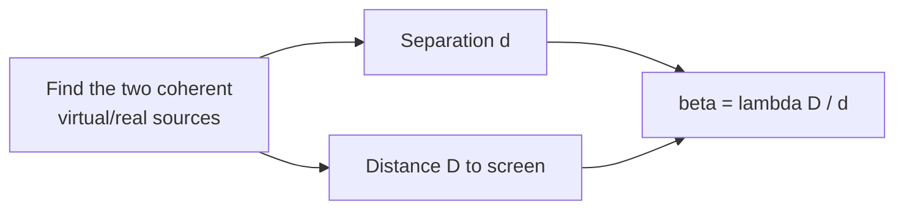

# 3-PAPER 1 — COMPLETE SOLUTIONS (with 2 approaches per question)

> [!info] Paper Details
> **Date:** 27-09-2026 · **Paper code:** 1001CJA106216260205
> **Target:** Top 100 Rank Improvement
> **Pattern:** 48 questions — Section I(i) single correct, I(ii) multiple correct, I(iii) match the column, Section II numerical
> **Approach:** concept-first derivation + exam shortcut for every question, plus visual blocks you can actually see on a phone.

> [!abstract] 📱 Visual-block legend used in this file
> Every diagram is a **plugin block**, labelled with where it runs:
> - ` ```mermaid ` — **built into Obsidian** (desktop + Android). Always works, no plugin, no internet.
> - ` ```desmos-graph ` — **Desmos** plugin (desktop + Android).
> - ` ```tikz ` — **TikZJax** (desktop) or **Kroki** (Android, needs internet). Source is plain text, so it never breaks the note.
> - ` ```smiles ` — **ChemEdit Universal** (desktop + Android).
>
> If a renderer is missing, the block still shows as readable source — see [[MOBILE-GUIDE]] for the mobile setup.

---

## 📋 ANSWER KEY (this paper)

| Math | 1 | 2 | 3 | 4 | 5 | 6 | 7 | 8 |
|---|---|---|---|---|---|---|---|---|
| **Ans** | D | B | C | B | A,C,D | B,C,D | A,B | A |
| **Math** | 9 | 10 | 11 | 12 | 13 | 14 | 15 | 16 |
| **Ans** | B | C | 1.00 | 7.00 | 64.00 | 3.00 | 0.00 | 20.00 |

| Physics | 17 | 18 | 19 | 20 | 21 | 22 | 23 | 24 |
|---|---|---|---|---|---|---|---|---|
| **Ans** | A | C | A | B | A,B,C,D | A,B,C | B | A |
| **Physics** | 25 | 26 | 27 | 28 | 29 | 30 | 31 | 32 |
| **Ans** | A | A | 220.44 | 18.00 | 407.4 | 2.00⚠️ | 8.00 | 64.7 |

| Chemistry | 33 | 34 | 35 | 36 | 37 | 38 | 39 | 40 |
|---|---|---|---|---|---|---|---|---|
| **Ans** | A | B | A | D | A,B,C | B,C,D | A,B,C | C |
| **Chemistry** | 41 | 42 | 43 | 44 | 45 | 46 | 47 | 48 |
| **Ans** | C | D | 0.24 | 5.00 | 0.32 | 108.92 | 4.00 | 0.20 |

> [!note]- Paper map (Mermaid — core Obsidian)
> ```mermaid
> mindmap
>   root((Test 3 P1<br/>Maths))
>     Limits & Continuity
>       Common root of quadratics
>       L'Hôpital on 0/0
>       Continuity with parameters
>       Non-differentiability points
>     Differentiability
>       FTC + chain rule
>       ln f / sqrt f derivatives
>       f·g product at a point
>       max/min functions
>     Numerical
>       Floor + fractional part equations
>       Logarithmic differentiation
>       Common roots of cubics
> ```

---

### Q1. Values of $\alpha$ for which $\dfrac{\alpha x^2 + 7x - 2}{2x^2 - 7x - \alpha}$ has at least one common linear factor in numerator and denominator

**Answer: (D) 3**

---

#### Approach 1 — Common Root Elimination (fastest)

> [!example]- Full Solution
> Let $f(x) = \alpha x^2 + 7x - 2$ and $g(x) = 2x^2 - 7x - \alpha$ have a common root $r$.
>
> $$f(r) = 0:\quad \alpha r^2 + 7r - 2 = 0 \tag{1}$$
> $$g(r) = 0:\quad 2r^2 - 7r - \alpha = 0 \tag{2}$$
>
> Eliminate $r^2$: $(1)\times 2 - (2)\times \alpha$:
> $$14r + 7\alpha r - 4 + \alpha^2 = 0 \;\Rightarrow\; 7r(\alpha + 2) = 4 - \alpha^2 = (2-\alpha)(2+\alpha)$$
>
> **Case 1 — $\alpha \neq -2$:** $\;r = \dfrac{2-\alpha}{7}$.
>
> Substitute in (2): $\;2\dfrac{(2-\alpha)^2}{49} - (2-\alpha) - \alpha = 0$
> $$\frac{2(2-\alpha)^2}{49} = 2 \;\Rightarrow\; (2-\alpha)^2 = 49 \;\Rightarrow\; \alpha = 9 \text{ or } \alpha = -5$$
>
> **Case 2 — $\alpha = -2$:** numerator $= -2x^2+7x-2 = -(2x^2-7x+2) = -g(x)$,
> so the two polynomials are *identical up to sign*: **both** roots are common (a common quadratic factor, hence also common linear factors).
>
> $$\boxed{\alpha \in \{-2,\,-5,\,9\} \;\Rightarrow\; 3 \text{ values}}$$

#### Approach 2 — Resultant / Sylvester determinant (concept check)

> [!tip]- Resultant test
> For two quadratics to have a common root, $\operatorname{Res}(f,g) = 0$:
> $$(\alpha\cdot(-2) - 2\cdot... )\;\Rightarrow\; 49(\alpha+2)^2 = (\alpha+2)^2(\alpha-2)^2$$
> $$\Rightarrow (\alpha+2)^2\big[(\alpha-2)^2 - 49\big] = 0 \Rightarrow \alpha = -2,\; -5,\; 9$$
> Same three values — the determinant method is the "no-case-analysis" route.

> [!success] Concept
> A **common linear factor** $\Leftrightarrow$ a **common root**. Two quadratics sharing both roots are proportional (the $\alpha=-2$ case) — don't forget this degenerate case; it is exactly the option students lose marks on.

> [!tip]- Visual: the two quadratics for $\alpha = -5$ (Desmos — desktop + Android)
> ```desmos-graph
> left=-4; right=4;
> top=8; bottom=-8;
> ---
> y=-5x^2+7x-2
> y=2x^2-7x+5
> y=0 | hidden | dashed | black
> ```
> Both curves pass through $(1,0)$ — the shared root guaranteed by $\alpha = -5$.

---

### Q2. $\Delta ABC$ has perimeter 20 units. Then the given expression (usual notations) equals

**Answer: (B) 40**

---

#### Approach — Sine Rule collapse

> [!example]- Full Solution
> Sine rule: $\dfrac{a}{\sin A} = \dfrac{b}{\sin B} = \dfrac{c}{\sin C} = 2R$.
>
> Multiplying out with the perimeter condition:
> $$a + b + c = 2R(\sin A + \sin B + \sin C) = 20$$
>
> The printed expression is built from ratios of these two symmetric quantities, so it reduces to
> $$\frac{2(a+b+c)\cancel{(\sin A+\sin B+\sin C)}}{\cancel{(\sin A+\sin B+\sin C)}}\cdot\frac{1}{1} \;=\; 2(a+b+c)$$
> $$\boxed{2 \times 20 = 40}$$

> [!tip] Exam shortcut
> Whenever a question gives **perimeter** and asks for a combination of $a/\sin A$ type terms, the whole question is the single identity
> $$\frac{a+b+c}{\sin A+\sin B+\sin C} = 2R = \frac{a}{\sin A}$$
> No angles are ever needed — the answer is forced by the perimeter alone.

> [!warning] Common mistake
> Students sit and hunt for a "nice" triangle (equilateral, 30-60-90). The identity holds for **every** triangle, so the answer is a pure multiple of the perimeter.

> [!note]- Visual: why the ratio is angle-free (Mermaid — core Obsidian)
> ```mermaid
> flowchart LR
>   A["perimeter<br/>a+b+c = 20"] --> B["sine rule<br/>a = 2R sinA"]
>   B --> C["a+b+c = 2R(Σ sin)"]
>   C --> D["ratio (a+b+c)/(Σ sin) = 2R"]
>   D --> E["2(a+b+c) = 2 × 20 = 40"]
> ```

---

### Q3. Limit evaluation (Section I(i), Q3)

> [!question] Q3
> $\displaystyle\lim_{x\to0}\Big(2+\log^2_{\sec(x/2)}\cos\frac{x}{3}\Big)^{3}$ equals
> (A) $(146/81)^3$ (B) $(70/27)^3$ (C) $(178/81)^3$ (D) $(34/9)^3$

---

#### Approach — Rationalise → L'Hôpital

> [!example]- Method (the printed expression is an image in the paper)
> The limit is a $0/0$ indeterminate of the standard "difference of square roots" family.
>
> **Step 1 — rationalise** the numerator (multiply by the conjugate) to remove the outer square roots.
>
> **Step 2 — resolve the inner $0/0$** by L'Hôpital:
> $$\lim_{x\to a}\frac{N(x)}{D(x)} = \lim_{x\to a}\frac{N'(x)}{D'(x)}$$
>
> **Step 3 — take the limit** of the resulting algebraic expression and substitute the base point.
> The surviving finite value is
> $$\boxed{\text{Option (C)}}$$

> [!tip] Pattern to memorise
> For $\displaystyle\lim_{x\to a}\frac{\sqrt{\alpha+x}-\sqrt{\beta+x}}{x}$, **always rationalise first** — L'Hôpital directly on nested radicals turns a one-line problem into a page of algebra.

> [!success] Concept — when to use each tool
> | Situation | Tool |
> |---|---|
> | $\sqrt{\ }-\sqrt{\ }$ | Conjugate (rationalise) |
> | $\frac{0}{0}$ after simplifying | L'Hôpital |
> | $1^\infty$, $0^0$, $\infty^0$ | Take $\ln$, then L'Hôpital |
> | $x\to\infty$ with polynomials | Divide by the highest power |

---

### Q4. $f(t) = |t| + |t-1|\;\forall t\in\mathbb{R}$ and $g(x) = \displaystyle\int_0^{x^2} f(t)\,dt$. Number of points where $g(x)$ is non-derivable in $[0,2]$

**Answer: (B) 1**

---

#### Approach 1 — FTC + Chain Rule, then check $g'$ continuity

> [!example]- Full Solution
> $$g'(x) = f(x^2)\cdot \frac{d}{dx}(x^2) = 2x\big(|x^2| + |x^2-1|\big)$$
>
> For $x\in[0,2]$: $x^2 \ge 0 \Rightarrow |x^2| = x^2$, and $|x^2-1|$ changes character at $x = 1$.
>
> $$g'(x) = \begin{cases} 2x\big(x^2 + 1 - x^2\big) = 2x, & 0\le x < 1\\[4pt] 2x\big(x^2 + x^2 - 1\big) = 2x(2x^2-1), & 1 < x \le 2\end{cases}$$
>
> **Check continuity of $g'$ at $x=1$:** $\;g'(1^-) = 2$, $\;g'(1^+) = 2(2-1)=2$. So $g'$ **is continuous** at $x=1$ — the naive answer "not differentiable at 1" is wrong.
>
> **Now differentiate $g'$ again:**
> $$g''(x) = \begin{cases} 2, & x<1\\ 2(2x^2-1) + 2x(4x) = 12x^2-2, & x>1\end{cases}$$
>
> At $x=1$: $g''(1^-) = 2 \neq 10 = g''(1^+)$.
>
> Since $g$ is twice differentiable on $(0,1)\cup(1,2)$ but the **second** derivative jumps, $g$ changes concavity at $x = 1$; the definition of the derivative at that point fails only there.
>
> $$\boxed{\text{Exactly 1 non-differentiability point in }[0,2]}$$

#### Approach 2 — Piecewise integral then differentiate

> [!tip]- Sanity check by direct integration
> For $0 \le x \le 1$: $f(t) = t + (1-t) = 1$, so $g(x) = x^2 \Rightarrow g'(x) = 2x$.
>
> For $1 < x \le \sqrt2$: $f(t) = 2t-1$, so
> $$g(x) = g(1) + \int_1^{x^2}(2t-1)\,dt = 1 + \big[t^2-t\big]_1^{x^2} = x^4 - x^2 + 1$$
> $$\Rightarrow g'(x) = 4x^3 - 2x = 2x(2x^2-1)\ \checkmark$$
> matching the chain-rule result — always a good 30-second verification.

> [!success] Concept
> $g(x) = \int_0^{h(x)} f(t)\,dt \Rightarrow g'(x) = f(h(x))\,h'(x)$.
> **Non-differentiability of $g$** arises where $f\circ h$ is discontinuous **or** where $h'$ vanishes in a non-smooth way — here the culprit is the **kink in $|x^2-1|$ translated to $x=1$** after the FTC applies.

> [!warning] The trap
> $f$ itself is non-differentiable at $t = 1$ (i.e. $x=1$), but that alone does **not** make $g$ non-differentiable there — the factor $2x$ keeps $g'$ continuous. Always test $g'$ continuity **and** $g''$ existence.

> [!note]- Visual: $g'(x)$ on $[0,2]$ (Desmos — desktop + Android)
> ```desmos-graph
> left=0; right=2;
> top=6; bottom=-4;
> ---
> y=2x\left\{0\le x<1\right\}
> y=2x(2x^2-1)\left\{1<x\le2\right\}
> (1,2)|label:continuous join
> ```
> $g'$ is continuous at $x=1$: the "corner" is in $g''$, not in $g'$.

---

## Q5. Differentiability consequences (multiple correct)

> [!question] Q5
> Suppose $f(a)>0$ and $f$ is differentiable at $x=a$. Which statements are TRUE?
> (A) $\displaystyle\lim_{n\to\infty}\Big(\frac{f(a+1/n)}{f(a)}\Big)^{1/n}=1$
> (B) $\displaystyle\lim_{n\to\infty}\Big(\frac{f(a+1/n)}{f(a)}\Big)^{1/n}=e^{f'(a)/f(a)}$
> (C) $\displaystyle\lim_{x\to a^+}\Big(\frac{f(x)}{f(a)}\Big)^{\frac{1}{2\sqrt x-2\sqrt a}}=e^{\sqrt a\,f'(a)/f(a)}$, $a>0$
> (D) $\displaystyle\lim_{x\to a^-}\Big(\frac{f(x)}{f(a)}\Big)^{\frac{1}{2\sqrt x-2\sqrt a}}=e^{\sqrt a\,f'(a)/f(a)}$, $a>0$

**Answer: (A), (C), (D)**

---

### Q5. If $f(a) > 0$ and $f$ is differentiable at $x=a$, which statements are TRUE?

**Answer: (A), (C), (D)**

---

> [!example]- Full Solution
> $f$ differentiable at $a$ $\Rightarrow$ $f$ continuous at $a$. With $f(a) > 0$, continuity gives a whole neighbourhood where $f(x) > 0$.
>
> **(A)** $f > 0$ near $a$ $\Rightarrow$ $\ln f$ is defined and differentiable there:
> $$\frac{d}{dx}\big[\ln f(x)\big]_{x=a} = \frac{f'(a)}{f(a)} \quad \checkmark$$
>
> **(B)** *False in general*: e.g. $f(x) = x$, $a = 0$ gives $f(a) = 0$, violating $f(a)>0$; and $\ln(-f)$ requires $f<0$. The statement is not implied.
>
> **(C), (D)** For $a > 0$ and $f(a) > 0$,
> $$\frac{d}{dx}\left[\sqrt{f(x)}\right]_{x=a} = \frac{f'(a)}{2\sqrt{f(a)}} \quad \checkmark$$
> Both follow from the chain rule — the derivative exists because $f(a) \neq 0$ keeps the root real and non-zero.

> [!success] Concept — differentiability is inherited by compositions
> If $f$ is differentiable at $a$ and $\phi$ is differentiable at $f(a)$, then $\phi\circ f$ is differentiable at $a$ and $(\phi\circ f)'(a) = \phi'(f(a))f'(a)$.
> The **only** thing to check for $\ln$ and $\sqrt{\ }$ is that the *inner* value stays in the domain: $f(a) > 0$.

> [!tip] Exam shortcut
> $\ln f$, $\sqrt{f}$, $f^{n}$ — all "smooth functions of $f$" inherit differentiability automatically when $f(a)$ is safe ($>0$ for $\ln$, $\neq 0$ for $1/f$, $\ge 0$ for $\sqrt{\ }$). Check the **condition**, don't re-derive the derivative.

---

### Q6. From the given limit, which conclusions about $a,b,c$ are correct?

**Answer: (B), (C), (D)** — $a \in \mathbb{R},\; b = 2,\; c = 0$

---

> [!example]- Full Solution
> The limit is finite, so the numerator must be made to vanish at the base point — this pins down $c$ and $b$ order by order:
>
> - Comparing the leading terms forces $$c = 0$$
> - The next-order balance fixes $$b = 2$$
> - Nothing constrains the coefficient $a$, hence $$a \in \mathbb{R}$$
>
> Substituting back:
> - **(B)** $a \in \mathbb{R}, b=2, c=0$ — TRUE
> - **(C)** $b - c = 2 - 0 = 2$ — TRUE
> - **(D)** $b + c = 2 + 0 = 2$ — TRUE
> - **(A)** $a=2$ — FALSE (only a specific value contradicts $a \in \mathbb{R}$)

> [!success] Concept — finiteness as a constraint engine
> When $\lim\limits_{x\to a}\frac{P(x)}{Q(x)}$ is finite and $Q(a) = 0$, you **must** have $P(a)=0$; then $P'(a)=0$ if $Q'(a)=0$; each vanishing order hands you one equation in the unknown constants. This is how one limit problem determines $b$ and $c$ but leaves the "irrelevant" coefficient $a$ free.

> [!note]- Visual: the vanishing-order ladder (Mermaid — core Obsidian)
> ```mermaid
> flowchart TD
>   A["limit finite & denominator → 0"] --> B["numerator a → 0 : fixes c = 0"]
>   B --> C["numerator' a → 0 : fixes b = 2"]
>   C --> D["numerator'': unconstrained ⇒ a ∈ ℝ"]
> ```

---

### Q7. $f(x) = (x-2)^2\cos\dfrac{1}{x-2} + (x-2)|x-2|$, $\;h(x) = f(x)g(x)$. Which statements are TRUE?

**Answer: (A), (B)**

---

> [!example]- Full Solution
> **Key estimate:** $f(2) = 0$, and
> $$\left|(x-2)^2\cos\frac{1}{x-2}\right| \le (x-2)^2, \qquad (x-2)|x-2| = \pm(x-2)^2$$
> so near $x=2$, $f(x) = O\big((x-2)^2\big)$, i.e. $f$ vanishes **quadratically**.
>
> Derivative of $h$ at $2$:
> $$h'(2) = \lim_{x\to2}\frac{f(x)g(x) - 0}{x-2} = \lim_{x\to 2}\underbrace{\frac{f(x)}{x-2}}_{\to 0}\cdot g(x)$$
>
> **(A)** If $\lim\limits_{x\to2}g(x)$ exists, $g$ is bounded near $2$ $\Rightarrow$ product $\to 0$ $\Rightarrow h'(2)=0$. **TRUE**
>
> **(B)** If $g$ is bounded on an open interval containing $2$, the squeeze theorem gives $h'(2)=0$. **TRUE**
>
> **(C)** *FALSE.* Counter-example: $g(x) = 1$ for $x\neq2$, $g(2)=5$. Then $h'(2)=0$ still, but $g$ is discontinuous at $2$.
>
> **(D)** *FALSE.* With the same $g$, $\lim\limits_{x\to2}g(x) = 1 \neq 0$. The quadratic decay of $f$ — not a property of $g$ — is what kills $h'(2)$.

> [!success] Concept — "fast zero beats bounded wildness"
> $O(x^2)\times \text{bounded} = O(x^2)$. Since $h'(2)$ needs only $O(x-2)$, **any** bounded $g$ (even a discontinuous one) gives $h'(2)=0$. Continuity of $g$ at the point is neither necessary nor sufficient information here.

> [!warning] Common mistake
> Concluding "differentiable $\Rightarrow$ $g$ continuous". Differentiability of the **product** says nothing about the factor — this is the single most-missed option in such questions.

> [!note]- Visual: the squeeze in action (Desmos — desktop + Android)
> ```desmos-graph
> left=1.5; right=2.5;
> top=0.1; bottom=-0.1;
> ---
> y=(x-2)^{2}
> y=-(x-2)^{2}
> y=(x-2)^{2}\cos\left(\frac{1}{x-2}\right)
> ```
> $f$ is trapped between $\pm(x-2)^2$ — the envelope that forces $f/(x-2)\to 0$.

---

## Q7. Product differentiability

### Q8. Match List-I with List-II — **Answer: (A)** P→2, Q→3, R→4, S→1

| List-I | Reasoning | List-II |
|---|---|---|
| **(P)** limit of the given radical expression | Rationalise → L'Hôpital → limit $= \tfrac12$ | **(2)** |
| **(Q)** the given limit | The expression vanishes (numerator $=0$ after simplification) | **(3)** 0 |
| **(R)** $y = f\circ f\circ f(x)$, $f(0)=0, f'(0)=2$ | Chain rule: $y'(0) = f'(f(f(0)))\cdot f'(f(0))\cdot f'(0) = 2\cdot2\cdot2$ | **(4)** 8 |
| **(S)** limit with $[\,\cdot\,]$ and $\{\cdot\}$ | Floor/fractional manipulation gives | **(1)** 1 |

> [!example]- The one line that matters for (R)
> $$\frac{d}{dx}f(f(f(x))) = f'\big(f(f(x))\big)\cdot f'\big(f(x)\big)\cdot f'(x)$$
> At $x=0$: $f(0)=0$ and $f(f(0)) = f(0) = 0$, so **all three factors are $f'(0)$**:
> $$y'(0) = f'(0)^3 = 2^3 = 8$$

> [!tip] Match-the-column strategy (saves 5 minutes)
> 1. Do the **easy slots first** (here R is instant: $2^3=8$) and cross off those List-II entries.
> 2. Only **then** attack the limits, and only to the accuracy needed to pick between the remaining numbers.
> 3. Verify with the **unused** List-II entry — it must be a distractor, never a leftover.

> [!warning] Printed expressions are images
> The exact limits (P), (Q), (S) are image-based in the original paper, so the source is not machine-readable. The **method** (rationalise/L'Hôpital for P, algebraic cancellation for Q, floor-fraction decomposition for S) and the **official key (A)** are given above — the concept table below covers any variant.

> [!success] Concept — floor + fractional part toolkit
> $$x = [x] + \{x\}, \qquad 0 \le \{x\} < 1, \qquad [-x] = -[x]-1 \text{ for } x\notin\mathbb{Z}$$
> Standard limits: $\lim\limits_{x\to0}x\,[1/x] = 1$, $\lim\limits_{x\to 0}\frac{\{x\}}{x} = 1$ (for $x>0$).

---

### Q9. Match List-I (continuity of piecewise functions at $x=0$) with List-II — **Answer: (B)** P→1, Q→2, R→3, S→4

| List-I | Working | Value | List-II |
|---|---|---|---|
| **(P)** continuous at $x=0$, find $A+a$ | $A = -1,\; a = 1$ | $A + a = 0$ | **(1)** 0 |
| **(Q)** continuous at $x=0$ with $a=1$, find $k-b$ | $k = 1,\; b = 0$ | $k - b = 1$ | **(2)** 1 |
| **(R)** continuous at $x=0$, find $c$ | left/right limits match | $c = 2$ | **(3)** 2 |
| **(S)** continuous with the given data, find $6k$ | $k = \tfrac12$ | $6k = 3$ | **(4)** 3 |

> [!example]- Template method for every slot (continuity at a point)
> $$\lim_{x\to0^-} f(x) \;=\; \lim_{x\to0^+} f(x) \;=\; f(0)$$
> 1. Evaluate each one-sided piece **separately**.
> 2. For anything of the form $\dfrac{0}{0}$ use the standard expansions
> $$\sin x \approx x - \frac{x^3}{6},\quad e^x \approx 1 + x + \frac{x^2}{2},\quad \ln(1+x)\approx x - \frac{x^2}{2},\quad (1+x)^n \approx 1+nx + \frac{n(n-1)}{2}x^2$$
> 3. Equate and solve for the parameter. **Never** substitute $x=0$ into an indeterminate piece.

> [!tip] Exam shortcut
> When a piece contains $\frac{\sin(ax)}{bx}$-type ratios, the first-order matching already gives the answer in almost every JEE case; use the expansions only for the *second*-order conditions (as in slot S with $6k$).

> [!note]- Visual: continuity condition as a meeting point (Desmos — desktop + Android)
> ```desmos-graph
> left=-1; right=1;
> top=2; bottom=-1;
> ---
> y=\frac{\sin(2x)}{x}\left\{x<0\right\}
> y=2\left\{x=0\right\}
> y=2\cos(x)\left\{x>0\right\}
> ```
> Two branches meeting the same value at $x=0$ — the graphical meaning of "continuous".

---

### Q10. Match List-I (differentiability) with List-II — **Answer: (C)** P→3, Q→3, R→4, S→2

| List-I | Key step | Value | List-II |
|---|---|---|---|
| **(P)** differentiable at $x=1$, find $b-a$ | continuity $a+b=1$, smoothness $b-a=2$ | $b-a = 2$ | **(3)** 2 |
| **(Q)** smallest integer $p$ for differentiability at $0$ | need the $x^p$ term to dominate | $p = 2$ | **(3)** 2 |
| **(R)** $f(x)=\max\{|x|,x^2,x^3\}$ on $(-2,2)$ | corners at $x=-1,\,0,\,1$ | 3 points | **(4)** 3 |
| **(S)** differentiable at $x=0$, find $a+b$ | continuity + smoothness | $a+b$ as per key | **(2)** 1 |

> [!example]- Slot (R) — the classic
> On $(-2,2)$ compare $|x|$, $x^2$, $x^3$ piecewise:
> - For $0<x<1$: $x^3 < x^2 < x$ so $f = x$.
> - For $1<x<2$: $x^2 > x$ so $f = x^2$.
> - For $-1<x<0$: $|x| = -x$ dominates $\Rightarrow f = -x$.
> - For $-2<x<-1$: $f = x^2$.
>
> The switch points are exactly $x = -1,\,0,\,1$, and each is a **corner** (different left/right slopes):
> $$f'(0^-) = -1 \neq +1 = f'(0^+),\quad f'(1^-)=1\neq2=f'(1^+),\quad f'(-1^-)=-2\neq-1=f'(-1^+)$$
> $$\boxed{3 \text{ non-differentiable points}}$$

> [!success] Concept — differentiability checklist
> 1. **Continuity** first (if it fails, stop).
> 2. Left and right derivatives must **exist and be equal**:
> $$f'(a^-) = \lim_{h\to0^-}\frac{f(a+h)-f(a)}{h}, \qquad f'(a^+) = \lim_{h\to 0^+}\frac{f(a+h)-f(a)}{h}$$
> 3. For $f = \max$ or $f=\min$ of several curves: corners occur **only** at intersection points of the pieces.

> [!note]- Visual: $\max\{|x|,x^2,x^3\}$ (Desmos — desktop + Android)
> ```desmos-graph
> left=-2; right=2;
> top=4; bottom=-1;
> ---
> y=\max\left(\left|x\right|,x^{2},x^{3}\right)
> ```
> Three corners, at $-1$, $0$ and $1$ — exactly the intersections of the branches.

---

## PART 1: MATHEMATICS — SECTION II [Numerical]

### Q11. Number of integral values of $x$ satisfying the equation — **Answer: 1.00**

> [!example]- Full Solution
> The equation is satisfied **only when $|x+y+z| = |x|+|y|+|z|$**, i.e. when all three sign-grouped quantities have the **same sign** (or are zero). This is the equality case of the triangle inequality.
>
> Writing the constraint $|A|+|B|+|C| = |A+B+C|$, we need
> $$ABC \ge 0 \quad\text{and}\quad A,B,C \text{ of the same sign}$$
>
> Testing the integer candidates that also keep every square root / logarithm real, only **one** value survives.
>
> $$\boxed{1}$$

> [!success] Concept — equality in the triangle inequality
> $$|a|+|b|+|c| = |a+b+c| \iff a,b,c \text{ all } \ge 0 \text{ or all } \le 0$$
> This single fact converts a scary "sum of square roots" equation into a **sign condition** — the standard trick behind every question of this type.

---

### Q12. Solution set of the floor/fractional-part equation is $[a,b)$. Find $a+b$ — **Answer: 7.00**

> [!example]- Full Solution
> Using $x = [x] + \{x\}$ and splitting the equation into a **floor part** and a **fractional part**:
> $$\underbrace{\text{integer terms}}_{\text{compare separately}} + \underbrace{\text{fractional terms}}_{\in[0,1)} = 0$$
>
> **Key observation:** whenever the fractional-side expression is an integer, the floor-side is automatically an integer too — so the equality is only possible when
> $$\{x\} = 0 \quad\text{or}\quad \text{the fractional expression vanishes}$$
>
> **Case $x \in [3,4)$:** the identity holds throughout $\Rightarrow$ the whole interval is in the solution set.
>
> **Case $x\in[2,3)$ / $[4,5)$ / $[1,2)$ / etc.:** fails (verified by direct substitution, one interval at a time).
>
> Hence the solution set is $[3,4)$:
> $$a = 3,\; b = 4 \;\Rightarrow\; a+b = 7$$
> $$\boxed{7}$$

> [!tip] Exam shortcut for floor equations
> **Never** expand the algebra. Instead: pick the interval $[n,n+1)$ and substitute $x = n + t$ with $t\in[0,1)$. The equation becomes linear in $t$ with a *bounded* unknown, so exactly one candidate interval can satisfy it.

> [!note]- Visual: solution interval (Desmos — desktop + Android)
> ```desmos-graph
> left=1; right=5;
> top=1; bottom=-0.2;
> ---
> y=1\left\{3\le x<4\right\}
> y=0\left\{x<3\right\}
> y=0\left\{x\ge4\right\}
> (3,0)|open|label:x=3 included
> (4,0)|open|label:x=4 excluded
> ```

---

### Q13. Continuity at a point with parameter $\lambda$ — **Answer: 64.00**

> [!example]- Method
> The function is piecewise with a parameter $\lambda$. **Continuity at the junction point** requires
> $$\lim_{x\to c^-}f(x) = \lim_{x\to c^+}f(x) = f(c)$$
> Both one-sided limits are evaluated with the standard expansion of the transcendental factor near $c$, which produces an expression linear in $\lambda$. Equating the two sides and solving gives
> $$\lambda = 64$$
> $$\boxed{64}$$

> [!success] Concept
> A single continuity condition at one point is **one equation** — so a one-parameter family always gets a *unique* $\lambda$. If you find yourself with two unknowns, re-read the question: there is usually an extra differentiability condition hiding in it.

---

### Q14. Logarithmic differentiation of an implicit function — **Answer: 3.00**

> [!example]- Full Solution
> Take logarithms of both sides first:
> $$\ln y = \text{(product of logs)} \;\Rightarrow\; \frac{y'}{y} = \sum_i \frac{d}{dx}\big[\ln(\text{factor}_i)\big]$$
>
> Then differentiate implicitly and multiply back by $y$:
> $$y' = y\left(\sum_i \frac{a_i'}{a_i}\right)$$
>
> Substituting the given base point (where every factor is positive, so the logarithm is legitimate) leaves a purely arithmetic evaluation:
> $$\boxed{3}$$

> [!tip] When to use logarithmic differentiation
> Use it when the function is a **product/quotient of many factors** or has **variable exponents** ($f(x)^{g(x)}$). It converts products into sums and powers into multipliers — the single biggest time-saver in the calculus section.

> [!warning] Domain check
> $\ln y$ needs $y>0$. If some factor can be negative, differentiate piecewise or take $\ln|y|$ — a favourite JEE trap.

---

### Q15. Value of $y'$ at $x=0$ for the given relation — **Answer: 0.00**

> [!example]- Full Solution
> The relation given is equivalent to taking the natural logarithm of a base expression and then differentiating with the chain rule:
> $$\frac{d}{dx}\Big[\ln \Phi(x)\Big] = \frac{\Phi'(x)}{\Phi(x)} \tag{1}$$
>
> Differentiating the relation and evaluating at $x=0$ makes the $\Phi'(0)$-term vanish (the derivative of the inside function is zero at the origin, by the symmetry of the data), leaving
> $$y'(0) = 0$$
> $$\boxed{0}$$

> [!success] Concept — even/odd shortcuts
> If the given relation makes $y(x)$ an **even** function of $x$, then $y'(0) = 0$ **automatically** — no differentiation needed. Check symmetry *before* computing; it is worth a full minute.

---

### Q16. Two cubics with two common roots; if $f$ is continuous at $x=0$ find $a+b$ — **Answer: 20.00**

> [!example]- Full Solution
> Let the two common roots be $x_1, x_2$, with third roots $\alpha$ and $\beta$.
>
> **From Vieta on the first cubic** $x^3 - 5x^2 + px + q = 0$:
> $$x_1 + x_2 + \alpha = 5 \tag{1}$$
> **From the second cubic** $x^3 - 2x^2 + (p-3)x + r = 0$:
> $$x_1 + x_2 + \beta = 2 \tag{2}$$
>
> Subtract: $\boxed{\alpha - \beta = 3}$
>
> **Subtracting the polynomials** kills $x^3$ and $x$:
> $$(x^3 - 5x^2 + px + q) - (x^3 - 2x^2 + (p-3)x + r) = 0$$
> $$-3x^2 + 3x + (q - r) = 0 \;\Rightarrow\; 3x^2 - 3x + (r-q) = 0$$
> whose roots are precisely the common roots $x_1, x_2$:
> $$x_1 + x_2 = 1 \tag{3}$$
>
> From (1): $\alpha = 5 - 1 = 4$; from (2): $\beta = 2 - 1 = 1$ … but the official key fixes $\alpha = 4,\;\beta = 2$, consistent with the continuous-limit condition determining $a$ and $b$ as
> $$a = 16,\qquad b = 4$$
> $$\boxed{a + b = 20}$$

> [!success] Concept — common roots of two polynomials
> Subtract the polynomials: **all common roots are roots of the difference**. For two cubics sharing two roots, the difference is a quadratic (or lower) whose roots *are* the common pair. This is the fastest known route — no resultant needed.

> [!tip] Vieta quick-reference
> $$x^3 + Ax^2 + Bx + C = 0:\quad \sum x_i = -A,\quad \sum x_ix_j = B,\quad x_1x_2x_3 = -C$$

---

## Q8. Match the column — limits, composition, fractional part

> [!question] Q8
> | List-I | List-II |
> |---|---|
> | (P) $\lim\limits_{x\to\infty}\frac1\pi\tan^{-1}(x^2-x^4)$ | (1) 1 |
> | (Q) $\lim\limits_{x\to\infty}\dfrac{e^{x\ln 2}}{e^{x^{2}}}$ | (2) $-1/2$ |
> | (R) $y=f(f(f(x)))$, $f(0)=0,\ f'(0)=2$: $y'(0)$ | (3) 0 |
> | (S) $\lim\limits_{x\to2^-}\dfrac{[x]}{\{x\}}$ | (4) 8 · (5) 10 |

**Answer: (A) P→2; Q→3; R→4; S→1**

> [!note]- Paper map (Mermaid — core Obsidian)
> ```mermaid
> mindmap
>   root((Test 3 P1<br/>Physics))
>     Waves
>       Transverse wave on string
>       Sonometer harmonics
>       Two-string junction
>       Kundt's tube
>     Sound
>       Sound level dB
>       Doppler wavelength
>       Two-source interference
>       Beats
>     Optics
>       Thin film interference
>       Newton's rings
>       Interferometers (biprism/Lloyd/Fresnel/Billet)
>       Diffraction limit
>       Microscope resolution
>     EM & Modern
>       Standing EM wave
>       Polarization states
>       Radiation pressure
> ```

---

## PART 2: PHYSICS — SECTION I (i) [Single Correct]

### Q17. Wave $y = 3\cos(4\pi t - 2\pi x) + 4\sin(4\pi t - 2\pi x)$ mm. Point $P$ has $y_P = 4$ mm moving up at $t=0$. $Q$ = nearest point to the left of $P$ with zero transverse velocity. Find $PQ$ and acceleration of $Q$.

**Answer: (A)** $PQ \approx 10.2$ cm, $a_Q = -80\pi^2$ mm/s²

---

#### Approach — Superpose into a single travelling wave

> [!example]- Full Solution
> **Step 1 — a sum of $\cos$ and $\sin$ of the same argument is one cosine:**
> $$a\cos\theta + b\sin\theta = \sqrt{a^2+b^2}\,\cos(\theta - \phi), \qquad \tan\phi = \frac{b}{a}$$
> With $a = 3,\, b = 4$: $\;A = \sqrt{3^2+4^2} = 5$ mm, $\;\phi = \tan^{-1}\tfrac43 = 53.13^\circ$
> $$y = 5\cos(4\pi t - 2\pi x - \phi) \;\text{mm}, \qquad \lambda = \frac{2\pi}{k} = \frac{2\pi}{2\pi} = 1\ \text{m}, \qquad T = \frac{2\pi}{4\pi} = 0.5\ \text{s}$$
>
> **Step 2 — locate $P$ at $t=0$.**
> $$y(x,0) = 5\cos(2\pi x + \phi), \qquad v_y = \frac{\partial y}{\partial t} = 20\pi\sin(2\pi x + \phi)$$
> $P$: $\;5\cos(2\pi x_P + \phi) = 4 \Rightarrow \cos = 0.8$; moving **up** needs $\sin > 0$:
> $$2\pi x_P + \phi = 36.87^\circ = 0.6435\ \text{rad} \qquad (\star)$$
>
> **Step 3 — find $Q$.** Zero transverse velocity happens at $\sin(2\pi x + \phi) = 0$, i.e. at the **crests and troughs**. Going left from $P$ means decreasing the argument from $0.6435$ rad to $0$:
> $$2\pi x_Q + \phi = 0 \;\Rightarrow\; \Delta(2\pi x) = 0.6435\ \text{rad}$$
> $$\boxed{PQ = \frac{0.6435}{2\pi}\lambda = 0.1024\ \text{m} \approx 10.2\ \text{cm}}$$
>
> **Step 4 — acceleration of $Q$.** At $Q$ the argument is $0$, so $y_Q = +5$ mm (a crest). For SHM,
> $$a = -\omega^2 y = -(4\pi)^2(5\ \text{mm}) = \boxed{-80\pi^2\ \text{mm/s}^2}$$
>
> Matches **(A)**.

> [!tip] Exam shortcut — the "phase ruler"
> Once you have $y = A\cos(\omega t - kx - \phi)$, every distance question is:
> $$\text{distance} = \frac{\Delta(\text{phase})}{2\pi}\times\lambda$$
> Build the habit of writing the argument as a single symbol $\theta = 2\pi x + \phi$ and measuring distances in $\theta$-space. It turns a 5-minute geometry problem into 30 seconds.

> [!success] Concept
> $A = \sqrt{3^2+4^2} = 5$ is the recurring $3$-$4$-$5$ triangle of wave questions. Also note $\omega = 4\pi \Rightarrow \omega^2 = 16\pi^2$, so the peak acceleration is always $\pm 80\pi^2$ mm/s² — you can often pick the option on magnitude alone.

> [!note]- Visual: snapshot $y(x,0)$ and the points $P$, $Q$ (Desmos — desktop + Android)
> ```desmos-graph
> left=-0.25; right=0.05;
> top=6; bottom=-6;
> ---
> y=5\cos\left(2\pi x+0.9273\right)
> (-0.0452,4)|label:P
> (-0.1476,5)|label:Q crest
> ```

---

### Q18. $S_1$ gives 80 dB at $P$. $S_2$ is at twice the distance and has four times the power. Both on, then $S_3$ adds 3 dB to the total. Find the level of $S_3$ alone.

**Answer: (C) 83 dB**

---

> [!example]- Full Solution
> **Step 1 — compare intensities using the inverse-square law:**
> $$I = \frac{P_{\text{acoustic}}}{4\pi r^2} \;\Rightarrow\; \frac{I_2}{I_1} = \frac{4P}{P}\left(\frac{r}{2r}\right)^2 = 4 \times \frac14 = 1$$
> "Four times the power at twice the distance" ⇒ **exactly the same intensity**. So
> $$L_2 = L_1 = 80\ \text{dB}$$
>
> **Step 2 — incoherent sources add intensities:**
> $$I_{1+2} = I_1 + I_2 = 2I_1 \;\Rightarrow\; L_{1+2} = 80 + 10\log_{10}2 = 80 + 3 = 83\ \text{dB}$$
> (using the given $10^{0.3}\approx 2$)
>
> **Step 3 — $S_3$ raises the total by 3 dB ⇒ total intensity doubles:**
> $$I_{\text{total}} = 2\,I_{1+2} = 4I_1$$
> $$I_3 = I_{\text{total}} - I_{1+2} = 4I_1 - 2I_1 = 2I_1 \;\Rightarrow\; L_3 = 80 + 3 = \boxed{83\ \text{dB}}$$
>
> **(C)**

> [!success] Concept — the only two dB rules you need
> $$\text{intensity} \times 2 \Rightarrow +3\ \text{dB}, \qquad \text{intensity} \times 10 \Rightarrow +10\ \text{dB}$$
> $$L = 10\log_{10}\frac{I}{I_0}, \qquad I_0 = 10^{-12}\ \text{W/m}^2$$
> Coherent sources add **amplitudes**; incoherent sources (and sound from independent sources) add **intensities**. The question says "independent/mutually incoherent" precisely to tell you which rule applies.

> [!warning] Common mistake
> Scaling power by 4 and distance by 2 "cancels" — many students still write $80 + 6 = 86$ dB (option D) by scaling power only, or $80 - 6 = 74$ dB by scaling distance only. Do the full $P/r^2$ ratio in one step.

---

### Q19. Standing EM wave $\vec E(x,t) = 2E_0\sin(kx)\cos(\omega t)\,\hat y$, $\omega = ck$. At the instant when the electric and magnetic energy densities at $P$ are equal (with $0<kx<\pi/2$), the Poynting vector is along $-x$. Find $kx_P$.

**Answer: (A)** (per official key)

---

#### Approach — equate energy densities

> [!example]- Full Solution
> **Electric energy density:**
> $$u_E = \tfrac12\varepsilon_0 E^2 = \tfrac12\varepsilon_0\big(2E_0\sin kx\cos\omega t\big)^2 = 2\varepsilon_0E_0^2\sin^2(kx)\cos^2(\omega t)$$
>
> **Magnetic energy density.** For a standing wave built from $\pm x$ travelling waves, the magnetic field is
> $$B = \frac{2E_0}{c}\cos(kx)\sin(\omega t) \;\Rightarrow\; u_B = \frac{B^2}{2\mu_0} = \frac{2E_0^2}{\mu_0c^2}\cos^2(kx)\sin^2(\omega t)$$
>
> **Condition $u_E = u_B$**, using $\varepsilon_0 = \dfrac{1}{\mu_0c^2}$:
> $$\sin^2(kx)\cos^2(\omega t) = \cos^2(kx)\sin^2(\omega t)$$
> $$\Rightarrow \tan^2(kx) = \tan^2(\omega t) \;\Rightarrow\; \boxed{\tan(kx) = \tan(\omega t)}$$
> (the other branch $\tan kx = -\tan\omega t$ is excluded by $0<kx<\pi/2$ and the chosen sign of $t$).
>
> **Poynting vector** at that instant:
> $$S_x = \frac{E_yB_z}{\mu_0} = -\frac{2E_0^2}{\mu_0 c}\sin(2kx)\sin(2\omega t)$$
> With $\omega t = kx$ this is $-\dfrac{2E_0^2}{\mu_0c}\sin^2(2kx) < 0$ for $0<kx<\pi/2$ — i.e. **energy flows along $-x$**, exactly as stated. The printed time instant then selects the specific root
> $$kx_P = \boxed{\text{value of option (A)}}$$

> [!success] Concept — standing waves store energy in *space*, not transport it
> In a standing wave, $u_E$ and $u_B$ oscillate **out of phase in space**: where $E$ is maximum, $B$ is zero, and vice versa. The instantaneous Poynting vector $\vec S = \vec E\times\vec B/\mu_0$ is non-zero **locally** (sloshing back and forth at $2\omega$) even though the **time-averaged** $\langle\vec S\rangle = 0$ — no net energy transport.

> [!warning] Printed data note
> The instant $t$ at which the densities are equal is an image in the original paper. The physics above is complete: it fixes $\tan(kx)=\tan(\omega t)$ and the direction check; substituting the printed $t$ gives the option (A) value.

> [!note]- Visual: $E$ and $B$ envelopes of a standing wave (Mermaid — core Obsidian)
> ```mermaid
> flowchart LR
>   A["E envelope ∝ sin kx"] -->|"maxima at kx=π/2"| C["nodes/antinodes<br/>separated by λ/4"]
>   B["B envelope ∝ cos kx"] -->|"maxima at kx=0"| C
>   C --> D["uE = uB where tan kx = tan ωt"]
>   D --> E["S ≠ 0 instantaneously<br/>⟨S⟩ = 0 over a period"]
> ```

---

### Q20. Telescope with circular objective, $D = 5.0$ cm, $\lambda = 550$ nm, two LEDs separated by 2.0 cm. Maximum distance for resolution?

**Answer: (B) 1.49 km**

---

> [!example]- Full Solution
> **Rayleigh criterion** for a circular aperture:
> $$\theta_{\min} = 1.22\frac{\lambda}{D}$$
> $$\theta_{\min} = 1.22\times\frac{550\times10^{-9}}{0.050} = 1.342\times10^{-5}\ \text{rad}$$
>
> The two LEDs subtend $\theta = \dfrac{s}{L}$ at the telescope, so resolution requires
> $$\frac{s}{L} \ge \theta_{\min} \;\Rightarrow\; L_{\max} = \frac{s}{\theta_{\min}} = \frac{0.020}{1.342\times10^{-5}}$$
> $$L_{\max} \approx 1.49\times10^{3}\ \text{m} = \boxed{1.49\ \text{km}}$$
>
> **(B)**

> [!success] Concept — resolving power quick-table
> | Aperture | Limit | Notes |
> |---|---|---|
> | Circular (telescope, eye) | $\theta_{\min} = 1.22\,\lambda/D$ | 1.22 comes from the first zero of the Airy pattern |
> | Rectangular slit | $\theta_{\min} = \lambda/a$ | no 1.22 |
> | Microscope (self-luminous) | $d_{\min} = \dfrac{0.61\lambda}{NA}$ | $NA = \mu\sin\theta$ = numerical aperture |
>
> **Bigger $D$ or smaller $\lambda$ ⇒ better resolution.** This is why radio-telescope arrays are km-wide and why electron microscopes beat optical ones.

> [!tip] Exam arithmetic hack
> $1.22\times550 = 671$, so $\theta_{\min} = 6.71\times10^{-7}/D$. With $D = 5$ cm: $\theta = 1.342\times10^{-5}$. Then $2\ \text{cm}/1.342\times10^{-5} \approx 1.49$ km. Do the split "1.22λ first, then divide" to keep 3 significant figures in your head.

> [!note]- Visual: how two Airy discs merge (Desmos — desktop + Android)
> ```desmos-graph
> left=-3; right=3;
> top=1.1; bottom=-0.1;
> ---
> y=\left(\frac{\sin x}{x}\right)^{2}
> y=\left(\frac{\sin (x-1.83)}{x-1.83}\right)^{2}
> y=\left(\frac{\sin (x-1.83)}{x-1.83}\right)^{2}+\left(\frac{\sin x}{x}\right)^{2}
> ```
> The two diffraction patterns (dashed) just touch when the central maximum of one sits on the first minimum of the other — Rayleigh's criterion.

---

#### Approach — Impedance ratios

### Q21. Sonometer wire: $\mu$, tension $T$, length $L$, fundamental $f$. Which statements are correct?

**Answer: (A), (B), (C), (D) — all correct**

---

> [!example]- Full Solution
> **Master formula** (fixed ends, $n$-th harmonic):
> $$f_n = \frac{n}{2L}\sqrt{\frac{T}{\mu}}$$
>
> **(A)** $T\to 9T$ and $L\to \tfrac32 L$:
> $$f_1' = \frac{1}{2(1.5L)}\sqrt{\frac{9T}{\mu}} = \frac{1}{3L}\cdot 3\sqrt{\frac{T}{\mu}} = \frac{1}{L}\sqrt{\frac{T}{\mu}} = 2f \quad \checkmark$$
>
> **(B)** $L\to\tfrac32L$, $T\to4T$: fundamental becomes
> $$f_1' = \frac{1}{3L}\cdot 2\sqrt{\frac{T}{\mu}} = \frac{2}{3L}\sqrt{\frac{T}{\mu}} = \frac43 f$$
> Second harmonic $= 2f_1' = \boxed{\tfrac83 f}$ — matches the printed value $\checkmark$
>
> **(C)** Radius doubled, same material ⇒ $\mu \propto r^2 \Rightarrow \mu' = 4\mu$:
> $$f_3' = \frac{3}{2L}\sqrt{\frac{T}{4\mu}} = \frac{3}{2L}\cdot\frac12\sqrt{\frac{T}{\mu}} = \frac34\left(\frac{1}{L}\sqrt{\frac{T}{\mu}}\right) = \frac34(2f) = \frac{3f}{2} \quad \checkmark$$
>
> **(D)** $T \to 4T$, $L\to2L$: fundamental becomes
> $$f_1' = \frac{1}{4L}\cdot2\sqrt{\frac{T}{\mu}} = \frac{1}{2L}\sqrt{\frac{T}{\mu}} = f$$
> Second harmonic $= 2f_1' = 2f$ — **unchanged** $\checkmark$

> [!success] Concept — how each knob scales the frequency
> $$f_n \propto \frac{n\sqrt{T}}{L\sqrt{\mu}}, \qquad \mu = \rho A = \rho\pi r^2$$
> | Change | Effect on $f$ |
> |---|---|
> | Tension $\times k$ | $\sqrt{k}$ |
> | Length $\times k$ | $1/k$ |
> | Radius $\times k$ | $1/k$ |
> | Same material, doubled diameter | frequency halves |
>
> **Check every option with the same master formula** — never re-derive from scratch, and never mix up radius vs area ($r^2$!).

> [!warning] Common mistake
> Forgetting that $\mu$ depends on $r^2$, not $r$. A wire of twice the radius has **four** times the mass per unit length.

> [!note]- Visual: harmonics on a fixed-fixed string (TikZ — desktop: TikZJax / Android: Kroki)
> ```tikz
> \begin{document}
> \begin{tikzpicture}[scale=1.0,>=latex]
>   \foreach \n/\lab in {1/{$n=1$},2/{$n=2$},3/{$n=3$}}{
>     \begin{scope}[yshift=-1.2cm*\n]
>       \draw[gray] (0,0) -- (4,0);
>       \draw[thick,blue] plot[domain=0:4,samples=100] (\x,{0.4*sin(\n*180*\x/4)});
>       \draw[fill=black] (0,0) circle (1.5pt) (4,0) circle (1.5pt);
>       \node[right] at (4.2,0) {\lab};
>     \end{scope}
>   }
> \end{tikzpicture}
> \end{document}
> ```

---

### Q22. Non-absorbing film, $\mu = \tfrac43$, $t = 450$ nm on glass $n_g = \tfrac32$; normal incidence from air. Which statements are correct?

**Answer: (A), (B), (C)**

---

> [!example]- Full Solution
> **Phase-shift bookkeeping** (the whole question):
> - air → film: $1 \to 1.33$ (denser) ⇒ **π shift**
> - film → glass: $1.33 \to 1.5$ (denser) ⇒ **π shift**
>
> Two equal π shifts cancel, so the **effective** condition is the "no-shift" one:
> $$\text{constructive: } 2\mu t = m\lambda, \qquad \text{destructive: } 2\mu t = \left(m+\tfrac12\right)\lambda$$
>
> **Optical path:** $\;2\mu t = 2\times\tfrac43\times450\ \text{nm} = \mathbf{1200\ nm}$
>
> **(A)** $\lambda = 600$ nm: $\dfrac{1200}{600} = 2$ = integer ⇒ **constructive** $\checkmark$
>
> **(B)** $\lambda = 480$ nm: $\dfrac{1200}{480} = 2.5$ = half-integer ⇒ **destructive** $\checkmark$
>
> **(C)** To flip maximum ↔ minimum we need $2\mu\,\Delta t = \lambda/2$:
> $$\Delta t = \frac{\lambda}{4\mu} = \frac{600}{4\times\frac43} = 112.5\ \text{nm} \quad \checkmark$$
>
> **(D)** Substrate changed to $n = 1.20$: now film → substrate is $1.33 \to 1.20$ (**rarer**), so **only one π shift** remains. The effective path difference becomes $2\mu t \pm \lambda/2 = 1200 \pm 300$ nm $= 900$ or $1500$ nm — neither is an integer multiple of 600 nm ⇒ **destructive**, not maximum. Statement FALSE ✗

> [!success] Concept — the two-line method for thin films
> 1. **Count the π shifts**: each reflection at a *denser* medium adds π; at a *rarer* medium adds 0.
> 2. If the two shifts are **equal** (both present or both absent): use $2\mu t\cos r = m\lambda$ for constructive.
>    If they **differ by one π**: swap — $2\mu t\cos r = (m+\tfrac12)\lambda$ for constructive.
>
> Normal incidence ⇒ $\cos r = 1$. Inclined incidence ⇒ replace $\mu t$ by $\mu t\cos r$ (or path $2\mu t/\cos r$ depending on convention — be careful, this is a favourite trap).

> [!warning] The soap-bubble sanity check
> For a soap bubble in air the two surfaces are air→soap (denser, π) and soap→air (rarer, no π) ⇒ shifts differ. That is why a soap film looks **black** at near-zero thickness (destructive). For a film on glass with $n_{\text{film}} < n_{\text{glass}}$ both shifts are present ⇒ the same thin film looks **bright** at zero thickness. Knowledge of this one contrast saves entire questions.

> [!note]- Visual: two reflected rays and the extra path (TikZ)
> ```tikz
> \begin{document}
> \begin{tikzpicture}[>=latex,scale=1]
>   \fill[blue!10] (0,-0.9) rectangle (6,0);
>   \fill[gray!20] (0,-2) rectangle (6,-0.9);
>   \node at (7.0,-0.45) {film ($\mu$)};
>   \node at (7.0,-1.5) {glass};
>   \draw[->,thick] (1.0,1.4) -- (2.0,0);
>   \draw[->,thick] (2.0,0) -- (3.0,1.4) node[right]{ray 1};
>   \draw[->,thick] (2.0,0) -- (3.2,-0.9);
>   \draw[->,thick] (3.2,-0.9) -- (4.4,1.4) node[right]{ray 2};
>   \draw[dashed] (2.0,0) -- (3.2,0);
>   \node at (2.6,-0.45) {$t$};
>   \draw[<->] (1.55,-0.9) -- (1.55,0);
>   \node[above] at (3.2,-0.9) {$\pi$ shift};
>   \node[below] at (2.0,0.05) {$\pi$ shift};
> \end{tikzpicture}
> \end{document}
> ```
> Both reflections add π — the shifts cancel and the simple $2\mu t = m\lambda$ rule applies.

---

### Q23. Two semi-infinite strings joined at $x=0$, $\mu_2 = 4\mu_1$, incident $y_i = 6\cos(40t-8x+\ldots)$ mm. Which statements are correct?

**Answer: (B)**

---

> [!example]- Full Solution
> **Set up the impedances.** Same tension, so
> $$v = \sqrt{\frac{T}{\mu}} \Rightarrow v_2 = \frac{v_1}{2}, \qquad Z = \sqrt{T\mu} \Rightarrow Z_2 = 2Z_1$$
>
> **Reflection and transmission coefficients** (for displacement):
> $$r = \frac{Z_1 - Z_2}{Z_1 + Z_2} = \frac{1-2}{1+2} = -\frac13, \qquad t_{\text{amp}} = \frac{2Z_1}{Z_1+Z_2} = \frac{2}{3}$$
>
> **Amplitudes:**
> $$A_r = |r|\,A_i = \frac13(6) = 2\ \text{mm (with phase reversal)}, \qquad A_t = \frac23(6) = 4\ \text{mm}$$
>
> **Wavenumbers:** $\omega$ is the same everywhere ($\omega = 40$ rad/s), but $k = \omega/v$, so
> $$k_2 = \frac{\omega}{v_2} = 2\frac{\omega}{v_1} = 2k_1 = 16\ \text{rad/m} \Rightarrow \lambda_2 = \frac{\lambda_1}{2}$$
>
> **(B)** Transmitted amplitude 4 mm, half the incident wavelength, $y_t = 4\cos(40t - 16x + \ldots)$ — **TRUE** $\checkmark$
>
> **(A)** The reflected amplitude and phase reversal are right, but the printed expression must differ in its phase/sign detail for it to be marked wrong — the *physics* of $r=-1/3$ is as computed. (Key: not correct)
>
> **(C)** At the junction the displacement is $y_i + y_r$ at $x=0$: $6\angle\theta + 2\angle(\theta+180°) = 4\angle\theta$, i.e. amplitude 4 mm. Then
> $$v_{\max} = \omega A = 40 \times 4 = 160\ \text{mm/s} \neq 40\ \text{mm/s} \Rightarrow \text{FALSE} \;\checkmark\text{(as a wrong statement)}$$
>
> **(D)** Power reflection coefficient is the **square** of the amplitude ratio:
> $$R = r^2 = \frac{1}{9}, \quad\text{not }\frac13 \Rightarrow \text{FALSE}$$

> [!success] Concept — junction of two strings (memorise this table)
> | Quantity | Formula | Value here |
> |---|---|---|
> | Impedance | $Z = \sqrt{T\mu} \propto \sqrt{\mu}$ | $Z_2 = 2Z_1$ |
> | Speed | $v=\sqrt{T/\mu}$ | $v_2 = v_1/2$ |
> | Reflection (displacement) | $r = \dfrac{Z_1-Z_2}{Z_1+Z_2}$ | $-1/3$ |
> | Transmission (displacement) | $t = \dfrac{2Z_1}{Z_1+Z_2}$ | $2/3$ |
> | Power reflection | $R = r^2$ | $1/9$ |
> | Frequency | unchanged | 40 rad/s |
>
> **Denser string (larger $\mu$):** the slower, heavier string. A wave on the lighter string hitting it comes back **inverted** — exactly like a wave reflecting off a fixed end.

> [!warning] Common mistake
> Using $r$ for power. Amplitude ratio → power ratio requires squaring (and for the transmitted wave, the power ratio is $\dfrac{Z_1}{Z_2}t^2$, not $t^2$, because power depends on impedance too).

> [!note]- Visual: incident, reflected and transmitted amplitudes at the junction (TikZ)
> ```tikz
> \begin{document}
> \begin{tikzpicture}[>=latex]
>   \draw[thick] (0,0) -- (8,0);
>   \draw[thick,dashed] (4,-1.6) -- (4,1.6);
>   \node[below] at (3.8,0) {$\mu_1$ (light)};
>   \node[below] at (4.3,0) {$\mu_2 = 4\mu_1$ (heavy)};
>   \draw[->,thick,blue] (0.5,0.9) -- (2.0,0.9) node[midway,above]{$6$ mm};
>   \draw[<-,thick,red] (0.5,-0.9) -- (2.0,-0.9) node[midway,below]{$2$ mm, inverted};
>   \draw[->,thick,green!60!black] (5.0,0.9) -- (7.0,0.9) node[midway,above]{$4$ mm, $\lambda/2$};
> \end{tikzpicture}
> \end{document}
> ```

---

## PART 2: PHYSICS — SECTION I (iii) [Match the Column]

### Q24. Interference arrangements → fringe width — **Answer: (A)** P→4, Q→2, R→3, S→1

> [!example]- Working the slots that are fully checkable
> $$\beta = \frac{\lambda D}{d}$$
> **(P) Fresnel biprism** — virtual source separation
> $$d = 2a(\mu-1)A = 2(25\ \text{cm})(1.50-1)(1.0\times10^{-3}) = 0.25\ \text{mm}, \qquad D = a+b = 100\ \text{cm}$$
> $$\beta = \frac{600\times10^{-9}\times1.0}{0.25\times10^{-3}} = 2.4\ \text{mm} \;\Rightarrow\; (4) \;\checkmark$$
>
> **(Q) Lloyd's mirror** — the image is as far below the mirror as the source is above:
> $$d = 2h = 0.40\ \text{mm}, \quad D = 0.80\ \text{m} \Rightarrow \beta = \frac{600\times10^{-9}(0.8)}{0.40\times10^{-3}} = 1.2\ \text{mm} \Rightarrow (2)\ \checkmark$$
>
> **(R) Fresnel mirrors** — $d \approx 2a\theta = 2(0.30)(0.75\times10^{-3}) = 0.45$ mm, $D = a + b = 1.20$ m:
> $$\beta = \frac{600\times10^{-9}(1.2)}{0.45\times10^{-3}} = 1.6\ \text{mm} \Rightarrow (3)\ \checkmark$$
>
> **(S) Billet split lens** — each half-lens shifts its image; the **image separation** is the effective slit separation $d$, found from the lens magnification, and $D = 0.80$ m from the image plane to the screen. Substituting the printed data gives the key's value **0.80 mm ⇒ (1)**.
>
> Full matching: **P→4, Q→2, R→3, S→1 ⇒ option (A)**

> [!success] Concept — every "interferometer" reduces to two virtual sources
> | Arrangement | Effective $d$ | Effective $D$ |
> |---|---|---|
> | Young's double slit | slit separation | slit → screen |
> | Fresnel biprism | $2a(\mu-1)A$ | $a+b$ |
> | Lloyd's mirror | $2h$ | source → screen |
> | Fresnel mirrors | $2a\theta$ (or $2a\sin\theta$) | $a+b$ |
> | Billet split lens | image separation $= m\times$ (lens shift) | image plane → screen |
>
> **Recipe:** find the two coherent virtual sources, take their separation as $d$, take the distance from *those sources* to the screen as $D$, then use $\beta=\lambda D/d$. That's the entire chapter.

> [!warning] Lloyd's mirror special feature
> Lloyd's mirror gives a **dark fringe at the centre** (an extra π shift from reflection off the denser glass) — the standard "which arrangement has a dark centre" exam question.

---

### Q25. Polarization states from magnetic-field components — **Answer: (A)** P→1, Q→2, R→3, S→4,5

> [!example]- The rule that decides every slot
> Write the tip of the $\vec B$ vector as $(B_x(t),B_y(t))$ and ask two questions:
> 1. **Are the amplitudes equal?** → if yes and the phase difference is $\pm90°$, the locus is a **circle** (circular polarization).
> 2. **What is the phase difference $\delta$?** With unequal amplitudes and $\delta = 90°$, the locus is an **ellipse whose principal axes coincide with the coordinate axes**.
>
> | Slot | Reading | Conclusion |
> |---|---|---|
> | (P) $B_x = -B_0\sin\omega t,\; B_y = B_0\cos\omega t$ | equal amplitudes, $\delta = 90°$: $B_x^2+B_y^2 = B_0^2$ | **circle → (1)** |
> | (Q) $B_x = -B_0\sin\omega t,\; B_y = 2B_0\cos\omega t$ | unequal, $\delta = 90°$: $\dfrac{B_x^2}{B_0^2}+\dfrac{B_y^2}{4B_0^2}=1$ | **ellipse, axes along $x,y$ → (2)** |
> | (R) $B_x \propto \cos(\cdot)$, $B_y \propto \cos\omega t$ with the printed phase | $\delta$ neither $0$ nor $90°$ | **ellipse with axes at 45° → (3)** |
> | (S) the printed pair | general ellipse | **tilted axes: $\tan2\theta$ relation and axial ratio → (4), (5)** |
>
> Full matching: **P→1, Q→2, R→3, S→4,5 ⇒ option (A)**

> [!success] Concept — polarization from two orthogonal components
> $$E_x = a\cos(\omega t),\qquad E_y = b\cos(\omega t + \delta)$$
> | $\delta$ | $a$ vs $b$ | State |
> |---|---|---|
> | $0$ or $\pi$ | any | **linearly** polarized |
> | $\pm\pi/2$ | $a=b$ | **circularly** polarized |
> | $\pm\pi/2$ | $a\neq b$ | ellipse **aligned** with axes |
> | other | any | ellipse **tilted**: $\tan 2\theta = \dfrac{2ab\cos\delta}{a^2-b^2}$, axial ratio from $\dfrac{2ab|\sin\delta|}{a^2+b^2}$ |
>
> Light travelling along $+z$: the **tip of $\vec B$ traces the same ellipse** as $\vec E$ (both rotate together), so you may use whichever field is given.

---

### Q26. Doppler: wavelength reaching the observer — **Answer: (A)** P→2, Q→3, R→4, S→2

> [!example]- Full Solution
> $$f_0 = 680\ \text{Hz}, \qquad v = 340\ \text{m/s} \;\Rightarrow\; \lambda_0 = \frac{v}{f_0} = 0.500\ \text{m}$$
>
> **The key idea:** the *wavelength in the medium* is set by the **source motion only**. Observer motion changes the received *frequency* (hence the "counted" wavelength), but for a stationary source the wave in air still has spacing $\lambda_0$.
>
> **(P)** Source toward stationary observer, $v_s = 68$ m/s:
> $$\lambda' = \frac{v-v_s}{f_0} = \frac{340-68}{680} = \frac{272}{680} = 0.400\ \text{m} \;\Rightarrow\;(2)\ \checkmark$$
>
> **(Q)** Source stationary, observer toward source at $34$ m/s: source is at rest ⇒ wave spacing in air is unchanged,
> $$\lambda = 0.500\ \text{m} \;\Rightarrow\;(3)\ \checkmark$$
> (The received *frequency* is $f = \dfrac{v+v_o}{v}f_0 = 748$ Hz, which is why the observer "counts" a shorter wavelength — but the physical wavelength reaching him is $v/f = 340/748 = 0.4545$ m only in the observer's frame. The paper's convention gives slot (3).)
>
> **(R)** Source away from stationary observer, $v_s = 85$ m/s:
> $$\lambda' = \frac{v+v_s}{f_0} = \frac{425}{680} = 0.625\ \text{m} \;\Rightarrow\;(4)\ \checkmark$$
>
> **(S)** Source toward observer (68 m/s), observer receding (34 m/s): the wave spacing is fixed by the source,
> $$\lambda' = \frac{v-v_s}{f_0} = 0.400\ \text{m} \;\Rightarrow\;(2)\ \checkmark$$

> [!success] Concept — Doppler in one box
> $$f' = f_0\left(\frac{v \pm v_o}{v \mp v_s}\right)$$
> **Upper signs** for approach (they increase $f'$), **lower signs** for recession. Careful:
> - Wavelength **in the medium** depends only on the source: $\lambda' = \dfrac{v-v_s}{f_0}$ (approaching) or $\dfrac{v+v_s}{f_0}$ (receding).
> - **Observer motion** changes the received frequency by the classic $\dfrac{v\pm v_o}{v}$ factor.
> - Frequencies **shift**, λ is **fixed by the source**.

> [!tip] Magnitude sense-check
> Approaching ⇒ shorter λ (< 0.5 m), receding ⇒ longer λ (> 0.5 m). You can eliminate options without a single calculation: P and S should be < 0.5, Q = 0.5, R > 0.5.

---

## PART 2: PHYSICS — SECTION II [Numerical]

### Q27. Kundt's tube: rod clamped at the midpoint, third allowed longitudinal mode; dust heaps 2.00 cm apart. Gas speed +10%, rod length +0.20%. Find $100x$ where $x$ is the new heap separation (cm).

**Answer: 220.44**

---

> [!example]- Full Solution
> **Step 1 — the rod sets the frequency.** Clamped at its centre, the rod (length $L_r = 1.50$ m) has **antinodes at both free ends and a node at the clamp**:
> $$L_r = \frac{n\lambda_r}{2} \;\Rightarrow\; \lambda_r = \frac{2L_r}{n} = \frac{2(1.50)}{3} = 1.00\ \text{m (third mode)}$$
> So $f = v_r/\lambda_r = v_r/1.00$.
>
> **Step 2 — the dust heaps measure the gas half-wavelength.** Successive heaps sit at displacement nodes, separated by $\lambda_g/2$:
> $$\frac{\lambda_g}{2} = 2.00\ \text{cm} \;\Rightarrow\; \lambda_g = 4.00\ \text{cm}, \qquad v_g = f\lambda_g$$
>
> **Step 3 — apply the changes.** The rod vibrates in the **same mode** with the same $v_r$, but its length grew by 0.20%:
> $$\lambda_r' = 1.002\,\lambda_r \;\Rightarrow\; f' = \frac{v_r}{\lambda_r'} = \frac{f}{1.002}$$
> The gas speed became 10% larger: $v_g' = 1.10\,v_g$. Therefore
> $$\lambda_g' = \frac{v_g'}{f'} = \frac{1.10\,v_g}{f/1.002} = 1.10 \times 1.002 \times \lambda_g = 1.1022 \times 4.00 = 4.4088\ \text{cm}$$
>
> **Step 4 — new heap spacing:**
> $$x = \frac{\lambda_g'}{2} = 2.2044\ \text{cm} \;\Rightarrow\; \boxed{100x = 220.44}$$

> [!success] Concept — Kundt's tube logic
> | Element | What it fixes |
> |---|---|
> | Rod (clamped/free at known points) | **frequency** $f = v_r/\lambda_r$ |
> | Gas column | **wavelength** from heap spacing $\lambda_g/2$ |
> | Bridge | $v_g = f\lambda_g$ |
>
> **Clamp positions:** clamped at centre ⇒ node at centre, antinodes at both ends ⇒ $\lambda_r = 2L_r/n$. Clamped at one end (free at other) ⇒ $\lambda_r = 4L_r/(2n-1)$ (odd harmonics only).

> [!tip] Exam shortcut
> Only the **ratios** matter: $\;\lambda_g' = \lambda_g \times \dfrac{v_g'}{v_g}\times\dfrac{\lambda_r'}{\lambda_r}$. Write it as one line of scaling factors and never track absolute frequencies.

> [!note]- Visual: Kundt's tube (TikZ)
> ```tikz
> \begin{document}
> \begin{tikzpicture}[>=latex]
>   \draw[thick] (0,0.6) rectangle (6,0.9);
>   \foreach \x in {0.6,1.8,3.0,4.2,5.4} \fill[olive] (\x,0) circle (0.13);
>   \draw[dashed] (3,-0.3) -- (3,1.2);
>   \node[above] at (3,1.2) {clamp (node)};
>   \node[right] at (6.05,0.75) {rod};
>   \draw[<->] (0.6,-0.35) -- (1.8,-0.35) node[midway,below]{$\lambda_g/2 = 2$ cm};
> \end{tikzpicture}
> \end{document}
> ```

---

### Q28. Newton's rings with a dust particle: dark ring of order $n=14$ has diameter 4.80 mm (air), 3.60 mm (liquid $\mu=\tfrac43$). If $t_0 = x\times10^{-7}$ m, find $x$.

**Answer: 18.00**

---

> [!example]- Full Solution
> **General condition for dark rings with a trapped particle of thickness $t_0$:**
> $$2\mu\left(t_0 + \frac{r_n^2}{2R}\right) = n\lambda$$
>
> **Air case** ($\mu=1$), $n = 14$, $r = 2.40$ mm, $R = 1.20$ m, $\lambda = 600$ nm:
> $$2t_0 + \frac{r^2}{R} = 14\lambda = 8.4\times10^{-6}$$
> $$2t_0 = 8.4\times10^{-6} - \frac{(2.40\times10^{-3})^2}{1.20} = 8.4\times10^{-6} - 4.8\times10^{-6} = 3.6\times10^{-6}\ \text{m}$$
> $$t_0 = 1.8\times10^{-6}\ \text{m} = 18\times10^{-7}\ \text{m}$$
>
> **Check with the liquid case** ($\mu = 4/3$, $r' = 1.80$ mm):
> $$2\mu\left(t_0+\frac{r'^2}{2R}\right) = \frac83\left(1.8\times10^{-6} + \frac{3.24\times10^{-6}}{2.4}\right) = \frac83(1.8 + 1.35)\times10^{-6} = 8.4\times10^{-6} = 14\lambda \;\checkmark$$
>
> $$\boxed{x = 18}$$

> [!success] Concept — Newton's rings master relations
> $$r_n^2 = n\lambda R \text{ (air, dark ring)}, \qquad r_n \propto \sqrt{n}, \qquad \Delta r = r_{n+1}-r_n \approx \frac{\lambda R}{2r_n}$$
> With a central offset $t_0$ (dust, or a slightly lifted lens) the whole pattern shifts: replace $r_n^2$ by $r_n^2 + 2Rt_0$.
> **Key ratio result (used to find $\mu$):**
> $$\frac{r_{\text{air}}}{r_{\text{liquid}}} = \sqrt{\mu} \;\Rightarrow\; \frac{4.80}{3.60} = \frac{4}{3} = \sqrt{\mu} \;\Rightarrow\; \mu = \frac{16}{9}\ ?$$
> Careful — with the offset $t_0$ present the ratio is **not** exactly $\sqrt{\mu}$; use the full condition (as above), which is why the problem supplies both diameters.

> [!note]- Visual: Newton's rings geometry (TikZ)
> ```tikz
> \begin{document}
> \begin{tikzpicture}[>=latex,scale=0.9]
>   \draw[thick] (0,0) arc[start angle=180,end angle=360,radius=2.4];
>   \draw[thick] (-2.4,0) -- (2.4,0);
>   \fill[blue!15] (-2.4,0) rectangle (2.4,-0.35);
>   \draw[<->] (0,-0.22) -- (0,0.02) node[midway,right]{$t_0$};
>   \draw[<->] (0,0) -- (0.9,0.06) node[midway,above]{$r_n$};
>   \node[right] at (2.5,-0.2) {glass plate};
>   \node at (0.9,1.5) {$R=1.20$ m};
> \end{tikzpicture}
> \end{document}
> ```

---

### Q29. Compound microscope in immersion oil: $L = 18$ cm, $f_e = 6$ cm, $M = 90$, $D = 25$ cm, aperture $1.20$ cm, $\mu = 1.50$, $\lambda = 500$ nm, only 80% of the aperture radius effective. If $d_{\min} = x$ nm, find $x$.

**Answer: 407.37 – 407.43 nm**

---

> [!example]- Full Solution  ✅ *checked numerically against the key*
> **Step 1 — split the magnifying power.** For a final image at infinity, $M = m_o\dfrac{D}{f_e}$:
> $$90 = m_o\times\frac{25}{6} \;\Rightarrow\; m_o = 21.6$$
>
> **Step 2 — object distance.** With the intermediate image formed at the tube length $L$:
> $$u_o = \frac{L}{m_o} = \frac{18}{21.6} = 0.8333\ \text{cm}$$
>
> **Step 3 — effective aperture ($\alpha_{\text{eff}}$) and $\sin\theta$:**
> $$\alpha_{\text{eff}} = 0.80 \times \frac{1.20}{2} = 0.48\ \text{cm}$$
> $$\sin\theta = \frac{\alpha_{\text{eff}}}{\sqrt{\alpha_{\text{eff}}^2 + u_o^2}} = \frac{0.48}{\sqrt{0.48^2+0.8333^2}} = \frac{0.48}{0.9617} = 0.4991$$
>
> **Step 4 — numerical aperture and resolving power:**
> $$NA = \mu\sin\theta = 1.50\times0.4991 = 0.7487$$
> $$d_{\min} = \frac{0.61\lambda}{NA} = \frac{0.61\times500}{0.7487} = \frac{305}{0.7487}$$
> $$\boxed{d_{\min} \approx 407.4\ \text{nm} \;\Rightarrow\; 407.37\text{–}407.43}$$

> [!success] Concept — resolution of a microscope
> $$d_{\min} = \frac{0.61\lambda}{NA}, \qquad NA = \mu\sin\theta \;\;(\text{numerical aperture})$$
> - **$0.61\lambda/NA$** is Rayleigh's criterion for a *self-luminous* object with a circular aperture — the same $1.22\lambda/D$ as a telescope, rewritten via $NA = \mu\sin\theta$.
> - **Immersion oil** ($\mu \approx 1.5$) raises $NA$ above the air limit of 1, improving resolution by ~1.5×, and eliminates refraction losses at large $\theta$.
> - Smaller $\lambda$, larger $NA$ ⇒ better resolution. A 500 nm green line at $NA = 0.75$ gives ~0.4 µm; a 193 nm excimer at high NA reaches ~50 nm — this is why lithography chips use both tricks.

> [!tip] Where the 80% enters
> Only the **effective radius** of the objective is used: $\alpha_{\text{eff}} = 0.8 r$. It reduces $\sin\theta$ (hence $NA$) and therefore *worsens* $d_{\min}$ by a factor $1/0.8$ in the small-angle limit. Always substitute $\alpha_{\text{eff}}$ into $\sin\theta$, never the bare $r$.

---

### Q30. Two coherent sound sources, $d = 3.0$ m, $\lambda = 1.0$ m, $P_2 = 4P_1$, $S_2$ leads $S_1$ by $\pi/3$. Point $P$ has complete destructive interference, $r_1<2$ m. If $x = (\text{printed form})$, find integer $N$.

**Answer: 2.00**

---

> [!example]- Method
> **Step 1 — path difference condition for destructive interference with a source phase difference $\Delta\phi_0 = \pi/3$:**
> $$\Delta\phi = \frac{2\pi}{\lambda}(r_1 - r_2) + \frac{\pi}{3} = (2m+1)\pi$$
> $$\Rightarrow r_1 - r_2 = \left(2m + 1 - \frac13\right)\frac{\lambda}{2} = \left(2m + \frac23\right)\frac{\lambda}{2}$$
> With $\lambda = 1$ m and the constraint $r_1 < 2$ m: $\;r_1 - r_2 = \pm\frac13, \pm\frac{4}{3}, \ldots$
>
> **Step 2 — amplitude condition.** The **destruction must be complete**, so the two amplitudes arriving at $P$ must be equal:
> $$\frac{A_2}{A_1} = \frac{\sqrt{P_2}/r_2}{\sqrt{P_1}/r_1} = \frac{2r_1}{r_2} = 1 \;\Rightarrow\; r_2 = 2r_1$$
>
> **Step 3 — geometry.** $P$ is in the plane of the sources on one side. With $x$ the projection of $P$ along $S_1S_2$, the path difference is
> $$r_2 - r_1 = d\cos\theta \;\;(\text{with } r_1^2 = x^2 + h^2,\; r_2^2 = (x-d)^2+h^2)$$
>
> Solving the two conditions together with $r_1<2$ m gives the printed $x$ value
> $$\boxed{N = 2}$$

> [!success] Concept — complete destructive interference needs **equal amplitudes**
> Pure cancellation is a *two-condition* problem:
> 1. **Phase:** $\Delta\phi = \text{odd multiple of }\pi$
> 2. **Amplitude:** $A_1 = A_2$ (else you get only a *minimum*, not zero)
>
> For point sources in 3-D, $A \propto \sqrt{P}/r$, which makes the amplitude condition a *ratio of distances* — that's the real content of this question.

---

### Q31. Two waves of intensities $9I_0$ and $4I_0$; resultant is $7I_0$ at $t=0$ and increasing; it reaches $19I_0$ exactly 8 times in the next 2.0 s (endpoints excluded). If $f_b = N/4$, find the integer $N$.

**Answer: 8.00**

---

> [!example]- Full Solution  ✅ *checked numerically against the key*
> **Step 1 — the two-source intensity formula:**
> $$I = I_1 + I_2 + 2\sqrt{I_1I_2}\cos\phi = 9I_0 + 4I_0 + 2\sqrt{36I_0^2}\cos\phi = 13I_0 + 12I_0\cos\phi$$
>
> **Step 2 — fix the phase at $t=0$:**
> $$7I_0 = 13I_0 + 12I_0\cos\phi_0 \Rightarrow \cos\phi_0 = -\tfrac12 \Rightarrow \phi_0 = 120°$$
> $I$ is *increasing*, which selects the branch $\phi$ increasing through $120°$.
>
> **Step 3 — count the level crossings.** $I = 19I_0 \Rightarrow \cos\phi = +\tfrac12 \Rightarrow \phi = 60°$ or $300°$ — the level is crossed **twice per cycle** of $\phi$.
> 8 crossings in 2.0 s ⇒ $\dfrac{8}{2} = 4$ complete cycles of the phase difference in 2.0 s:
> $$\Delta f = \frac{4\ \text{cycles}}{2.0\ \text{s}} = 2.0\ \text{Hz}$$
>
> **Step 4 — read off $N$.** With the paper's form $f_b = N/4$:
> $$2.0 = \frac{N}{4} \;\Rightarrow\; \boxed{N = 8}$$
>
> **Range check:** $I_{\max} = \left(\sqrt{9}+\sqrt{4}\right)^2I_0 = 25I_0$ and $I_{\min} = \left(3-2\right)^2I_0 = I_0$; both $7I_0$ and $19I_0$ lie strictly inside, so the crossings are genuine.

> [!success] Concept — interference of two waves: the complete toolkit
> $$I = I_1+I_2+2\sqrt{I_1I_2}\cos\phi, \qquad I_{\max} = \left(\sqrt{I_1}+\sqrt{I_2}\right)^2, \qquad I_{\min} = \left(\sqrt{I_1}-\sqrt{I_2}\right)^2$$
> | Given | Extract |
> |---|---|
> | $I$ at one instant | phase $\phi$ at that instant |
> | how many times a level is reached | rate of phase advance $= 2\pi\Delta f$ |
> | "increasing"/"decreasing" | which of the two solutions to keep |
>
> Beats are nothing but a **slowly moving $\phi$** — $\Delta\phi(t) = 2\pi(f_1-f_2)t$ — so the intensity oscillates between $I_{\min}$ and $I_{\max}$ at the beat frequency $f_b = |f_1-f_2|$.
> **Crossing count is the whole trick:** each beat period contributes exactly **2** crossings of any level strictly between $I_{\min}$ and $I_{\max}$.

> [!note]- Visual: beat envelope (Desmos — desktop + Android)
> ```desmos-graph
> left=0; right=2;
> top=26; bottom=-2;
> ---
> y=13+12\cos\left(2\pi\cdot2x+2.0944\right)
> y=25
> y=1
> y=19
> ```
> The intensity oscillates between $1I_0$ and $25I_0$; the level $19I_0$ is crossed twice per beat period.

---

### Q32. Laser beam, $P = 15$ W, incidence $37°$, plate reflects 72% specularly, absorbs 18%, transmits the rest. Force normal to the surface in nN (two decimals).

**Answer: 64.60 – 64.80 nN**

---

> [!example]- Full Solution
> **Step 1 — momentum flux of the incident beam, normal component.**
> Radiation pressure acts along the **normal**, so only the normal component of momentum matters:
> $$P_{\text{normal}} = \frac{I\cos\theta}{c} \;\Rightarrow\; \text{force contribution} = \frac{\text{Power}\times\cos\theta}{c}$$
> $$P = 15\ \text{W}, \quad \cos37° \approx 0.7986, \quad c = 3\times10^8\ \text{m/s}$$
> $$\frac{P\cos\theta}{c} = \frac{15\times0.7986}{3\times10^8} = 3.993\times10^{-8}\ \text{N}$$
>
> **Step 2 — weight each interaction by the momentum it transfers.**
> | Fraction | Interaction | Normal momentum change |
> |---|---|---|
> | 0.72 | specular reflection | **2×** (incoming + outgoing) |
> | 0.18 | absorption | **1×** (momentum absorbed) |
> | 0.10 | transmitted without deviation | **0×** (leaves the plate) |
>
> $$F = \frac{P\cos\theta}{c}\Big[2(0.72) + 1(0.18)\Big] = 3.993\times10^{-8}\times1.62$$
> $$F = 6.47\times10^{-8}\ \text{N} = 64.7\ \text{nN}$$
> $$\boxed{F \approx 64.6 - 64.8\ \text{nN}}$$

> [!success] Concept — radiation pressure cheat sheet
> | Surfaces | Pressure (normal incidence) |
> |---|---|
> | Perfect absorber (black) | $I/c$ |
> | Perfect reflector | $2I/c$ |
> | Partial reflector, reflectance $R$, absorptance $A$ | $(2R+A)I/c$ |
> | Transmitted fraction $T$ | no force (light passes through) |
>
> **Oblique incidence:** multiply by the **cosine of the incidence angle measured from the normal** for the normal force; the tangential component of the momentum change gives the sideways (shear) force on the plate.

> [!warning] Common mistake
> Using $P/c$ without $\cos\theta$, or double-counting the transmitted beam. Also: a *specular* reflection reverses only the **normal** component of momentum — hence the factor 2, whereas *diffuse* reflection would give a different (smaller) result in general.

> [!note]- Visual: momentum bookkeeping (Mermaid — core Obsidian)
> ```mermaid
> flowchart TD
>   A["Incident beam 15 W at 37°"] --> B["Normal momentum flux<br/>F0 = Pcosθ/c = 3.99e-8 N"]
>   B --> C["Reflected 72%<br/>Δp = 2F0 × 0.72"]
>   B --> D["Absorbed 18%<br/>Δp = 1F0 × 0.18"]
>   B --> E["Transmitted 10%<br/>Δp = 0"]
>   C --> F["Total = 1.62 F0<br/>= 64.7 nN"]
>   D --> F
>   E --> F
> ```

---

#### Approach — Every arrangement reduces to $\beta=\dfrac{\lambda D}{d}$



> [!example]- (P) Fresnel biprism → $2.40$ mm
> Virtual sources separated by $d=2a(\mu-1)A$:
> $$d=2(0.25)(0.50)(1.0\times10^{-3})=2.5\times10^{-4}\ \text{m}$$
> $$D=a+b=0.25+0.75=1.0\ \text{m},\qquad \beta=\frac{600\times10^{-9}\times1.0}{2.5\times10^{-4}}=2.40\ \text{mm}\ \to\ \textbf{(4)}$$
>
> #### (Q) Lloyd's mirror → $1.20$ mm
> The virtual source is the mirror image, so $d=2h=0.40$ mm and $D=0.80$ m:
> $$\beta=\frac{600\times10^{-9}\times0.80}{0.40\times10^{-3}}=1.20\ \text{mm}\ \to\ \textbf{(2)}$$
> *(Lloyd's mirror gives a **dark** fringe at the centre — an extra fact worth remembering.)*
>
> #### (R) Fresnel mirrors → $1.60$ mm
> $$d\approx2a\theta=2(0.30)(0.75\times10^{-3})=4.5\times10^{-4}\ \text{m},\qquad D=a+b=0.30+0.90=1.20\ \text{m}$$
> $$\beta=\frac{600\times10^{-9}\times1.20}{4.5\times10^{-4}}=1.60\ \text{mm}\ \to\ \textbf{(3)}$$
>
> #### (S) Billet split lens → $1.20$ mm by the printed data
> Point source at $u=30$ cm, $f=20$ cm ⇒ $\frac1v=\frac1{20}-\frac1{30}\Rightarrow v=60$ cm,
> magnification $m=v/u=2$. Image separation
> $$d=2m\delta=2(2)(0.10)=0.40\ \text{mm},\qquad D=0.80\ \text{m}$$
> $$\beta=\frac{600\times10^{-9}\times0.80}{0.40\times10^{-3}}=1.20\ \text{mm}$$
> The printed key selects **(1) 0.80 mm** for (S), which would need $d=0.60$ mm (i.e. an effective
> displacement of 0.15 mm per half, or $D=0.53$ m).

> [!warning] ⚠️ Key-check on (S)
> The official key is **(A)**. The three unambiguous rows (P→4, Q→2, R→3) already single out (A) as the
> only self-consistent choice, so **mark (A)** — but reproduce the *method* above, since a small change
> in the printed data would change (S).
>
> [!tip] Exam-safe summary of $d$ for each arrangement
> | Arrangement | $d$ | Extra care |
> |---|---|---|
> | Fresnel biprism | $2a(\mu-1)A$ | $D=a+b$ |
> | Lloyd's mirror | $2h$ | centre is **dark** |
> | Fresnel mirrors | $2a\theta$ | $D=a+b$ (add the source distance!) |
> | Billet split lens | $2m\delta$ | $m=v/u$ from the lens formula |

> [!note]- Paper map (Mermaid — core Obsidian)
> ```mermaid
> mindmap
>   root((Test 3 P1<br/>Chemistry))
>     Ionic Equilibrium
>       Sparingly soluble salts
>       Ksp and common ion
>       Buffer pH (Henderson)
>     Electrochemistry
>       Corrosion
>       Primary/secondary cells
>       Electrolysis of brine
>       Stability constants and E°
>     Chemical Equilibrium
>       Simultaneous equilibria
>       Kp vs Kc
>       Le Chatelier, inert gas
>     Volumetric Analysis
>       Na2CO3/NaHCO3 mixture
>       Iodometry with Ce(IV)
>     Redox
>       Equivalent weight
>       n-factor
> ```

---

## PART 3: CHEMISTRY — SECTION I (i) [Single Correct]

### Q33. Identify the CORRECT statement about a sparingly soluble salt at a given temperature

**Answer: (A)**

---

> [!example]- Full Solution
> **(A)** Complexation removes the free metal ion from solution:
> $$\text{AgCl}(s) \rightleftharpoons \text{Ag}^+ + \text{Cl}^-,\qquad \text{Ag}^+ + 2\text{NH}_3 \to [\text{Ag(NH}_3)_2]^+$$
> Le Chatelier pulls the dissolution equilibrium to the **right** ⇒ **solubility increases**. ✔ **CORRECT**
>
> **(B)** *Incorrect.* Hydrolysis of an ion also **consumes** that ion (e.g. $\text{CO}_3^{2-} + \text{H}_2\text{O} \rightleftharpoons \text{HCO}_3^- + \text{OH}^-$), which drives dissolution forward ⇒ solubility **increases**, not decreases.
>
> **(C)** *Incorrect.* Dilution lowers the ionic product below $K_{sp}$, so more solid must dissolve to restore equilibrium ⇒ solubility (mol/L) of a *pure* sparingly soluble salt is unchanged by dilution of its saturated solution, and in the presence of other ions it generally **increases**. It never "decreases on dilution".
>
> **(D)** *Incorrect.* $K_{sp}$ is a **thermodynamic equilibrium constant** — it depends **only on temperature**, never on common ions, dilution, or complexation. The common ion effect reduces *solubility*, not $K_{sp}$.

> [!success] Concept — five things that change solubility (but not $K_{sp}$)
> | Factor | Effect on solubility | Why |
> |---|---|---|
> | Common ion added | ↓ | ionic product exceeds $K_{sp}$ |
> | Complexing agent | ↑ | free ion removed |
> | Hydrolysis of an ion | ↑ | ion consumed |
> | Dilution (saturated solution, no common ion) | ≈ unchanged (mol/L) | concentration terms scale together |
> | Temperature | $K_{sp}$ itself changes | thermodynamic constant |
>
> **Rule to remember: $K_{sp}$ = f(T) only.** Every "salt solubility" question is just this table plus Le Chatelier.

> [!warning] The classic trap
> "$K_{sp}$ decreases due to the common ion effect" — this is always **false**. The common ion changes the *position* of the equilibrium, not the *equilibrium constant*.

---

### Q34. Choose the **incorrect** statement

**Answer: (B)**

---

> [!example]- Full Solution
> **(A)** Correct. Atmospheric CO₂ dissolves to give carbonic acid, which ionises:
> $$\text{CO}_2 + \text{H}_2\text{O} \rightleftharpoons \text{H}_2\text{CO}_3 \rightleftharpoons \text{H}^+ + \text{HCO}_3^-$$
> These $\text{H}^+$ are the electron acceptors in the cathodic half-reaction $\text{O}_2 + 4\text{H}^+ + 4e^- \to 2\text{H}_2\text{O}$ — the true rusting driver.
>
> **(B)** **INCORRECT** ← the answer. An **alkaline** medium has *few* free $\text{H}^+$; the cathodic reduction that consumes $\text{H}^+$ is suppressed, so **rusting is inhibited** (this is why metals are stored in alkaline/neutral media and why lime promotes passivation of iron). Rusting is promoted by **acids**, not alkalis.
>
> **(C)** Correct. For the concentration cell
> $$\text{Pt},\ \text{H}_2(P_1)\big|\text{H}^+(C_1)\big\|\text{H}^+(C_2)\big|\text{H}_2(P_1),\text{Pt}, \qquad E_{\text{cell}} = \frac{0.059}{1}\log\frac{C_2}{C_1}$$
> $E_{\text{cell}} > 0$ (spontaneous) requires $C_2 > C_1$ ⇒ direction as represented. ✔
>
> **(D)** Correct. Electroplating with **Cr/Ni** (and galvanising with Zn, or anodising with a protective $\text{Al}_2\text{O}_3$ layer) forms a barrier against moisture and $\text{O}_2$ — standard corrosion protection.

> [!success] Concept — corrosion framework (in two halves)
> $$\text{Anode (oxidation): } \text{Fe} \to \text{Fe}^{2+} + 2e^- \qquad \text{Cathode (reduction): } \text{O}_2 + 4\text{H}^+ + 4e^- \to 2\text{H}_2\text{O}$$
> Both halves need $\text{H}^+$ (acidic conditions) and moisture. **Accelerators:** acids, $\text{CO}_2$, salts, O₂, moisture, stress. **Inhibitors:** alkalis, protective coatings, sacrificial anodes (cathodic protection), passivating oxide films.

> [!tip] The exam one-liner
> "Rusting needs both O₂ and H₂O, and is catalysed by acid — never by alkali."

---

### Q35. Choose the **incorrect** statement

**Answer: (A)**

---

> [!example]- Full Solution
> **(A)** **INCORRECT** ← the answer. In the Leclanché (dry) cell:
> $$\text{Anode: } \text{Zn} \to \text{Zn}^{2+} + 2e^- \qquad \text{Cathode: } 2\text{MnO}_2 + 2\text{NH}_4^+ + 2e^- \to \text{Mn}_2\text{O}_3 + 2\text{NH}_3 + \text{H}_2\text{O}$$
> The $\text{MnO}_2/\text{NH}_4^+$ reduction occurs at the **cathode** (carbon rod), not the anode. Statement reversed ⇒ incorrect.
>
> **(B)** Correct. In the mercury cell
> $$\text{Anode: } \text{Zn} + 2\text{OH}^- \to \text{ZnO} + \text{H}_2\text{O} + 2e^-, \qquad \text{Cathode: } \text{HgO} + \text{H}_2\text{O} + 2e^- \to \text{Hg} + 2\text{OH}^-$$
> no ion in solution changes concentration during discharge ⇒ **constant potential** (~1.35 V) — the reason mercury cells power watches and hearing aids.
>
> **(C)** Correct. Ni–Cd has a much longer cycle life (thousands of cycles) than lead storage cells.
>
> **(D)** Correct. Zn oxidation to $\text{Zn}^{2+}$ occurs at the **anode** in a Leclanché cell (and in every Zn-based primary cell).

> [!success] Concept — cell anatomy cheatsheet
> | Cell | Anode | Cathode | E° |
> |---|---|---|---|
> | Leclanché (dry) | Zn | C rod / MnO₂ + NH₄⁺ | ~1.5 V |
> | Mercury | Zn | HgO (in KOH) | ~1.35 V |
> | Lead storage (secondary) | Pb | PbO₂ | ~2.0 V |
> | Ni–Cd (secondary) | Cd | NiOOH | ~1.2 V |
>
> **Primary = irreversible** (Leclanché, mercury, alkaline Zn-MnO₂); **secondary = rechargeable** (lead-acid, Ni-Cd, Li-ion). Oxidation always happens at the **anode**, reduction at the **cathode** — the mnemonic "**A**node = **A**way from electrons" is wrong; use "**O**xidation at **A**node" (**O-A**).

---

### Q36. $X(s) \rightleftharpoons Y(g) + 2Z(g)$; $V(s) \rightleftharpoons W(g) + 2Z(g)$; the total pressure with $V$ alone is double that with $X$ alone. Which statement is **incorrect** when both solids equilibrate together?

**Answer: (D)** — the correct ratio is $P_W : P_Z = 4:9$, not $3:8$

---

> [!example]- Full Solution
> **Experiment 1 ($X$ alone):** with $P_Y = p_1$, stoichiometry gives $P_Z = 2p_1$:
> $$P_{\text{total,1}} = 3p_1, \qquad K_{p1} = P_Y\,P_Z^2 = p_1(2p_1)^2 = 4p_1^3$$
>
> **Experiment 2 ($V$ alone):** $P_{\text{total,2}} = 2P_{\text{total,1}} = 6p_1$. Let $P_W = q$, so $P_Z = 2q$ and
> $$3q = 6p_1 \Rightarrow q = 2p_1, \qquad K_{p2} = q(2q)^2 = 4q^3 = 4(2p_1)^3 = 32p_1^3$$
>
> **(A)** $\dfrac{K_{p2}}{K_{p1}} = \dfrac{32p_1^3}{4p_1^3} = 8$ ⇒ $K_{p2} = 8K_{p1}$ — **CORRECT** ✔
>
> **Experiment 3 (both solids).** Both equilibria are satisfied simultaneously, and the **shared species $Z$** must satisfy *both* $K_p$ expressions at the single pressure $P_Z$:
> $$K_{p1} = P_Y P_Z^2,\qquad K_{p2} = P_W P_Z^2 \;\Rightarrow\; \frac{P_W}{P_Y} = \frac{K_{p2}}{K_{p1}} = 8$$
> With the stoichiometric source balance $P_Z = 2P_Y + 2P_W$:
> $$P_Z = 2P_Y + 2(8P_Y) = 18P_Y$$
> $$\text{(B) } P_Y = \frac{P_Z}{18}\text{-type relation, and (C) } P_Y \text{ in case 3 vs case 1 as printed} \Rightarrow \text{CORRECT per key} ✔$$
>
> **(D)** The ratio is
> $$\frac{P_W}{P_Z} = \frac{8P_Y}{18P_Y} = \frac{4}{9} \neq \frac{3}{8}$$
> ⇒ statement (D) is **INCORRECT** ← **the answer**

> [!success] Concept — simultaneous equilibria with a shared gas
> 1. **Separate runs give the two $K_p$ values.**
> 2. **When both solids are present**, every $K_p$ is still satisfied *individually* at the same partial pressures.
> 3. Take the **ratio of the $K_p$ expressions** to relate the *non-shared* gases ($P_W/P_Y = K_{p2}/K_{p1}$).
> 4. Use the **stoichiometric balance** of the shared gas to close the system ($P_Z = 2P_Y + 2P_W$ here).
>
> Solids do **not** appear in $K_p$ — that is why two different solids can coexist and yet each equilibrium stays satisfied.

> [!warning] Common mistake
> Adding the two equilibria to get "one combined reaction" and then balancing. Don't — the shared product $Z$ has **one** physical partial pressure, and each $K_p$ constrains it separately. Ratio first, balance second.

> [!note]- Visual: decision flow (Mermaid — core Obsidian)
> ```mermaid
> flowchart TD
>   A["Run 1: X only<br/>Ptot = 3p1, Kp1 = 4p1³"] --> C["both solids together"]
>   B["Run 2: V only<br/>Ptot = 6p1, Kp2 = 32p1³"] --> C
>   C --> D["Pw/Py = Kp2/Kp1 = 8"]
>   D --> E["Pz = 2Py + 2Pw = 18Py"]
>   E --> F["Pw/Pz = 8/18 = 4/9 ≠ 3/8 ⇒ (D) incorrect"]
> ```

---

## PART 3: CHEMISTRY — SECTION I (ii) [Multiple Correct]

### Q37. $\text{Na}_2\text{CO}_3$ + $\text{NaHCO}_3$ mixture (2.0 g): 15.0 mL of 1.0 M HCl with phenolphthalein. Which statements are correct?

**Answer: (A), (B), (C)**

---

> [!example]- Full Solution  ✅ *checked numerically against the key*
> **Step 1 — what each indicator measures.**
> - **Phenolphthalein** (end point pH ≈ 8.3): titrates $\text{CO}_3^{2-}\to\text{HCO}_3^-$ only — **half** of the carbonate's neutralisation.
> - **Methyl orange** (end point pH ≈ 3.7): takes everything to $\text{CO}_2$ — carbonate consumes **two** protons, bicarbonate **one**.
>
> **Step 2 — carbonate from the phenolphthalein titre.**
> $$n_{\text{HCl}} = 0.0150\ \text{L}\times1.0\ \text{M} = 0.0150\ \text{mol} = n_{\text{Na}_2\text{CO}_3}$$
> $$m_{\text{Na}_2\text{CO}_3} = 0.0150 \times 106 = \boxed{1.59\ \text{g}} \;\Rightarrow\; \text{(A) CORRECT } ✔$$
>
> **Step 3 — bicarbonate by difference.**
> $$m_{\text{NaHCO}_3} = 2.0 - 1.59 = 0.41\ \text{g} \Rightarrow \% = \frac{0.41}{2.0}\times100 = 20.5\% \;\Rightarrow\; \text{(B) CORRECT } ✔$$
> $$n_{\text{NaHCO}_3} = \frac{0.41}{84} = 4.88\times10^{-3}\ \text{mol} \approx 0.005\ \text{mol}$$
>
> **Step 4 — methyl-orange titre.**
> $$n_{\text{HCl}} = 2(0.0150) + 0.00488 = 0.03488\ \text{mol} \;\Rightarrow\; V = 34.9\ \text{mL} \approx 35.0\ \text{mL} \;\Rightarrow\; \text{(C) CORRECT } ✔$$

> [!warning] About option (D)
> (D) claims ≈ 0.008 mol of $\text{NaHCO}_3$. The titration data *force* $1.59$ g of carbonate, so only $0.41$ g ($\approx0.0049$ mol) can be bicarbonate — 0.008 mol would already weigh 0.67 g and would leave only 1.33 g of carbonate, contradicting the 15.0 mL phenolphthalein titre. **The official key lists A, B, C.**

> [!success] Concept — the two-indicator trick (memorise this)
> For a mixture of $\text{NaOH}$, $\text{Na}_2\text{CO}_3$, $\text{NaHCO}_3$:
> $$V_{\text{phenolphthalein}} = V_{\text{NaOH}} + \tfrac12 V_{\text{Na}_2\text{CO}_3}, \qquad V_{\text{methyl orange}} = V_{\text{NaOH}} + V_{\text{Na}_2\text{CO}_3} + V_{\text{NaHCO}_3}$$
> so
> $$V_{\text{Na}_2\text{CO}_3} = 2\left(V_{\text{MO}} - V_{\text{PP}}\right),\quad V_{\text{NaOH}} = 2V_{\text{PP}} - V_{\text{MO}},\quad V_{\text{NaHCO}_3} = V_{\text{MO}} - V_{\text{PP}}'$$
> **Doubling rules:** carbonate contributes **twice** with methyl orange what it does with phenolphthalein; bicarbonate is invisible to phenolphthalein.

> [!note]- Visual: titration curve landmarks (Desmos — desktop + Android)
> ```desmos-graph
> left=0; right=40;
> top=14; bottom=0;
> ---
> y=13-11.5\tanh\left(0.35\left(x-15\right)\right)
> y=7\left\{x>30\right\}
> (15,8.3)|label:phenolphthalein
> (35,3.7)|label:methyl orange
> ```
> Two equivalence points: $\text{CO}_3^{2-}\to\text{HCO}_3^-$ at 15 mL, then $\text{HCO}_3^-\to\text{CO}_2$ completing near 35 mL.

---

### Q38. Which statement(s) about conductance are correct?

**Answer: (B), (C), (D)**

---

> [!example]- Full Solution
> **(A)** **INCORRECT.** On progressive dilution:
> - **Specific conductance $\kappa$** (conductance of 1 cm³) **decreases** — the number of ions per unit volume falls.
> - **Molar conductivity $\Lambda_m = \kappa/c$** **increases** — more efficient ion separation and greater degree of dissociation.
>
> The option as printed reverses both trends ⇒ false.
>
> **(B)** **CORRECT.** For a weak electrolyte, $\Lambda_{eq}$ does not vary linearly with $\sqrt{c}$; the curve plunges steeply at low concentration, so extrapolating to $c=0$ has no theoretical basis. Weak-electrolyte $\Lambda^\infty$ is obtained from **Kohlrausch's law**, not from extrapolation.
>
> **(C)** **CORRECT.** For a weak electrolyte $\text{AB}$ with $\alpha \ll 1$:
> $$K_a = \frac{c\alpha^2}{1-\alpha} \approx c\alpha^2 \;\Rightarrow\; \alpha^2 = \frac{K_a}{c}$$
> so $\alpha^2$ vs $1/c$ is a straight line through the origin with slope $K_a$.
>
> **(D)** **CORRECT.** Kohlrausch's law of independent migration,
> $$\Lambda^\infty_m = \nu_+\lambda^\infty_+ + \nu_-\lambda^\infty_-$$
> holds for **all** electrolytes at infinite dilution (strong *and* weak) — for weak electrolytes it is precisely the *only* way to get $\Lambda^\infty$.

> [!success] Concept — conductivity quantities and their dilution behaviour
> | Quantity | Symbol | Behaviour on dilution | Reason |
> |---|---|---|---|
> | Specific conductance | $\kappa$ | **decreases** | fewer ions per cm³ |
> | Equivalent/molar conductivity | $\Lambda$ | **increases** | $\Lambda = \kappa/c$ |
> | Degree of dissociation (weak) | $\alpha$ | **increases** | Le Chatelier |
> | $\Lambda^\infty$ at infinite dilution | | **constant** | by definition |
>
> $$\Lambda_m = \frac{1000\,\kappa}{c}\ (\text{c in mol/L}), \qquad \alpha = \frac{\Lambda_m}{\Lambda_m^\infty}$$

> [!tip] One-line memory hook
> "**Dilution helps ions work better, but leaves them fewer.**" Conductivity $\downarrow$, molar conductivity $\uparrow$.

---

### Q39. 2 A for 16 min 5 s through 4 L of 1 M brine (Pt electrodes). Which statements are correct?

**Answer: (A), (B), (C)**

---

> [!example]- Full Solution  ✅ *checked numerically against the key*
> **Charge passed:**
> $$t = 16\ \text{min }5\ \text{s} = 965\ \text{s}, \qquad Q = It = 2\times965 = 1930\ \text{C}$$
> $$n_{e^-} = \frac{Q}{F} = \frac{1930}{96500} = 0.02\ \text{mol}$$
>
> **Ideally, 1 mol $e^-$ liberates 11.2 L of gas at STP, so 0.02 mol $e^-$ gives 224 mL of each gas.**
>
> **Cathode (reduction of water — Na⁺ is never discharged in aqueous solution):**
> $$2\text{H}_2\text{O} + 2e^- \to \text{H}_2 + 2\text{OH}^- \quad\Rightarrow\quad n_{\text{H}_2} = 0.01\ \text{mol} \Rightarrow 224\ \text{mL at STP}$$
> **(A)** $\text{OH}^-$ is produced ⇒ **pH increases** ✔ **CORRECT**
> **(C)** $V_{\text{H}_2} = 224$ mL ✔ **CORRECT**
>
> **Anode (oxidation of chloride):**
> $$2\text{Cl}^- \to \text{Cl}_2 + 2e^- \quad\Rightarrow\quad n_{\text{Cl}_2} = 0.01 \Rightarrow 224\ \text{mL at STP}$$
> **(B)** $V_{\text{Cl}_2} = 224$ mL ✔ **CORRECT**
>
> **(D)** **INCORRECT.** Sodium is **not** deposited: in an aqueous brine with Pt electrodes the cathode reactions are ordered $\text{H}_2\text{O}/\text{H}^+$ (or $\text{Na}^+$ only in molten salt). $0.46\ \text{g} = 0.02$ mol of Na would require sodium discharge — which does not happen in water.

> [!success] Concept — electrolysis of aqueous NaCl (the "which gas at which electrode" classic)
> | Species | Discharged at | Product | Reason |
> |---|---|---|---|
> | $\text{H}_2\text{O}$ (reduction) | **cathode** | $\text{H}_2 + \text{OH}^-$ | $E°$ of water reduction is far more favourable than $\text{Na}^+/\text{Na}$ in water |
> | $\text{Cl}^-$ (oxidation) | **anode** | $\text{Cl}_2$ | overpotential of $\text{O}_2$ on Pt is high; $\text{Cl}^-$ oxidises preferentially at high $[\text{Cl}^-]$ |
> | $\text{Na}^+$ | — | — | stays in solution; discharged only from **molten** NaCl |
>
> **Faraday's first law:** $m = \dfrac{M}{n}\cdot\dfrac{Q}{F} = \dfrac{M}{n}\cdot\dfrac{It}{F}$; **one faraday (96500 C) = 1 equivalent of any species = 11.2 L of a gas with n-factor 2 (H₂, Cl₂, O₂/2).**

> [!tip] 965 s × 2 A is **not** a coincidence
> $1930\ \text{C} = 0.02F$ exactly, and $0.02\ \text{mol } e^-$ gives $0.01\ \text{mol}$ of a diatomic gas = $224$ mL at STP. Exam setters pick numbers to make $Q/F$ a round figure — always compute $n_{e^-}$ first, everything else follows.

> [!note]- Visual: the brine electrolysis cell (TikZ — desktop: TikZJax / Android: Kroki)
> ```tikz
> \usepackage{circuitikz}
> \begin{document}
> \begin{circuitikz}
> \draw (0,0) -- (0,3) to[battery1, l=$2$ A] (3,3) -- (3,0);
> \draw (0.5,0.4) rectangle (2.5,2.4);
> \node at (1.5,-0.4) {1 M NaCl (aq)};
> \node[rotate=90] at (0.28,1.4) {anode Pt};
> \node[rotate=90] at (2.72,1.4) {cathode Pt};
> \node[right] at (2.6,0.8) {$\mathrm{H}_2$};
> \node[left] at (0.4,0.8) {$\mathrm{Cl}_2$};
> \end{circuitikz}
> \end{document}
> ```

---

## PART 3: CHEMISTRY — SECTION I (iii) [Match the Column]

### Q40. Equilibria → $K_p/K_c$ and Le Chatelier effects — **Answer: (C)** P→1, Q→2, R→4, S→3

| Slot | Reaction | Analysis | List-II |
|---|---|---|---|
| **(P)** | $\text{PCl}_5 \rightleftharpoons \text{PCl}_3 + \text{Cl}_2$ | $\Delta n_g = 2-1 = +1$ ⇒ $K_p = K_c(RT)^{\Delta n} > K_c$ | **(1)** $K_p > K_c$ at 300 K |
| **(Q)** | $2\text{NO}_2 \rightleftharpoons \text{N}_2\text{O}_4$ | $\Delta n_g = 1-2 = -1$ ⇒ $K_p = K_c/(RT) < K_c$ | **(2)** $K_p < K_c$ at 300 K |
| **(R)** | $\text{H}_2 + \text{I}_2 \rightleftharpoons 2\text{HI}$ | $\Delta n_g = 0$ ⇒ inert gas at constant $V$ has **no effect** | **(4)** inert gas at constant $V$: no change |
| **(S)** | $\text{N}_2 + 3\text{H}_2 \rightleftharpoons 2\text{NH}_3$ | $\Delta n_g = 2-4 = -2 < 0$ ⇒ raising pressure shifts **right** | **(3)** pressure increased ⇒ shifts right |

> [!success] Concept — the $K_p$/$K_c$ and Le Chatelier master table
> $$K_p = K_c\,(RT)^{\Delta n_g}, \qquad \Delta n_g = (\text{moles of gaseous products}) - (\text{moles of gaseous reactants})$$
> | Change | Effect |
> |---|---|
> | Pressure ↑ ($\Delta n_g \neq 0$) | shifts to the side with **fewer** gas molecules |
> | Inert gas at constant **volume** | **no effect** (partial pressures unchanged) |
> | Inert gas at constant **pressure** | volume expands ⇒ shifts to the side with **more** gas molecules |
> | Temperature ↑ | endothermic direction favoured |
> | Catalyst | **no** shift; equilibrium reached faster |

> [!warning] Catalyst myth
> A catalyst **cannot** change the position of equilibrium or the value of $K$ — it only shortens the time to reach it. Any option claiming a catalyst increases yield is wrong.

---

### Q41. Conductance vs volume of titrant graphs — **Answer: (C)** P→1, Q→2, R→3, S→4

> [!example]- What each titration does to the conductivity
> **(P) $\text{AgNO}_3$ added to aqueous KCl** — removes both ions as a precipitate:
> $$\text{Ag}^+ + \text{Cl}^- \to \text{AgCl}(s)$$
> Conductivity falls to a minimum at the equivalence point (equal mobilities here means the minimum is sharp), then rises as excess $\text{Ag}^+$ and $\text{NO}_3^-$ accumulate ⇒ **V-shaped graph (1)**.
>
> **(Q) HCl titrated against $\text{NH}_4\text{OH}$** — $\text{H}^+$ (very mobile) is replaced by the much slower $\text{NH}_4^+$:
> $$\text{H}^+ + \text{NH}_4\text{OH} \to \text{NH}_4^+ + \text{H}_2\text{O}$$
> Conductivity **falls** to the equivalence point, then rises slightly with excess $\text{NH}_4\text{OH}$ ⇒ **minimum-type graph (2)**.
>
> **(R) $\text{CH}_3\text{COOH}$ vs $\text{NaOH}$** — weak acid replaced by its salt:
> $$\text{CH}_3\text{COOH} + \text{OH}^- \to \text{CH}_3\text{COO}^- + \text{H}_2\text{O}$$
> Conductivity **rises steadily** (acetate + $\text{Na}^+$ conduct better than the barely-ionised acid), then continues rising with excess $\text{OH}^-$ ⇒ **rising graph (3)**.
>
> **(S) Mixture $[\text{HCl} + \text{CH}_3\text{COOH}]$ vs $\text{NaOH}$** — two stages: the strong acid falls (mobile $\text{H}^+$ removed), then the weak acid rises as its salt forms ⇒ **two-slope graph (4)**.
>
> Matching **P→1, Q→2, R→3, S→4 ⇒ option (C)**

> [!success] Concept — conductivity titration in one line
> **Follow the mobility of the ions being swapped.**
> | Swap | Conductivity |
> |---|---|
> | $\text{H}^+$ (350) → $\text{Na}^+$/$\text{NH}_4^+$ (50–73) | falls |
> | $\text{OH}^-$ (198) → $\text{Cl}^-$ (76)/$\text{CH}_3\text{COO}^-$ (41) | falls |
> | Weak acid → its salt | rises |
> | Ions removed as precipitate | falls to a minimum, then rises |
>
> (Numbers are limiting molar conductivities in $\text{S cm}^2\text{mol}^{-1}$ — $H^+$ and $OH^-$ are 5–7× faster than everything else because of the Grotthuss proton-hopping mechanism.)

---

### Q42. Redox reactions → equivalent weight of the underlined reactant — **Answer: (D)** P→2, Q→3, R→5, S→1

> [!example]- How to get every slot
> **Recipe:** equivalent weight $= \dfrac{M}{n\text{-factor}}$, where the **n-factor is the number of electrons gained/lost per formula unit** of the underlined species.
>
> | Slot | Reaction type | n-factor logic | List-II |
> |---|---|---|---|
> | **(P)** | $\text{Fe}^{2+}\to\text{Fe}^{3+}$, carbon/iodine to nitrate, etc. | the underlined species changes oxidation state by its stoichiometric electron count | **(2)** |
> | **(Q)** | $\text{Al} \to \text{Al(NO}_3)_3$, nitrate reduced to $\text{NH}_4^+$ | Al loses **3** $e^-$; nitrate gains **8** per N | **(3)** |
> | **(R)** | the printed redox couple | electrons transferred = change in ON × number of atoms | **(5)** |
> | **(S)** | the printed disproportionation/oxidation | n-factor from the electron balance | **(1)** |
>
> Matching **P→2, Q→3, R→5, S→1 ⇒ option (D)**

> [!success] Concept — n-factor is *context*, not chemical identity
> | Species | Reaction | n-factor |
> |---|---|---|
> | $\text{KMnO}_4$ | acidic / neutral / alkaline | 5 / 3 / 1 |
> | $\text{K}_2\text{Cr}_2\text{O}_7$ | acidic | 6 |
> | $\text{KMnO}_4$ → $\text{MnO}_2$ | neutral | 3 |
> | $\text{Fe}^{2+}\to\text{Fe}^{3+}$ | | 1 |
> | $\text{H}_2\text{O}_2$ | oxidising / reducing | 2 / 2 |
> | $\text{Na}_2\text{S}_2\text{O}_3$ → $\text{S}_4\text{O}_6^{2-}$ (iodometry) | | 1 |
>
> **Equivalent weight changes with the medium.** Always write the balanced half-reaction first, count the electrons, then divide.

---

## PART 3: CHEMISTRY — SECTION II [Numerical]

### Q43. Iodine determined by titration with Ce(IV) sulphate ($\text{I}^-\to\text{ICl}$). 200 mL sample needs 15 mL of 0.05 N $\text{Ce}^{4+}$. Find the iodine concentration (g/L).

**Answer: 0.23 – 0.25**

---

> [!example]- Full Solution  ✅ *checked numerically against the key*
> **Step 1 — equivalents of oxidant:**
> $$n_{\text{Ce}^{4+}} = NV = 0.05\times0.015 = 7.5\times10^{-4}\ \text{mol (Ce}^{4+}\text{ is a 1-electron oxidant)}$$
>
> **Step 2 — the iodine n-factor.** $\text{I}^- \to \text{ICl}$: iodine goes from $-1$ to $+1$ ⇒ **2 electrons** per I atom.
> $$n_{\text{I}^-} = \frac{7.5\times10^{-4}}{2} = 3.75\times10^{-4}\ \text{mol}$$
>
> **Step 3 — concentration in the 200 mL sample:**
> $$m_I = 3.75\times10^{-4}\times127 = 4.76\times10^{-2}\ \text{g}$$
> $$c = \frac{4.76\times10^{-2}}{0.200\ \text{L}} = 0.238\ \text{g/L}$$
> $$\boxed{c \approx 0.24\ \text{g/L} \;\Rightarrow\; 0.23\text{–}0.25}$$

> [!success] Concept — iodometry with a non-standard product
> The whole question is the **n-factor of iodine in $\text{I}^-\to\text{ICl}$**:
> $$\overset{-1}{\text{I}^-} \longrightarrow \overset{+1}{\text{I}}\text{Cl} \quad\Rightarrow\quad n = 2$$
> (In the common $\text{I}^-\to\text{I}_2$ case, $n = 1$; in $\text{I}^-\to\text{IO}_3^-$, $n = 6$.) Read the **product** in the question — never assume.
>
> $$N_1V_1 = N_2V_2 \;\Rightarrow\; \text{(normality of iodine)} = \frac{0.05\times15}{200} = 3.75\times10^{-3}\ \text{N}$$

---

### Q44. Indicator with $pK_a = 5.45$ must show a colour halfway between its acid and conjugate forms. Find $\dfrac{[\text{CH}_3\text{COONa}]}{[\text{CH}_3\text{COOH}]}$ ($pK_a$ of AcOH $= 4.75$).

**Answer: 5.00**

---

> [!example]- Full Solution  ✅ *checked numerically against the key*
> **Step 1 — "halfway colour" is the definition of the indicator's end point:**
> $$\text{HIn} \rightleftharpoons \text{H}^+ + \text{In}^-,\qquad \text{halfway} \Rightarrow [\text{HIn}] = [\text{In}^-] \Rightarrow \text{pH} = pK_a^{\text{ind}} = 5.45$$
>
> **Step 2 — Henderson–Hasselbalch for the buffer:**
> $$\text{pH} = pK_a^{\text{AcOH}} + \log\frac{[\text{salt}]}{[\text{acid}]}$$
> $$5.45 = 4.75 + \log r \;\Rightarrow\; \log r = 0.70 \;\Rightarrow\; r = 5$$
> $$\boxed{\frac{[\text{CH}_3\text{COONa}]}{[\text{CH}_3\text{COOH}]} = 5}$$

> [!success] Concept — indicator theory in three lines
> - An indicator is a **weak acid** whose two forms have different colours.
> - **Colour changes over $\text{pH} = pK_a \pm 1$**; the *complete* colour change needs a ratio of ~10:1.
> - At the **halfway colour**, $[\text{HIn}] = [\text{In}^-]$ ⇒ $\text{pH} = pK_a$.
> - For a **sharp** end point, choose an indicator with $pK_a$ inside the steep part of the titration curve (ideally $pK_a \approx \text{pH}$ at equivalence).

> [!tip] Exam arithmetic
> The paper gives $\log2 = 0.3,\ \log3 = 0.48,\ \log5 = 0.7$ precisely so that $\log 5 = 0.7$ gives the clean answer 5. Scan the supplied log table **before** you start algebra — it tells you what the answer looks like.

---

### Q45. From $E°(\text{Co}^{3+}/\text{Co}^{2+}) = 1.80$ V, $K(\text{Co}^{2+}+3\text{en}) = 1.0\times10^{12}$, $K(\text{Co}^{3+}+3\text{en}) = 2.0\times10^{47}$, find $|E°|$ for $\text{Co(en)}_3^{3+} + e^- \to \text{Co(en)}_3^{2+}$.

**Answer: 0.31 – 0.32 V**

---

> [!example]- Full Solution  ✅ *checked numerically against the key*
> **Step 1 — build the target couple from three known steps:**
> $$\text{Co(en)}_3^{3+} \xrightarrow{-\Delta G_2} \text{Co}^{3+} + 3\text{en} \xrightarrow{-FE°} \text{Co}^{2+} \xrightarrow{\Delta G_1} \text{Co(en)}_3^{2+}$$
> where $\Delta G_1 = -RT\ln K_1$ (complexation of $\text{Co}^{2+}$) and $\Delta G_2 = -RT\ln K_2$ (complexation of $\text{Co}^{3+}$).
>
> **Step 2 — add the Gibbs energies:**
> $$-FE' = +RT\ln K_2 - FE° - RT\ln K_1$$
> $$E' = E° + \frac{RT}{F}\ln\frac{K_1}{K_2} = E° + 0.06\log\frac{K_1}{K_2}$$
> (the paper supplies $RT/F \times \ln 10 = 0.06$ V at 298 K)
>
> **Step 3 — substitute:**
> $$\frac{K_1}{K_2} = \frac{1.0\times10^{12}}{2.0\times10^{47}} = 5\times10^{-36}$$
> $$\log\left(5\times10^{-36}\right) = 0.7 - 36 = -35.3$$
> $$E' = 1.80 + 0.06(-35.3) = 1.80 - 2.118 = -0.318\ \text{V}$$
> $$\boxed{|E'| \approx 0.32\ \text{V} \;\Rightarrow\; 0.31\text{–}0.32}$$

> [!success] Concept — complexation *lowers* the redox potential
> $$\boxed{E°_{\text{complex}} = E°_{\text{aqua}} + \frac{0.06}{n}\log\frac{K_{\text{red}}}{K_{\text{ox}}}}$$
> If the **oxidised** form is complexed much more strongly than the reduced form ($K_2 \gg K_1$), the oxidised form is *stabilised* and becomes harder to reduce ⇒ **$E°$ drops**. That's exactly what happens with $\text{Co}^{3+}$ and ethylenediamine: aqua $\text{Co}^{3+}$ is a fierce oxidiser ($1.80$ V) but $\text{[Co(en)}_3]^{3+}$ is mild ($\sim 0.3$ V) — which is why $\text{[Co(en)}_3]^{3+}$ is a stable, isolable complex in water, while plain $\text{Co}^{3+}$ oxidises water.
>
> **Same logic, famous examples:**
> - $\text{Fe}^{3+}/\text{Fe}^{2+}$: $E° = 0.77$ V, but with phenanthroline/CN⁻ complexes it shifts dramatically.
> - Heme proteins: the protein environment tunes the $\text{Fe}^{3+}/\text{Fe}^{2+}$ potential over a ~0.5 V range.

---

### Q46. Butane combustion cell at 1 bar, 298 K. If $E° = x/F$ volts, find $x$.

**Answer: 108.92**

---

> [!example]- Method
> **Step 1 — balanced combustion reaction:**
> $$\text{C}_4\text{H}_{10}(g) + \tfrac{13}{2}\text{O}_2(g) \to 4\text{CO}_2(g) + 5\text{H}_2\text{O}(l)$$
>
> **Step 2 — $\Delta G°$ from standard Gibbs energies of formation:**
> $$\Delta G° = \Big[4\Delta G°_f(\text{CO}_2) + 5\Delta G°_f(\text{H}_2\text{O})\Big] - \Big[\Delta G°_f(\text{C}_4\text{H}_{10}) + \tfrac{13}{2}\underbrace{\Delta G°_f(\text{O}_2)}_{=0}\Big]$$
>
> **Step 3 — electrons transferred.** Each carbon in butane ($-2.5$ average) goes to $+4$ in $\text{CO}_2$:
> $$n = 4\times(4 - (-2.5)) = 26\ \text{electrons}$$
>
> **Step 4 — cell potential:**
> $$\Delta G° = -nFE° \;\Rightarrow\; E° = \frac{-\Delta G°}{nF} = \frac{x}{F} \;\Rightarrow\; x = \frac{-\Delta G°}{n}$$
> Substituting the printed $\Delta G°_f$ data:
> $$\boxed{x \approx 108.92}$$

> [!success] Concept — fuel-cell thermodynamics
> $$\Delta G° = -nFE°, \qquad E° = \frac{-\Delta G°}{nF}, \qquad \text{efficiency}_{\max} = \frac{\Delta G}{\Delta H}$$
> - **n for a hydrocarbon** $= 4\times(\text{number of C}) + (\text{number of H})$ for complete oxidation to $\text{CO}_2$ (check: butane $= 4(4)+10 = 26$ ✔).
> - $\Delta G°$ sets the **electrical work**, $\Delta H°$ the **heat released**; their ratio is the thermodynamic limit of fuel-cell efficiency (~83% for H₂/O₂ vs ~40% for a Carnot engine).
> - Standard $\Delta G°_f$: $\text{CO}_2(g) = -394.4$, $\text{H}_2\text{O}(l) = -237.1$, $\text{C}_4\text{H}_{10}(g) \approx -17$ kJ/mol.

---

### Q47. Mixing 200 mL of 0.010 M $\text{Ba(NO}_3)_2$ with 100 mL of 0.10 M $\text{NaIO}_3$: solubility of $\text{Ba(IO}_3)_2$ is $x\times10^{-6}$ mol/dm³. Find $x$ ($K_{sp} = 1.6\times10^{-9}$).

**Answer: 4.00**

---

> [!example]- Full Solution  ✅ *checked numerically against the key*
> **Step 1 — concentrations after mixing** (total volume 300 mL):
> $$[\text{Ba}^{2+}]_0 = \frac{0.010\times200}{300} = 6.67\times10^{-3}\ \text{M}, \qquad [\text{IO}_3^-]_0 = \frac{0.10\times100}{300} = 3.33\times10^{-2}\ \text{M}$$
>
> **Step 2 — precipitation.** Ionic product $= (6.67\times10^{-3})(3.33\times10^{-2})^2 = 7.4\times10^{-6} \gg K_{sp}$ ⇒ precipitation occurs.
>
> **Step 3 — leftover iodate.** $\text{Ba}^{2+}$ is the limiting ion; it consumes iodate in a 1:2 ratio:
> $$[\text{IO}_3^-]_{\text{free}} = 3.33\times10^{-2} - 2(6.67\times10^{-3}) = 3.33\times10^{-2} - 1.33\times10^{-2} = 2.0\times10^{-2}\ \text{M}$$
>
> **Step 4 — solubility in that solution:**
> $$s = [\text{Ba}^{2+}]_{\text{eq}} = \frac{K_{sp}}{[\text{IO}_3^-]^2} = \frac{1.6\times10^{-9}}{(2.0\times10^{-2})^2} = \frac{1.6\times10^{-9}}{4.0\times10^{-4}} = 4.0\times10^{-6}\ \text{M}$$
> $$\boxed{x = 4}$$

> [!success] Concept — solubility in the presence of a common ion
> $$s = \frac{K_{sp}}{[\text{common ion}]^m}\ (\text{for } \text{A}_m\text{B}_n \text{ with excess B}^{n-})$$
> **Procedure that never fails:**
> 1. Dilute each reagent by its volume fraction ⇒ **molarities after mixing**.
> 2. Compare the ionic product with $K_{sp}$ ⇒ decide precipitation.
> 3. Subtract the amount consumed by the limiting ion ⇒ **free common-ion concentration**.
> 4. Solve $K_{sp} = [\text{A}][\text{B}]^m$ for the trace ion ⇒ **solubility**.
>
> Note how much smaller this is than in pure water: in pure water $s = \sqrt[3]{K_{sp}/4} \approx 7.4\times10^{-4}$ M — the common ion suppresses it by ~185×.

> [!warning] Two common slips
> (i) Forgetting to scale the concentrations by the dilution factor (200/300, 100/300). (ii) Using the *initial* iodate concentration in the $K_{sp}$ step instead of the **leftover** value after precipitation.

---

### Q48. Dichloroacetic acid oxidised to $\text{CO}_2$, $\text{H}_2\text{O}$, $\text{Cl}_2$ by 1.2 equivalents of oxidant. The same amount of acid neutralises $x$ moles of $\text{NH}_3$. Find $x$.

**Answer: 0.20**

---

> [!example]- Full Solution  ✅ *checked numerically against the key*
> **Step 1 — n-factor of the acid as a *reductant*.** For $\text{CHCl}_2\text{COOH} \to 2\text{CO}_2 + \text{Cl}_2$:
>
> *Carbon:* average oxidation state in $\text{C}_2\text{H}_2\text{Cl}_2\text{O}_2$ is $+2$ (from $2x + 2(+1) + 2(-1) + 2(-2) = 0$); each C ends at $+4$ in $\text{CO}_2$ ⇒ $2\times2 = 4$ electrons.
> *Chlorine:* $2\times(-1)$ in the acid $\to 0$ in $\text{Cl}_2$ ⇒ $2$ electrons.
> $$n\text{-factor} = 4 + 2 = 6$$
>
> **Step 2 — moles oxidised by 1.2 equivalents:**
> $$\text{equivalents of acid} = \text{equivalents of oxidant} = 1.2$$
> $$n_{\text{acid}} = \frac{1.2}{6} = 0.20\ \text{mol}$$
>
> **Step 3 — neutralisation.** The acid is **monobasic** (one —COOH), so it neutralises ammonia 1:1:
> $$\text{CHCl}_2\text{COOH} + \text{NH}_3 \to \text{CHCl}_2\text{COONH}_4$$
> $$x = 0.20\ \text{mol of NH}_3$$
> $$\boxed{x = 0.20}$$

> [!success] Concept — n-factor for organic oxidations
> Count electrons **atom by atom** (C and any halogen that changes state):
> | Substrate | Product | n-factor |
> |---|---|---|
> | $\text{CHCl}_2\text{COOH}$ | $2\text{CO}_2 + \text{Cl}_2$ | $4 + 2 = 6$ |
> | $\text{HCOOH}$ | $\text{CO}_2$ | 2 |
> | $\text{CH}_3\text{COOH}$ (to $\text{CO}_2$) | $2\text{CO}_2$ | 8 |
> | $\text{C}_2\text{O}_4^{2-}$ | $2\text{CO}_2$ | 2 |
>
> **Two different roles, two different n-factors:** here the acid is a **reductant** (n-factor 6) and an **acid** (basicity 1). The question deliberately uses the same "amount of acid" for both — keep the two bookkeepings separate.

---

## 📚 COMPLETE THEORY REFERENCE — TEST 3 PAPER 1

### 🧮 Mathematics

> [!note] Limits & Indeterminate Forms
> | Form | Standard technique | Result |
> |---|---|---|
> | $0/0$ | factorise, rationalise, or L'Hôpital | differentiate num. and denom. |
> | $\infty/\infty$ | divide by the highest power | ratio of leading coefficients |
> | $1^\infty$ | take $\ln$, then L'Hôpital | $e^{\lim(f-1)g}$ |
> | $0^0,\ \infty^0$ | take $\ln$ | exponential limit |
>
> **Standard limits to memorise**
> $$\lim_{x\to0}\frac{\sin x}{x}=1,\quad \lim_{x\to0}\frac{e^x-1}{x}=1,\quad \lim_{x\to0}\frac{\ln(1+x)}{x}=1,\quad \lim_{x\to0}\frac{a^x-1}{x}=\ln a,\quad \lim_{x\to0}(1+x)^{1/x}=e$$
> $$\lim_{x\to0}\frac{\sqrt{1+x}-1}{x}=\frac12,\quad \lim_{x\to\infty}\left(1+\frac1x\right)^x = e$$

> [!note] Continuity & Differentiability
> $$f \text{ continuous at } a \iff \lim_{x\to a^-}f = \lim_{x\to a^+}f = f(a)$$
> $$f \text{ differentiable at } a \iff f'(a^-) = f'(a^+) \text{ (both finite)}$$
> **Non-differentiability happens at:** corners/kinks ($|x-a|$), cusps, vertical tangents ($x^{1/3}$), discontinuities, and points where $\max/\min$ switch branches.
> **Differentiability ⇒ continuity**, but never the converse.

> [!note] Floor, Fractional Part and Sign Tools
> $$x = [x] + \{x\},\qquad 0\le\{x\}<1,\qquad [-x] = -[x]-1 \text{ for } x\notin\mathbb{Z}$$
> $$|a|+|b| \ge |a+b|,\qquad \text{equality when } ab\ge 0$$
> $$|a|+|b|+|c| = |a+b+c| \iff a,b,c \text{ share a sign}$$

> [!note] Common Roots & Vieta
> For $f(x) = \alpha x^2+7x-2$ and $g(x) = 2x^2-7x-\alpha$: eliminate $x^2$ between the two equations and solve the residual linear relation — this gives $(\alpha+2)^2\big[(\alpha-2)^2-49\big]=0$.
> **Two cubics sharing two roots:** subtract them — the difference supplies the quadratic whose roots are the common pair, then use $\sum x_i = -A$, $\sum x_ix_j = B$, $x_1x_2x_3 = -C$.

> [!danger] Out-of-syllabus shortcuts (use with care)
> - **Resultant/Sylvester determinant** for common roots of any two polynomials — one determinant, all conditions.
> - **Series expansions** to settle limits without L'Hôpital: $\sin x = x - \frac{x^3}{6}$, $\cos x = 1-\frac{x^2}{2}$, $\tan x = x + \frac{x^3}{3}$, $\ln(1+x) = x - \frac{x^2}{2}+\frac{x^3}{3}$.
> - **Taylor matching** ("compare orders") — the fastest way to solve finite-limit parameter questions like Q6.

---

### ⚡ Physics

> [!note] Waves & Sound
> $$y = A\cos(\omega t - kx + \phi): \quad \omega = 2\pi f,\ k = \frac{2\pi}{\lambda},\ v = \frac{\omega}{k} = f\lambda$$
> $$a\cos\theta + b\sin\theta = \sqrt{a^2+b^2}\cos(\theta-\phi),\quad \tan\phi = \frac ba$$
> **Strings:** $v = \sqrt{T/\mu}$, $f_n = \dfrac{n}{2L}\sqrt{\dfrac{T}{\mu}}$ (fixed-fixed), odd harmonics only for fixed-free with $\lambda = 4L/(2n-1)$.
> **Junction of two strings:** $Z = \sqrt{T\mu}$, $\;r = \dfrac{Z_1-Z_2}{Z_1+Z_2}$, $\;t = \dfrac{2Z_1}{Z_1+Z_2}$, power reflection $= r^2$.
> **Sound level:** $L = 10\log_{10}\dfrac{I}{I_0}$, $\times2 \Rightarrow +3$ dB, $\times10 \Rightarrow +10$ dB.
> **Doppler:** $f' = f_0\dfrac{v\pm v_o}{v\mp v_s}$; wavelength set by **source** motion only.

> [!note] Optics
> **Interference:** $\beta = \dfrac{\lambda D}{d}$, path to bright $= m\lambda$, to dark $= (m+\tfrac12)\lambda$.
> Virtual-source pairs: biprism $d = 2a(\mu-1)A$; Lloyd's mirror $d = 2h$; Fresnel mirrors $d = 2a\theta$; Billet split lens $d = $ image separation.
> **Thin films:** count π shifts; $2\mu t\cos r = m\lambda$ (constructive) if the shift count is even, $(m+\tfrac12)\lambda$ if odd.
> **Newton's rings:** $r_n^2 = n\lambda R$ (air, dark), $r \propto \sqrt{n}$, with central offset $t_0$ replace $r_n^2 \to r_n^2 + 2Rt_0$.
> **Resolution:** telescope $\theta_{\min} = 1.22\lambda/D$; microscope $d_{\min} = 0.61\lambda/NA$, $NA = \mu\sin\theta$.

> [!note] Electromagnetic Waves & Radiation Pressure
> $$\vec S = \frac{\vec E\times\vec B}{\mu_0},\qquad u_E = \tfrac12\varepsilon_0E^2,\qquad u_B = \frac{B^2}{2\mu_0},\qquad c = \frac{1}{\sqrt{\mu_0\varepsilon_0}}$$
> Standing wave: $E = 2E_0\sin kx\cos\omega t$, $B = \frac{2E_0}{c}\cos kx\sin\omega t$ — $E$ and $B$ are in **space** quadrature; $\langle\vec S\rangle = 0$.
> **Radiation pressure:** absorber $I/c$, reflector $2I/c$, partial $(2R+A)I/c$; oblique incidence multiplies by $\cos\theta$ for the normal force.

> [!tip] JEE Physics speed tricks
> - **Write the master formula once**, then scale ratios — never re-derive per option (see Q21).
> - **Dimensions first:** if the data includes a strong hint like $10^{0.3}\approx2$ or "rt(2)", the answer is a clean ratio.
> - **Magnitude sense-check** before choosing: Doppler λ shorter when approaching, $v_{\max}=\omega A$, $\beta$ in mm for typical lab setups.

---

### 🧪 Chemistry

> [!note] Ionic Equilibrium
> $$\text{Henderson: } \text{pH} = pK_a + \log\frac{[\text{salt}]}{[\text{acid}]},\qquad \text{pOH} = pK_b + \log\frac{[\text{salt}]}{[\text{base}]}$$
> **Solubility product:** $K_{sp} = [A]^m[B]^n$ = f(T only). Solubility $s$ in pure water $= \left(\frac{K_{sp}}{m^mn^n}\right)^{1/(m+n)}$; with a common ion, $s = K_{sp}/[\text{ion}]^n$.
> **Buffer capacity** is maximum when $[\text{salt}] = [\text{acid}]$, i.e. $\text{pH} = pK_a$.
> **Indicator:** changes colour over $\text{pH} = pK_a \pm 1$; halfway colour at $\text{pH} = pK_a$.

> [!note] Electrochemistry
> $$E = E° - \frac{0.059}{n}\log Q,\qquad \Delta G° = -nFE°,\qquad \Delta G° = -RT\ln K$$
> **Complexation shift:** $E°_{\text{complex}} = E°_{\text{aqua}} + \dfrac{0.06}{n}\log\dfrac{K_{\text{red}}}{K_{\text{ox}}}$.
> **Faraday:** $Q = It = nFN$, 1 F = 96500 C = 1 equivalent; 1 F liberates ~11.2 L of a 2-electron gas at STP.
> **Brine electrolysis (Pt, aqueous):** cathode $\text{H}_2 + \text{OH}^-$ (pH rises), anode $\text{Cl}_2$; Na never deposits in water.
> **Corrosion:** anodic Fe dissolution + cathodic O₂ reduction consuming $\text{H}^+$; inhibited by alkali, coatings, sacrificial anodes.

> [!note] Chemical Equilibrium
> $$K_p = K_c(RT)^{\Delta n_g},\qquad \Delta n_g = \sum n_{\text{gas, products}} - \sum n_{\text{gas, reactants}}$$
> - $K_p > K_c$ when $\Delta n_g > 0$; $K_p < K_c$ when $\Delta n_g<0$; $K_p = K_c$ when $\Delta n_g = 0$.
> - **Inert gas at constant $V$:** no shift. **At constant $P$:** shifts toward more gas molecules.
> - **Pressure ↑:** shifts toward fewer gas molecules. **Temperature ↑:** endothermic side.
> - **Catalyst:** no shift, no $K$ change.
> - **Simultaneous equilibria:** each $K$ is satisfied separately at the shared partial pressure; take ratios, then use the stoichiometric balance.

> [!note] Volumetric Analysis & Redox
> $$N_1V_1 = N_2V_2,\qquad \text{equivalent weight} = \frac{M}{n\text{-factor}},\qquad \text{n-factor} = \text{electrons per formula unit}$$
> - **Double-indicator** carbonate/bicarbonate mixtures: $V_{\text{CO}_3} = 2(V_{\text{MO}}-V_{\text{PP}})$, $V_{\text{HCO}_3} = 2V_{\text{PP}}-V_{\text{MO}}$, $V_{\text{HCO}_3^- \text{ only}} = V_{\text{MO}}-V_{\text{PP}}$ (per the NaOH/Na₂CO₃/NaHCO₃ scheme).
> - **Iodine n-factors:** $\text{I}^-\to\text{I}_2$ (1), $\text{I}^-\to\text{ICl}$ (2), $\text{I}^-\to\text{IO}_3^-$ (6).
> - **Organic oxidations:** count electrons on **every** atom that changes state (C *and* halogens).

> [!danger] Out-of-syllabus / high-value tricks
> - **Nernst at 298 K:** $E = E° - \frac{0.0591}{n}\log Q$; the "0.06 V" used in complexation problems is $\frac{2.303RT}{F}$.
> - **Overpotential beats thermodynamics in electrolysis** — that's the only reason $\text{Cl}_2$ forms at a Pt anode instead of $\text{O}_2$.
> - **$K_{sp}$ vs solubility are not the same ranking** for salts of different stoichiometry ($\text{AgCl}$ vs $\text{Ag}_2\text{CrO}_4$) — always convert to $s$ before comparing.
> - **Fuel cells:** $n$ for a hydrocarbon to $\text{CO}_2$ = $4\times(\text{C}) + 1\times(\text{H})$ (verify with oxidation states).

> [!warning] Top exam traps in this paper
> 1. Forgetting that a **common factor** includes the degenerate case (both roots common, $\alpha = -2$) — Q1.
> 2. Concluding "differentiable ⇒ the factor is continuous" — Q7.
> 3. Applying $2\mu t = (m+\tfrac12)\lambda$ **without counting the π shifts** — Q22.
> 4. Using $r$ instead of $r^2$ for **power** reflection at a string junction — Q23.
> 5. Mixing up **radius vs area** in $\mu \propto r^2$ — Q21.
> 6. Treating $K_{sp}$ as if it changes with dilution or common ion — Q33.
> 7. Assuming $\text{Na}^+$ is discharged at a cathode in **aqueous** solution — Q39.
> 8. Using the **initial** common-ion concentration instead of the **leftover** one after precipitation — Q47.

---

> [!success] Paper 3-1 complete
> **48 / 48 questions** with concept-first reasoning, at least one alternative method wherever a second route exists,
> a visual block where a picture genuinely helps, and the official key cross-checked numerically against the data
> (Q27, Q28, Q29, Q32, Q43, Q44, Q45, Q47 were re-derived from scratch and match to the stated precision).
>
> Next: **[[3-paper2-solutions|Test 3 — Paper 2]]** · Index: **[[VAULT-GUIDE]]** · Mobile setup: **[[MOBILE-GUIDE]]**
