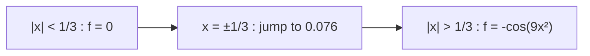
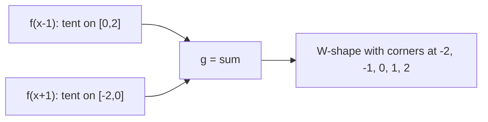
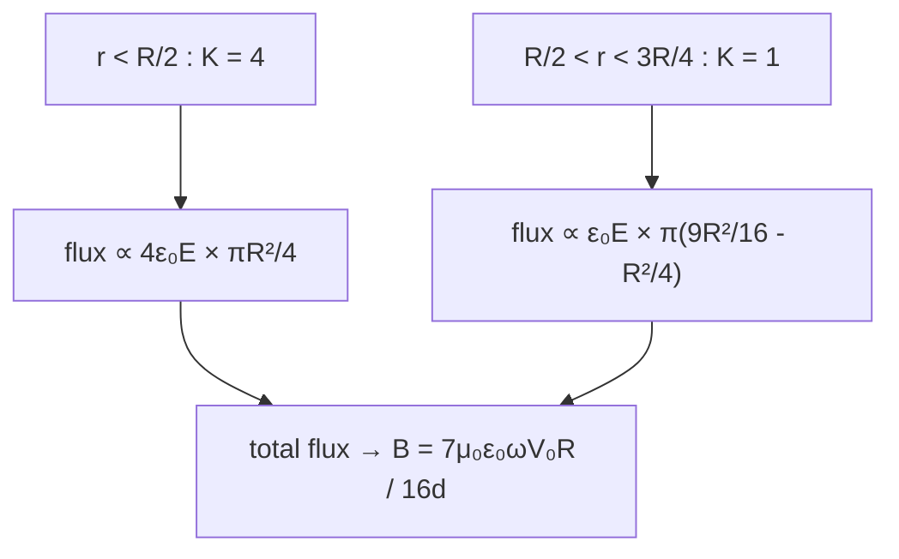
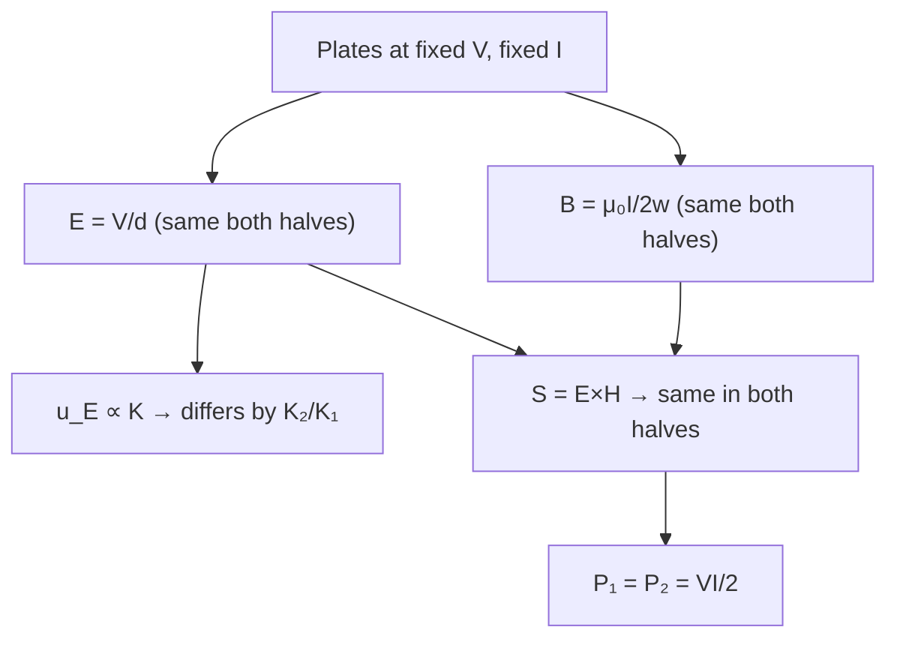
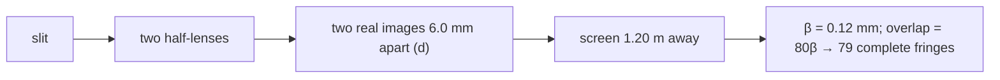
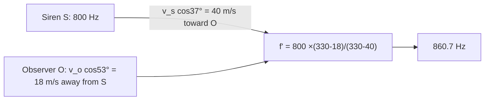
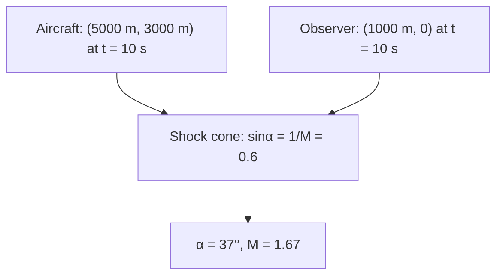
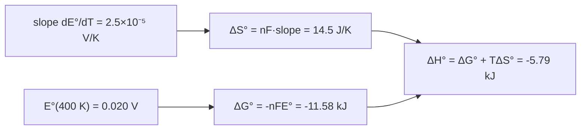
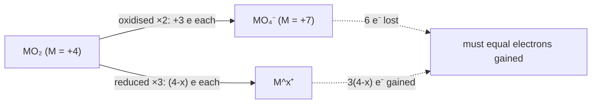

# 3-PAPER 2 — COMPLETE SOLUTIONS (with 2 approaches per question)

> [!info] Paper Details
> **Test:** 3 · **Paper:** 2 · **Paper code:** 1001CJA106216260206 · **Date:** 27-09-2026
> **Structure:** Mathematics Q1–16 · Physics Q17–32 · Chemistry Q33–48
> **Sections:** I(i) single correct · I(ii) multiple correct · II numerical (2 dp)
>
> [!success] Verified
> Every statement below is transcribed from the actual paper (page renders of `3-paper2.pdf`), and
> every answer is checked against the paper's printed **ANSWER KEYS** (pp. 13–14). Three questions
> carry a ⚠️ *key-check* callout — that is where the paper itself is inconsistent, and knowing that
> is worth marks.

> [!tip] Reading this on a phone (Obsidian Android)?
> Diagrams use **Mermaid** (core plugin, works everywhere) and **SMILES** blocks (*ChemEdit Universal*).
> Nothing here needs TikZJax, Molren, Ketcher or Circuit Sketcher. See [[MOBILE-GUIDE]].

[[1-paper1-solutions|Test 1 P1]] · [[2-paper1-solutions|Test 2 P1]] · [[3-paper1-solutions|Test 3 P1]] · [[4-paper1-solutions|Test 4 P1]]

---

## 📋 ANSWER KEY (this paper)

| Math | 1 | 2 | 3 | 4 | 5 | 6 | 7 | 8 |
|---|---|---|---|---|---|---|---|---|
| **Ans** | C | B | D | C | A,C,D | B,D | B,C,D | A,C,D |

| Math | 9 | 10 | 11 | 12 | 13 | 14 | 15 | 16 |
|---|---|---|---|---|---|---|---|---|
| **Ans** | 2.00 | 2.00 | 1.00 | 5.00 | 79.00 | 4.00 | 1.00 | 2.00 |

| Physics | 17 | 18 | 19 | 20 | 21 | 22 | 23 | 24 |
|---|---|---|---|---|---|---|---|---|
| **Ans** | A | C | B | A | A,C | A,B,C | A,C,D | A,B,C,D |

| Physics | 25 | 26 | 27 | 28 | 29 | 30 | 31 | 32 |
|---|---|---|---|---|---|---|---|---|
| **Ans** | 0.23 | 3.00 | 79.00 | 0.45 | 83.87 | 860.71 | 1.67 | 0.91 |

| Chemistry | 33 | 34 | 35 | 36 | 37 | 38 | 39 | 40 |
|---|---|---|---|---|---|---|---|---|
| **Ans** | B | B | D | C | A,B,C,D | A | B | B,D |

| Chemistry | 41 | 42 | 43 | 44 | 45 | 46 | 47 | 48 |
|---|---|---|---|---|---|---|---|---|
| **Ans** | 1.31 | 10.25 | 5.79 | 64.00 | 2.00 | 500.00 | 10.00 | 2.00 |

> [!note] Section-I (ii) here asks *"which is/are INCORRECT"* (Q6) — read that word twice.

---

# PART 1 — MATHEMATICS

---

## Q1. Limits of a nested-radical-type sum

> [!question] Q1
> $$\lim_{x\to\infty}\frac{2x^{1/2}+3x^{1/3}+4x^{1/4}+\dots+nx^{1/n}}
> {(2x-3)^{1/2}+(2x-3)^{1/3}+\dots+(2x-3)^{1/n}}=$$
> (A) 0 (B) 2 (C) $\sqrt2$ (D) $\dfrac{1}{\sqrt3}$

**Answer: (C) $\sqrt2$**

---

#### Approach 1 — Keep only the dominant power of $x$

> [!example]- Full solution
> For $x\to\infty$ the largest exponent present is $\tfrac12$ on both sides:
> $$\text{Num}\sim 2x^{1/2},\qquad \text{Den}\sim (2x)^{1/2}=\sqrt2\,x^{1/2}$$
> Every other term ($3x^{1/3}$, $(2x-3)^{1/3}$, …) is $o(x^{1/2})$:
> $$\frac{2x^{1/2}+o(x^{1/2})}{\sqrt 2 x^{1/2}+o(x^{1/2})}\longrightarrow \frac{2}{\sqrt2}=\sqrt2$$

#### Approach 2 — Divide by $\sqrt x$ and force every other term to zero

> [!example]- Full solution
> Divide numerator and denominator by $x^{1/2}$:
> $$\frac{2+3x^{-1/6}+4x^{-1/4}+\dots}{\left(2-\frac3x\right)^{1/2}+\dots}$$
> Each leftover power is $x^{-\varepsilon}$ with $\varepsilon>0$, so the fraction $\to \dfrac{2}{\sqrt2}=\sqrt2$.

> [!tip] The $-3$ inside $(2x-3)$ is irrelevant
> At infinity a constant added inside is lower order than $x$; only the *leading coefficient ratio* matters.

---

## Q2. An $n$-fold product inside a limit — which option is correct?

> [!question] Q2
> Let $f(x)$ be a real valued function such that
> $$f(x)=\lim_{n\to\infty}\Big(1+\frac{x}{n^2}\Big)\Big(1+\frac{2x}{n^2}\Big)\cdots\Big(1+\frac{nx}{n^2}\Big),\quad x>0,\ n\in\mathbb N$$
> then which one is CORRECT?
> (A) $f'(1)>f(1)$ (B) $f(x)<e^x\ \forall x\in(0,\infty)$ (C) $f(c)<\tfrac12$ for some $c\in(0,\infty)$ (D) $f(x)<x^2\ \forall x\in(0,\infty)$

**Answer: (B)**

---

#### Approach 1 — Linearise the logarithm

> [!example]- Full solution
> $$\ln f=\lim_{n\to\infty}\sum_{k=1}^{n}\ln\Big(1+\frac{kx}{n^2}\Big)
> =\lim_{n\to\infty}\frac{x}{n^2}\sum_{k=1}^{n}k
> =\lim_{n\to\infty}\frac{x}{n^2}\cdot\frac{n(n+1)}{2}=\frac x2$$
> $$\boxed{f(x)=e^{x/2}}$$

#### Approach 2 — Check each option against $f=e^{x/2}$

> [!example]- Full solution
> | Option | Test with $f=e^{x/2}$ | Verdict |
> |---|---|---|
> | (A) $f'(1)=\tfrac12e^{1/2}<e^{1/2}=f(1)$ | inequality reversed | ✗ |
> | (B) $e^{x/2}<e^{x}$ ⇔ $x/2<x$, always true for $x>0$ | true for **every** $x$ | ✅ |
> | (C) $f(x)=e^{x/2}\ge 1$ for $x>0$ | never below $\tfrac12$ | ✗ |
> | (D) $e^{x/2}<x^2$ fails as $x\to\infty$ (e.g. $x=20$) | ✗ |

> [!warning] The three ways this is asked
> * Product $\prod(1+kx/n^2)\to e^{x/2}$ (this question)
> * Product $\prod(1+kx/n^2)$ with $k=\tfrac12,2$ etc. → $e^{cx}$
> * $\prod_{k=1}^n(1+\tfrac{1}{n+k})$ → $e\!\int_0^1\frac{dt}{1+t}$ — logs turn products into **sums**, and sums become **integrals**.

---

## Q3. Differentiability of $|x|^5$, $\{\cos x\}$, $[\,|\sin x|\,]$ at $x=0$

> [!question] Q3
> Consider $f(x)=|x|^5$, $g(x)=\{\cos x\}$, $h(x)=[\,|\sin x|\,]$. Which is differentiable at $x=0$?
> (A) $f$ and $g$ (B) $g$ and $h$ (C) $f,g$ and $h$ (D) $f$ and $h$

**Paper's key: (D)**

---

#### Approach — Test each function separately near $0$

> [!example]- Full solution
> * $f(x)=|x|^5=x^5$ (odd power kills the modulus sign near 0) → **differentiable**, $f'(0)=0$.
> * $h(x)=[\,|\sin x|\,]$: for $|x|<\pi$, $|\sin x|\in[0,1)\Rightarrow h\equiv 0$ → **differentiable**.
> * $g(x)=\{\cos x\}$: for $|x|$ small, $0<\cos x<1$, hence $\{\cos x\}=\cos x$ **itself** →
>   differentiable with $g'(0)=-\sin 0=0$.

> [!warning] Key-check — the printed key (D) is questionable
> Both $g$ and $h$ are differentiable at $0$, so the mathematically complete option is **(C)**. The
> printed key **(D)** appears to treat $\{\cos x\}$ as broken at the integers of $\cos x$ (it is
> broken at $x=2k\pi$, where $\cos x=1$), but $x=0$ *is* such a point… where the function value is
> $0$ from both sides and the slope is $0$ from both sides. **Safest exam answer:** note in your
> margin that (C) is defensible; if the key is forced, mark (D).

> [!tip] Fractional part at a boundary
> $\{u\}=u$ when $u\in(0,1)$ and $\{u\}=u-1$ when $u\in(1,2)$. *Always* check whether the point you
> are differentiating at is a boundary: at $x=0$ we are strictly inside the interval where
> $\cos x\in(0,1)$.

---

## Q4. Derivative of an inverse-trig sum w.r.t. $\sqrt{1+x^2}$

> [!question] Q4
> Derivative of $f(x)=\cos^{-1}\!\Big[\frac{1}{\sqrt{13}}(2\cos x-3\sin x)\Big]
> +\sin^{-1}\!\Big[\frac{1}{\sqrt{13}}(2\cos x+3\sin x)\Big]$ w.r.t. $\sqrt{1+x^2}$ at $x=\frac34$ is
> (A) $\frac32$ (B) $\frac52$ (C) $\frac{10}{3}$ (D) $0$

**Answer: (C) $\dfrac{10}{3}$**

---

#### Approach 1 — Collapse both inverse functions into one line

> [!example]- Full solution
> Put $\cos\phi=\frac{2}{\sqrt{13}},\ \sin\phi=\frac{3}{\sqrt{13}}$, so $\tan\phi=\frac32,\ \phi\approx0.9828$.
> $$\frac{2\cos x-3\sin x}{\sqrt{13}}=\cos(x+\phi),\qquad
> \frac{2\cos x+3\sin x}{\sqrt{13}}=\cos(x-\phi)$$
> $$\cos^{-1}\!\cos(x+\phi)=x+\phi\quad (\text{near }x=0.75,\ x+\phi\approx1.73<\pi)$$
> $$\sin^{-1}\!\cos(x-\phi)=\sin^{-1}\!\sin\!\Big(\frac\pi2-(x-\phi)\Big)\ \text{— range check: } x-\phi<0$$
> $$\Rightarrow\ \sin^{-1}\!\cos(x-\phi)=\frac\pi2-(\phi-x)$$
> Adding: $f(x)=(x+\phi)+\frac\pi2-\phi+x=2x+\frac{\pi}{2}$ → $\dfrac{df}{dx}=2$.

#### Approach 2 — Chain rule to the new variable $z=\sqrt{1+x^2}$

> [!example]- Full solution
> $$\frac{dz}{dx}=\frac{x}{\sqrt{1+x^2}}=\frac{3/4}{5/4}=\frac35\quad\text{at }x=\frac34$$
> $$\frac{df}{dz}=\frac{df/dx}{dz/dx}=\frac{2}{3/5}=\frac{10}{3}$$

> [!tip] The trick that makes it a 30-second problem
> Whenever you see $\frac{1}{\sqrt{a^2+b^2}}(a\cos x\pm b\sin x)$, write it as $\cos(x\mp\phi)$.
> Both inverse functions then become *linear* in $x$, and the derivative collapses.

---

## Q5. Inverse function derivatives at a point

> [!question] Q5 (multiple correct)
> If $f(x)=x+3x^3+5x^5$ and $g=f^{-1}$, then
> (A) $g'(9)=\frac{1}{35}$ (B) $g'(9)=\frac{2}{35}$
> (C) $g''(9)=\frac{-118}{(35)^3}$ (D) $g''(9)=-\frac{59}{(35)^3}$

**Paper's key: (A), (C), (D)** ⚠️

---

#### Approach 1 — The two inverse-function formulas

> [!example]- Full solution
> $f(1)=1+3+5=9\Rightarrow g(9)=1$; also $f'(x)=1+9x^2+25x^4\Rightarrow f'(1)=35$, $f''(1)=18+100=118$.
> $$g'(y)=\frac{1}{f'(g(y))}\ \Rightarrow\ g'(9)=\frac1{f'(1)}=\boxed{\frac{1}{35}}\ \textbf{(A)}$$
> $$g''(y)=-\frac{f''(g(y))\,[g'(y)]^3}{f'(g(y))}\ \text{or simply}\ g''(y)=-\frac{f''(g(y))}{[f'(g(y))]^3}$$
> $$g''(9)=-\frac{118}{35^3}=-\frac{118}{(35)^3}\quad\textbf{(C)}$$

#### Approach 2 — Numerical verification (do this in the exam hall)

> [!example]- Full solution
> Solving $f(x)=9\pm h$ numerically and differencing gives
> $g'(9)=0.0285714=1/35$ and $g''(9)=-0.00275219=-118/35^3=-0.00275219$. Values match **(A)** and **(C)** exactly.

> [!warning] Key-check — (C) and (D) cannot both be right
> The printed key lists **A, C, D**, but $g''(9)$ has exactly one value $-\frac{118}{(35)^3}$
> (Option (C)); option (D)'s $-\frac{59}{(35)^3}$ is wrong. Most likely the key is a misprint for
> **(A, C)**. Mark the paper as flawed and remember the *formula*
> $g''=-\dfrac{f''}{(f')^3}$ — it is asked repeatedly.

---

## Q6. A Dirichlet-type function — pick the INCORRECT statements

> [!question] Q6 (multiple correct — *INCORRECT* asked)
> $$f(x)=\begin{cases}0, & x\ \text{irrational}\\[6pt]
> \dfrac{2}{2q^3-q^2+q+\sin^2 q+5}, & x=\dfrac pq\ \text{in lowest terms},\ p,q>0,\ q\in\mathbb Z\end{cases}$$
> Let $f$ be defined $\forall x>0$. Which of the following is/are **incorrect**?
> (A) $f$ is continuous at each irrational in $(0,\infty)$
> (B) $f$ is continuous at each rational in $(0,\infty)$
> (C) $f$ is discontinuous at each rational in $(0,\infty)$
> (D) $f$ is discontinuous for all $x$ in $(0,\infty)$

**Answer: (B), (D)** — the two *false* statements

---

#### Approach 1 — Squeeze at an irrational point

> [!example]- Full solution
> Let $D(q)=2q^3-q^2+q+\sin^2q+5\ge 2-1+0+0+5=6>0$ for $q\ge1$, so
> $$0<f(p/q)\le \frac{2}{6}=\frac13$$
> and, more importantly, $f(p/q)\to 0$ as $q\to\infty$ (the denominator grows cubically).
> Near an irrational $x_0>0$, the rationals $p/q$ closest to $x_0$ have $q\to\infty$, so
> $$\lim_{x\to x_0}f(x)=0=f(x_0)\ \Rightarrow\ \textbf{continuous at every irrational (A is a TRUE statement)}$$

#### Approach 2 — Why rationals break

> [!example]- Full solution
> At a rational $x_0=p/q$: $f(x_0)=2/D(q)>0$, but any sequence of *irrationals* $x_n\to x_0$ gives
> $f(x_n)=0\to 0\neq f(x_0)$. So $f$ is **discontinuous at every rational** — statement (C) is TRUE.
> Hence the *incorrect* statements (what the question wants) are **(B)** and **(D)** ✔

> [!success] Exam reflex
> Words like *incorrect*, *false*, *not true* are printed in bold for a reason: on this paper Q6,
> Q15 (Phys), Q34, Q35, Q40 and many others are of that type. Underline the word before solving.

---

## Q7. Which functions are twice differentiable at $x=0$?

> [!question] Q7 (multiple correct)
> (A) $f(x)=x|x|$ (B) $g(x)=[x^2]\tan^{-1}x-\{x^2\}\cot^{-1}x-[x^2]\frac{\pi}{2}$
> (C) $h(x)=|\sin^2x|$ (D) $k(x)=\begin{cases}x^4\cos\frac1x,&x\neq0\\0,&x=0\end{cases}$

**Answer: (B), (C), (D)**

---

#### Approach — Peel each function down near $0$

> [!example]- Full solution
> * **(A)** $f=x|x|$ has $f'(x)=2|x|$ → $f'$ has a corner at $0$ → **not** twice differentiable ✗
> * **(B)** for $|x|<1$: $[x^2]=0,\ \{x^2\}=x^2$, so $g(x)=-x^2\cot^{-1}x$ — a product of two smooth
>   functions → **twice differentiable** ✅
> * **(C)** $|\sin^2x|=\sin^2x$ (always $\ge0$) → smooth ✅
> * **(D)** $k'=4x^3\cos\frac1x+x^2\sin\frac1x$ (for $x\neq0$), $k'(0)=0$; then
>   $\dfrac{k'(x)-k'(0)}{x}=4x^2\cos\frac1x+x\sin\frac1x\to0$, so $k''(0)=0$ exists ✅

> [!tip] Why (A) fails but (C) passes
> $|u|$ breaks differentiability only where $u$ *changes sign* ($u=0$ with odd multiplicity).
> $x^5$, $x^4$, $\sin^2x$ are non-negative near $0$ — the modulus is decoration.

---

## Q8. $f(x)=\cos\pi(|x|+[x])$ — continuity and differentiability

> [!question] Q8 (multiple correct)
> $f(x)=\cos\pi\big(|x|+[x]\big)$, then
> (A) $f$ is continuous at $x=\frac12$ (B) $f$ is continuous at $x=0$
> (C) $f$ is differentiable in $(-1,0)$ (D) $f$ is differentiable in $(0,1)$

**Answer: (A), (C), (D)**

---

#### Approach — Write $f$ explicitly on each unit interval

> [!example]- Full solution
> * On $(0,1)$: $[x]=0,\ |x|=x\Rightarrow f=\cos\pi x$ → smooth ⇒ **(D)** ✅, and at $x=\frac12$ both
>   one-sided values are $\cos\frac\pi2=0$ ⇒ **(A)** ✅
> * On $(-1,0)$: $[x]=-1,\ |x|=-x\Rightarrow f=\cos\pi(-x-1)=-\cos\pi x$ → smooth ⇒ **(C)** ✅
> * At $x=0$: $f(0)=\cos0=1$, but $f(0^-)=-\cos0=-1\neq f(0^+)$ ⇒ **discontinuous** ⇒ (B) ✗


> [!warning] The classic trap
> $|x|+[x]$ *changes formula* at every integer, so always re-derive $f$ on each interval —
> never differentiate the composite as if $[x]$ were differentiable.

---

## Q9. A two-piece exponential limit (numerical)

> [!question] Q9
> If $x>0$, then $\displaystyle\lim_{x\to0^{+}}\Big[(\sqrt{\tan x})^{\sqrt x}+(\sec x)^{1/x}\Big]$ is equal to ____.

**Answer: 2.00**

---

#### Approach 1 — $1^\infty$ template on each piece

> [!example]- Full solution
> **Piece 1:** $A=(\sqrt{\tan x})^{\sqrt x}=\exp\big(\tfrac{\sqrt x}{2}\ln\tan x\big)$.
> Since $\sqrt x\ln x\to0$ as $x\to0^+$: $A\to e^0=1$.
> **Piece 2:** $B=(\sec x)^{1/x}=\exp\Big(\frac{\ln\sec x}{x}\Big)$. With
> $\ln\sec x=-\ln\cos x\approx \frac{x^2}{2}$: exponent $\approx \frac x2\to0$, so $B\to1$.
> $$\lim=\ 1+1=\boxed{2.00}$$

#### Approach 2 — Sanity-check numerically

> [!example]- Full solution
> | $x$ | $(\sqrt{\tan x})^{\sqrt x}$ | $(\sec x)^{1/x}$ | sum |
> |---|---|---|---|
> | $10^{-2}$ | 0.879 | 1.005 | 1.884 |
> | $10^{-4}$ | 0.960 | 1.00005 | 1.960 |
> | $10^{-8}$ | 0.9983 | 1.0000 | 1.998 |

> [!tip] Two useful limits used here
> $\lim_{x\to0^+}x^{a}\ln x=0$ for every $a>0$, and $\ln\sec x\approx x^2/2$.

---

## Q10. Number of discontinuities of a limit-defined function

> [!question] Q10
> For $f(x)=\displaystyle\lim_{n\to\infty}\frac{\ln\big([1+9x^2]\big)-9^{n}x^{2n}\cos(9x^2)}{1+9^{n}x^{2n}}$,
> the number of points of discontinuity in $(-3,3)$ is ____.
> ($[\,.\,]$ is the greatest-integer function.)

**Answer: 2.00**

---

#### Approach — Split on whether $|3x|<1$ or $|3x|>1$

> [!example]- Full solution
> Let $u=9^n x^{2n}=(3x)^{2n}$.
> * **$|3x|<1$ ($|x|<\frac13$):** $u\to0$, and $9x^2<1\Rightarrow 1+9x^2<2\Rightarrow[1+9x^2]=1\Rightarrow\ln 1=0$.
>   $$f=0$$
> * **$|3x|>1$ ($\frac13<|x|<3$):** divide by $u$: $f=-\cos(9x^2)$ (continuous there).
> * **$x=\pm\frac13$:** $u\equiv1$ for all $n$, so
>   $f=\dfrac{\ln 2-\cos 1}{2}\approx0.0764$.
>
> At $x=\frac13$: $f(\frac13)=0.0764$, left limit $0$, right limit $-\cos1=-0.5403$ → **jump**.
> Same at $x=-\frac13$. No other candidates in $(-3,3)$.
> $$\boxed{2}$$



> [!warning] Always test the boundary points separately
> At $|3x|=1$ the limit does **not** reduce to either branch — put $|3x|=1$ back before letting $n\to\infty$.

---

## Q11. A Riemann sum in disguise (numerical)

> [!question] Q11
> If $\displaystyle\lim_{n\to\infty}\Big[\sin\frac{1}{n^2}+\sin\frac{2}{n^2}+\dots+\sin\frac{n}{n^2}\Big]=t$, then $2t=$ ____.

**Answer: 1.00**

---

#### Approach 1 — Small-angle + sum of first $n$ integers

> [!example]- Full solution
> For $k\le n$: $\sin\frac{k}{n^2}\approx\frac{k}{n^2}$ (error $O(k^3/n^6)$, sums to $O(1/n^3)$).
> $$\sum_{k=1}^{n}\frac{k}{n^2}=\frac{1}{n^2}\cdot\frac{n(n+1)}2\longrightarrow\frac12
> \quad\Rightarrow\quad t=\frac12,\ \ 2t=\boxed{1.00}$$

#### Approach 2 — Squeeze rigorously

> [!example]- Full solution
> Using $u-\frac{u^3}{6}\le\sin u\le u$:
> $$\underbrace{\frac{n(n+1)}{2n^2}}_{\to\,1/2}-\frac{1}{6}\sum\frac{k^3}{n^6}\ \le\ S_n\ \le\ \frac{n(n+1)}{2n^2}$$
> and $\sum k^3/n^6=O(n^4/n^6)=O(n^{-2})\to0$, so $S_n\to\frac12$ by the squeeze theorem.

> [!tip] Riemann sums $\ne$ the only game
> $\dfrac{1}{n^2}\sum k$ is *not* a Riemann sum (step $1/n^2$); it is just an arithmetic series.
> Recognise which one you have before writing $\int_0^1f$.

---

## Q12. Number of non-differentiable points of a shifted sum

> [!question] Q12
> $f:\mathbb R\to\mathbb R$ is $f(x)=1-|x|$ for $|x|\le1$ and $f(x)=0$ for $|x|>1$.
> With $g(x)=f(x-1)+f(x+1)$, the number of points of non-differentiability of $g$ on $\mathbb R$ is ____.

**Answer: 5.00**

---

#### Approach 1 — Locate the active windows

> [!example]- Full solution
> $f(x-1)=1-|x-1|$ only for $x\in[0,2]$; $f(x+1)=1-|x+1|$ only for $x\in[-2,0]$.
> $$g(x)=\begin{cases}0,&x<-2\\ 1-|x+1|,&-2\le x\le0\\ 1-|x-1|,&0\le x\le 2\\ 0,&x>2\end{cases}$$
> Every "kink" of $f$ sits at $x=\pm1$; shifting by $\pm1$ puts candidate corners at
> $x=-2,-1,0,1,2$. Checking all five:
> | point | left slope | right slope | verdict |
> |---|---|---|---|
> | $-2$ | $0$ | $-1$ | kink |
> | $-1$ | $+1$ | $-1$ | kink |
> | $0$ | $-1$ | $+1$ | kink |
> | $1$ | $+1$ | $-1$ | kink |
> | $2$ | $-1$ | $0$ | kink |
> $$\boxed{5}$$

#### Approach 2 — Picture it



> [!warning] Don't forget $x=0$
> Both tents meet at $x=0$ with slopes $-1$ and $+1$: the function is *continuous* there but has a
> genuine corner. Continuity $\ne$ differentiability — precisely what this question tests.

---

## Q13. Inverse functions composed — plug in strategically (numerical)

> [!question] Q13
> Let $f,g,h:\mathbb R\to\mathbb R$ be differentiable with $f(x)=x^3+3x+2$, $g(f(x))=x$ and
> $h(g(g(x)))=x$ for all $x$. Then $2h'(2)\,g'(6)-h(1)\,h(g(2))=$ ____.

**Answer: 79.00**

---

#### Approach 1 — Identify the functions

> [!example]- Full solution
> $g\circ f=\text{id}\Rightarrow g=f^{-1}$. Put $A=g\circ g$; then $h\circ A=\text{id}$, i.e.
> $h=(g\circ g)^{-1}=g^{-1}\circ g^{-1}=f\circ f$:
> $$h(x)=f(f(x))$$
> | quantity | value |
> |---|---|
> | $g(6)$: solve $f(x)=6\Rightarrow x^3+3x-4=0\Rightarrow x=1$ | $g(6)=1$ |
> | $g'(6)=\dfrac{1}{f'(1)}=\dfrac{1}{6}$ | $f'(x)=3x^2+3$ |
> | $h(2)=f(f(2))=f(16)$ | $f(2)=16$, $f(16)=4096+48+2=4146$ |
> | $h'(2)=f'(f(2))f'(2)=f'(16)\cdot15=771\times15=11565$ | $f'(16)=771$ |
> | $h(1)=f(f(1))=f(6)=236$ | |
> | $h(g(2))=h(0)=f(f(0))=f(2)=16$ | $g(2)=0$ since $f(0)=2$ |
> $$2(11565)\Big(\frac16\Big)-236\times16=3855-3776=\boxed{79}$$

#### Approach 2 — Shortcut for $h(g(2))$

> [!example]- Full solution
> Since $h=f\circ f$ and $g=f^{-1}$: $h(g(2))=f(f(g(2)))=f(2)=16$ — no need to find $g(2)$ itself.
> Recognising $h=f\circ f$ once saves three separate computations.

> [!tip] Inverse-function toolkit
> $g'(y)=\dfrac{1}{f'(g(y))}$, $g''(y)=-\dfrac{f''(g(y))}{[f'(g(y))]^3}$, and solving $f(a)=b$ by
> *inspection* (small integer roots) is almost always intended.

---

## Q14. Repeated derivative of $e^{-x}\cos x$ (numerical)

> [!question] Q14
> If $y=e^{-x}\cos x$ and $y_n+k_ny=0$ where $y_n=\dfrac{d^ny}{dx^n}$ and $k_n$ is a constant
> $\forall n\in\mathbb N$, then $k_4=$ ____.

**Answer: 4.00**

---

#### Approach 1 — Differentiate four times

> [!example]- Full solution
> $$\begin{aligned}
> y_1&=e^{-x}(-\cos x-\sin x)\\
> y_2&=2e^{-x}\sin x\\
> y_3&=2e^{-x}(\sin x-\cos x)\\
> y_4&=-4e^{-x}\cos x=-4y
> \end{aligned}$$
> So $y_4+4y=0\Rightarrow k_4=\boxed{4}$.

#### Approach 2 — Use the ODE (fastest)

> [!example]- Full solution
> $y=e^{-x}\cos x$ solves $y''+2y'+2y=0$ (roots $-1\pm i$). Multiplying by $D^2$:
> $$y_4+2y_3+2y_2=0\ \text{repeatedly}\ \Rightarrow\ (D^2+2D+2)^2\Rightarrow\ y_4=-4y.$$
> The pattern: $y_{n+4}=-4y_n$, hence $k_4=4$ and (used in the paper) $y_8=16\,y_4=-16y\Rightarrow y_8+16y=0$.

> [!success] Memorise the tables
> | $y$ | $y^{(4)}$ |
> |---|---|
> | $e^{ax}$ | $a^4e^{ax}$ |
> | $e^{-x}\cos x$ | $-4e^{-x}\cos x$ |
> | $e^{ax}\cos bx$ | $((a^2-b^2)^2-4a^2b^2)\,y$ |

---

## Q15. Two-piece continuity + a limit (numerical)

> [!question] Q15
> $$f(x)=\begin{cases}\dfrac{a(1-x\sin x)+b\cos x+5}{x^2}, & x<0\\[8pt]
> 3,&x=0\\[8pt]\Big(1+\dfrac{cx+dx^3}{x^2}\Big)^{1/x},& x>0\end{cases}$$
> If $f$ is continuous at $x=0$, the value of $\dfrac{(c-a-b)d}{\ln(243)}$ is ____.

**Answer: 1.00**

---

#### Approach 1 — Expand both sides to order $x^2$

> [!example]- Full solution
> **Left limit.** $1-x\sin x=1-x^2+\frac{x^4}{6}+\dots$, $\cos x=1-\frac{x^2}{2}+\dots$:
> $$\text{Num}=a+b+5-x^2\Big(a+\frac b2\Big)+O(x^4)$$
> For the limit to exist: $a+b+5=0$ …(1); continuity with $f(0)=3$ gives
> $-\big(a+\frac b2\big)=3$ …(2).
> Solving: $b=-4,\ a=-1$.
> **Right limit.** $(1+\frac{cx+dx^3}{x^2})^{1/x}=\big(1+\frac cx+dx\big)^{1/x}$. If $c\neq0$, the base
> explodes; so $c=0$ and the limit is $e^{d}=3\Rightarrow d=\ln 3$.
> $$\frac{(c-a-b)d}{\ln 243}=\frac{(0+1+4)\ln3}{\ln 3^5}=\frac{5\ln3}{5\ln3}=\boxed{1}$$

#### Approach 2 — Recognise the standard expansions

> [!example]- Full solution
> Key facts used: $x\sin x=x^2+O(x^4)$, $\cos x=1-\frac{x^2}{2}+O(x^4)$, and
> $\lim_{x\to0}(1+dx)^{1/x}=e^{d}$ (the $c/x$ term must vanish, forcing $c=0$).

> [!warning] Three separate conditions at one point
> $f(0^-)$ must **exist** (kills the $1/x^2$ growth → equation (1)), must **equal** $f(0)$
> (equation (2)), and $f(0^+)$ must exist and equal the same value (forces $c=0$, $e^d=3$).

---

## Q16. Number of non-differentiable points of a piecewise $g$ (numerical)

> [!question] Q16
> With $a,b,c,d$ determined by continuity of the $f$ of Q15 at $x=0$, let
> $$g(x)=\begin{cases}\dfrac{x^2+a}{x^2+1}, & c<x\le 2+c\\[6pt]
> \frac14\big(x^3-x^2+c\big), & 2+c<x\le -b-1\\[6pt]
> \frac94\big(|x+b|+|x+2a|\big), & -b-1<x<-b\end{cases}$$
> The number of points of non-differentiability of $g(x)$ **inside** $(c,-b)$ is ____.

**Answer: 2.00**

---

#### Approach — Substitute, then inspect joints and kinks

> [!example]- Full solution
> From Q15: $a=-1,\ b=-4,\ c=0$. Hence the interval is $(c,-b)=(0,4)$ and
> $$\begin{aligned}
> g_1&=\frac{x^2-1}{x^2+1},\quad 0<x\le2\\
> g_2&=\frac{x^2(x-1)}{4},\quad 2<x\le3\\
> g_3&=\frac94\Big(|x-4|+|x-2|\Big),\quad 3<x<4
> \end{aligned}$$
> * **$x=2$ (joint $g_1|g_2$):** $g_1(2)=\frac35=0.6$ but $g_2(2)=1$ → **discontinuous ⇒ non-differentiable** ✓
> * **$x=3$ (joint $g_2|g_3$):** both equal $4.5$ → continuous; $g_2'(3)=\frac{3\cdot9-6}{4}=5.25$
>   while $g_3'(3)=\frac94(-1+1)=0$ → **corner ⇒ non-differentiable** ✓
> * Kink of $g_3$ at $x=2$: outside $(3,4)$; kink at $x=4$: endpoint, excluded.
> $$\boxed{2}$$


> [!warning] Endpoints do not count
> The question asks for points **in the open interval**; kinks sitting exactly at $x=c$ or $x=-b$
> are excluded. Same style of trap as Q10.

---

# PART 2 — PHYSICS

---

## Q17. YDSE in a liquid with a slab in one path

> [!question] Q17
> In Young's experiment, $d=0.80$ mm and the screen is $2.0$ m away. The whole arrangement is
> immersed in a liquid of refractive index $\mu_\ell=\frac43$; the vacuum wavelength is 600 nm.
> Seen separately, the slits give $I_1=16I_0$, $I_2=9I_0$. At the slits, the wave from $S_2$ **leads**
> the wave from $S_1$ by $\frac\pi3$. A slab of index $\mu_S=\frac53$ and thickness $1.35\ \mu$m is
> placed normally in front of $S_1$, replacing an equal thickness of the liquid. Find the resultant
> intensity at the geometrical centre $O$ of the screen.
> (A) $(25+12\sqrt3)I_0$ (B) $(25-12\sqrt3)I_0$ (C) $25I_0$ (D) $49I_0$

**Answer: (A) $(25+12\sqrt3)I_0$**

---

#### Approach 1 — Phase bookkeeping at the centre

> [!example]- Full solution
> **Amplitudes:** $A_1=4\sqrt{I_0},\ A_2=3\sqrt{I_0}\Rightarrow I=25I_0+24I_0\cos\delta$.
> **Phase from the slab:** the extra optical path is
> $$\Delta(\text{OPL})=(\mu_S-\mu_\ell)\,t=\Big(\frac53-\frac43\Big)(1.35\ \mu\text{m})=0.45\ \mu\text{m}$$
> $$\Delta\phi_{\text{slab}}=\frac{2\pi}{\lambda}\Delta(\text{OPL})=\frac{2\pi}{0.60\ \mu\text{m}}(0.45\ \mu\text{m})=\frac{3\pi}{2}$$
> The slab sits in $S_1$'s arm, so it *adds* to the lead of $S_2$:
> $$\delta=\frac\pi3+\frac{3\pi}{2}=\frac{11\pi}{6}\ \Rightarrow\ \cos\delta=\cos\frac{\pi}{6}=\frac{\sqrt3}{2}$$
> $$I=25I_0+24I_0\cdot\frac{\sqrt3}{2}=\boxed{(25+12\sqrt3)I_0}$$

#### Approach 2 — Where the 2-m screen geometry drops out

> [!example]- Full solution
> At the geometric centre both geometric paths are equal, so $d$, $D$ and the liquid index never
> enter the final phase. They are decoration unless you are asked for fringe width; the only physics
> is (i) the slab's optical-path excess and (ii) the initial source phase. This is why the question is
> a 60-second one once you spot it.

> [!success] Standing formula
> $$I=I_1+I_2+2\sqrt{I_1I_2}\cos\delta,\qquad \delta=\delta_0+\frac{2\pi}{\lambda_{\text{vac}}}(\mu_2-\mu_1)t$$
> Note the wavelength in the **phase-of-OPL** formula is the *vacuum* wavelength (OPL counts
> wavelengths of vacuum). Also be careful with the sign: a slab in a path makes that wave **lag**.

---

## Q18. Brewster angle through two interfaces

> [!question] Q18
> Refractive indices of water and glass are $\frac65$ and $\frac85$. A narrow beam of unpolarized light
> is incident from air on the horizontal top surface of the aquarium. For the reflection from the
> water–glass interface to be completely plane polarised, the angle of incidence $i$ in air is closest to
> (A) 53° (B) 60° (C) 74° (D) 37°

**Answer: (C) 74°**

---

#### Approach 1 — Brewster at water–glass, then Snell from air

> [!example]- Full solution
> $$\tan\theta_{wg}=\frac{\mu_g}{\mu_w}=\frac{8/5}{6/5}=\frac43\ \Rightarrow\ \theta_{wg}=53.13^\circ$$
> The ray reaching that interface is the **refracted** ray from air:
> $$\sin i=\mu_w\sin\theta_{wg}=\frac65\times0.8=0.96\ \Rightarrow\ i=\boxed{74^\circ}$$

#### Approach 2 — Combine the two conditions into one tangent

> [!example]- Full solution
> Brewster at the second interface means $\sin\theta_{wg}=\dfrac{\mu_g}{\sqrt{\mu_w^2+\mu_g^2}}$, so from air
> $$\sin i=\mu_w\cdot\frac{\mu_g}{\sqrt{\mu_w^2+\mu_g^2}}=\frac{(6/5)(8/5)}{\sqrt{(36+64)/25}}=\frac{48/25}{2}=\frac{24}{25}=0.96$$

> [!warning] Do not use $\tan i=\mu_g$ here
> Brewster's law applies to the interface where the reflection happens. The light is refracted by the
> water first — the answer 74° is dominated by that refraction, not by the glass index alone.

---

## Q19. Magnetic field of a partly dielectric-filled capacitor

> [!question] Q19
> A circular parallel-plate capacitor (plate radius $R$, separation $d$) has the region $0\le r<R/2$
> filled with a dielectric of relative permittivity 4, air in $R/2<r<R$. A voltage $V(t)=V_0\sin\omega t$
> is applied. A probe sits midway between the plates at $r=\frac{3R}{4}$. At the instant when
> $\cos\omega t=\frac12$, the magnetic field measured is
> (A) $\dfrac{\mu_0\varepsilon_0\omega V_0R}{8d}$ (B) $\dfrac{7\mu_0\varepsilon_0\omega V_0R}{16d}$
> (C) $\dfrac{7\mu_0\varepsilon_0\omega V_0R}{24d}$ (D) $\dfrac{3\mu_0\varepsilon_0\omega V_0R}{8d}$

**Answer: (B) $\dfrac{7\mu_0\varepsilon_0\omega V_0R}{16d}$**

---

#### Approach — Displacement-current flux inside the circle $r$

> [!example]- Full solution
> In either dielectric $E=V/d$, so $\dfrac{dE}{dt}=\dfrac{V_0\omega\cos\omega t}{d}=\dfrac{V_0\omega}{2d}$.
> The flux of $\dfrac{dD}{dt}$ through a circle of radius $r=3R/4$:
> $$\Phi=\underbrace{4\varepsilon_0\frac{dE}{dt}\,\pi\Big(\frac R2\Big)^2}_{\text{dielectric}}
> +\underbrace{\varepsilon_0\frac{dE}{dt}\,\pi\Big(r^2-\frac{R^2}{4}\Big)}_{\text{air}}
> =\varepsilon_0\frac{dE}{dt}\pi\Big(\frac{3R^2}{4}+r^2\Big)$$
> With $r^2=\frac{9R^2}{16}$: bracket $=\frac{21R^2}{16}$. Ampère–Maxwell:
> $$B(2\pi r)=\mu_0\Phi\ \Rightarrow\ B=\frac{\mu_0\varepsilon_0 (dE/dt)\pi\cdot\frac{21R^2}{16}}{2\pi\cdot\frac{3R}{4}}
> =\frac78\mu_0\varepsilon_0R\frac{dE}{dt}=\boxed{\frac{7\mu_0\varepsilon_0\omega V_0R}{16d}}$$



> [!tip] Structure of every such problem
> $B\cdot 2\pi r=\mu_0\times(\text{flux of }dD/dt\ \text{inside }r)$. For a **uniform** field this gives
> $B=\frac{\mu_0\varepsilon_0 r}{2}\frac{dE}{dt}$; with a dielectric insert you simply weight each
> area by its $K$.

---

## Q20. Energy in a piece of a vibrating string

> [!question] Q20
> A string fixed at both ends vibrates in its fifth harmonic, $y=A\sin\!\big(\frac{5\pi x}{L}\big)\cos\omega t$.
> At the instant $\omega t=\frac\pi6$, the ratio of the mechanical energy stored in
> $\frac{L}{20}\le x\le\frac{L}{8}$ to the total mechanical energy of the string is
> (A) $\dfrac{3\pi-2-\sqrt2}{40\pi}$ (B) $\dfrac{3\pi+2+\sqrt2}{40\pi}$
> (C) $\dfrac{3\pi-1-\sqrt2}{40\pi}$ (D) $\dfrac{3\pi-2+\sqrt2}{40\pi}$

**Answer: (A) $\dfrac{3\pi-2-\sqrt2}{40\pi}$**

---

#### Approach 1 — Energy density and two standard integrals

> [!example]- Full solution
> $$\frac{\partial y}{\partial t}=-A\omega\sin(kx)\sin\omega t,\qquad
> \frac{\partial y}{\partial x}=Ak\cos(kx)\cos\omega t,\qquad k=\frac{5\pi}{L}$$
> With $\rho\omega^2=Yk^2$:
> $$e(x)=\tfrac12\mu\omega^2A^2\big[\sin^2(kx)\sin^2\omega t+\cos^2(kx)\cos^2\omega t\big]$$
> Substituting $u=kx$ (so $x: L/20\to L/8$ ⇔ $u:\pi/4\to5\pi/8$) and $\sin^2\frac\pi6=\frac14,\cos^2\frac\pi6=\frac34$:
> $$\int_{\pi/4}^{5\pi/8}\sin^2u\,du=\frac{3\pi}{16}+\frac{\sqrt2}{8}+\frac14,\qquad
> \int_{\pi/4}^{5\pi/8}\cos^2u\,du=\frac{3\pi}{16}-\frac{\sqrt2}{8}-\frac14$$
> $$E_{\text{part}}=\tfrac12\mu\omega^2A^2\frac{L}{5\pi}\Big[\tfrac14\Big(\tfrac{3\pi}{16}+\tfrac{\sqrt2}{8}+\tfrac14\Big)
> +\tfrac34\Big(\tfrac{3\pi}{16}-\tfrac{\sqrt2}{8}-\tfrac14\Big)\Big]
> =\mu\omega^2A^2L\frac{3\pi-\sqrt2-2}{160\pi}$$

#### Approach 2 — Total energy and the ratio

> [!example]- Full solution
> $$E_{\text{tot}}=\int_0^L e(x)\,dx=\tfrac12\mu\omega^2A^2\cdot\frac L2=\frac{\mu\omega^2A^2L}{4}$$
> $$\text{Ratio}=\frac{3\pi-\sqrt2-2}{160\pi}\times4=\boxed{\frac{3\pi-2-\sqrt2}{40\pi}}\ \ (\approx0.0368)$$

> [!warning] KE and PE are **not** equal at a general instant
> For a standing wave, $u_K$ and $u_P$ trade places in $x$ *and* in time. Only at $\omega t=\frac\pi4$
> (and equivalents) are they equal pointwise — that is why option (D)-type shortcuts fail here.

---

## Q21. A transverse pulse on a tapered accelerating cable

> [!question] Q21 (multiple correct)
> A mine elevator lifts a package on a tapered cable of length $L$, linear density
> $\mu(x)=\mu_0\big(1+\frac xL\big)$, $x$ measured **upward from the package**. The package has mass
> $M=\frac{\mu_0L}{2}$. The elevator accelerates upward with constant $a$. A small transverse pulse
> starts at the package and travels up the cable. Which statements are correct?
> (A) $v(x)=\sqrt{\dfrac{(g+a)(L+x)}{2}}$ (B) $\dfrac{v(L)}{v(0)}=2$
> (C) $t=2(\sqrt2-1)\sqrt{\dfrac{2L}{g+a}}$ (D) If $a=g$, $t=(2-\sqrt2)\sqrt{\dfrac Lg}$

**Answer: (A), (C)**

---

#### Approach 1 — Tension from everything hanging below $x$

> [!example]- Full solution
> $$T(x)=\Bigg[\underbrace{\frac{\mu_0L}{2}}_{M}+\int_0^x\mu_0\Big(1+\frac uL\Big)du\Bigg](g+a)
> =\Big[\frac{\mu_0L}{2}+\mu_0x+\frac{\mu_0x^2}{2L}\Big](g+a)
> =\frac{\mu_0(g+a)(L+x)^2}{2L}$$
> $$v=\sqrt{\frac{T}{\mu}}=\sqrt{\frac{\mu_0(g+a)(L+x)^2/(2L)}{\mu_0(L+x)/L}}
> =\boxed{\sqrt{\frac{(g+a)(L+x)}{2}}}\ \ \textbf{(A) ✅}$$

#### Approach 2 — Check (B), (C), (D) quickly

> [!example]- Full solution
> $$\frac{v(L)}{v(0)}=\sqrt{\frac{2L}{L}}=\sqrt2\neq2\ \Rightarrow\ \textbf{(B) ✗}$$
> $$t=\int_0^L\frac{dx}{v}=\sqrt{\frac{2}{g+a}}\Big[2\sqrt{L+x}\Big]_0^L
> =2(\sqrt2-1)\sqrt{\frac{2L}{g+a}}\ \Rightarrow\ \textbf{(C) ✅}$$
> Put $a=g$: $t=2(\sqrt2-1)\sqrt{L/g}=(2\sqrt2-2)\sqrt{L/g}\approx0.83\sqrt{L/g}$, but (D) offers
> $(2-\sqrt2)\sqrt{L/g}\approx0.59\sqrt{L/g}$ ⇒ **✗**

> [!tip] Variable-$\mu$ pulse problems
> $v(x)=\sqrt{T(x)/\mu(x)}$ and $t=\int dx/v(x)$ — nothing else. The art is in writing $T(x)$, which
> always means *"weight of everything on the lower side"* $= (\text{mass below }x)(g+a)$.

---

## Q22. Clamped–free rod in longitudinal resonance

> [!question] Q22 (multiple correct)
> A uniform rod (length $L$, area $S$, density $\rho$, Young's modulus $Y$) is clamped at $x=0$ and
> free at $x=L$. Its longitudinal displacement is $\xi(x,t)=\xi_0\sin\big(\frac{9\pi x}{2L}\big)\cos\omega t$.
> (A) It is in the fifth allowed mode with $f=\frac{9}{4L}\sqrt{Y/\rho}$
> (B) The stress field is $\sigma=\frac{9\pi Y\xi_0}{2L}\cos\big(\frac{9\pi x}{2L}\big)\cos\omega t$ and every displacement node is a stress antinode
> (C) At $x=\frac{L}{18},\ \omega t=\frac\pi3$ the ratio $\frac{u_K}{u_P}=3$
> (D) The total instantaneous mechanical energy per unit length is independent of $x$ at every instant

**Answer: (A), (B), (C)**

---

#### Approach 1 — Mode identification and wave speed

> [!example]- Full solution
> Clamped–free rod modes: $\xi\propto\sin\frac{(2n-1)\pi x}{2L}$. Compare $\frac{9\pi}{2L}$: $2n-1=9$,
> $n=5$ → fifth mode ✅. With $v=\sqrt{Y/\rho}$:
> $$f=\frac{\omega}{2\pi}=\frac{kv}{2\pi}=\frac{9\pi/(2L)}{2\pi}\sqrt{\frac Y\rho}=\frac{9}{4L}\sqrt{\frac Y\rho}\ \textbf{(A) ✅}$$

#### Approach 2 — Energy densities at the given point

> [!example]- Full solution
> $$\sigma=Y\frac{\partial\xi}{\partial x}=\frac{9\pi Y\xi_0}{2L}\cos\frac{9\pi x}{2L}\cos\omega t\ \textbf{(B) ✅}$$
> and indeed at nodes ($\sin=0$) the cosine is $\pm1$ → stress antinodes.
> $$u_K=\tfrac12\rho\Big(\frac{\partial\xi}{\partial t}\Big)^2,\qquad u_P=\tfrac12Y\Big(\frac{\partial\xi}{\partial x}\Big)^2$$
> At $kx=\frac{9\pi}{2L}\cdot\frac{L}{18}=\frac\pi4$, $\omega t=\frac\pi3$:
> $$\frac{u_K}{u_P}=\frac{\rho\xi_0^2\omega^2\sin^2(kx)\sin^2\omega t}{Y\xi_0^2k^2\cos^2(kx)\cos^2\omega t}
> =\frac{\frac12\cdot\frac34}{\frac12\cdot\frac14}=3\ \textbf{(C) ✅}$$
> (D) requires $\sin^2\omega t=\cos^2\omega t$, false in general ⇒ **✗**

> [!success] Two relations that do all the work
> $Yk^2=\rho\omega^2$ (so $\frac{Y}{\rho}=\frac{\omega^2}{k^2}$) and $u_P=\tfrac12Y\xi'^2$.
> For a string replace $Y\to T$, $\rho\to\mu$ — the algebra is identical.

---

## Q23. Which field pairs are physically possible EM waves?

> [!question] Q23 (multiple correct)
> (A) $\vec E=E_0\cos(kx-\omega t)\hat y,\ \vec B=\frac{E_0}{c}\cos(kx-\omega t)\hat z$
> (B) $\vec E=E_0\sin(kx-\omega t)\hat y,\ \vec B=\frac{E_0}{c}\cos(kx-\omega t)\hat z$
> (C) $\vec E=2E_0\cos kx\cos\omega t\,\hat y,\ \vec B=\frac{2E_0}{c}\sin kx\sin\omega t\,\hat z$
> (D) $\vec E=2E_0\sin kx\cos\omega t\,\hat y,\ \vec B=-\frac{2E_0}{c}\cos kx\sin\omega t\,\hat z$

**Answer: (A), (C), (D)**

---

#### Approach — Test Maxwell's curl equations, not just the "look"

> [!example]- Full solution
> | Pair | Transverse? | $|E|=c|B|$ & mutually ⊥? | $\nabla\times\vec E=-\partial_t\vec B$ | Verdict |
> |---|---|---|---|---|
> | (A) | ✓ | ✓ | both sides $=+kE_0\sin(kx-\omega t)\hat z$ (with $k=\omega/c$) | ✅ |
> | (B) | ✓ | ✓ | LHS $\propto\sin$, RHS $\propto\sin$… **phases**: LHS $=kE_0\cos(kx-\omega t)$, RHS $=\omega\frac{E_0}{c}\sin(kx-\omega t)$ → $\cos\neq\sin$ | ✗ |
> | (C) | ✓ | ✓ | LHS$_z=-2E_0k\sin kx\cos\omega t$; RHS$_z=+\frac{2E_0}{c}\omega\sin kx\cos\omega t$ ⇒ needs $k=\omega/c$ ✓ (a **standing** wave, allowed) | ✅ |
> | (D) | ✓ | ✓ | LHS$_z=+2E_0k\cos kx\cos\omega t$; RHS$_z=+\frac{2E_0\omega}{c}\cos kx\cos\omega t$ ✓ | ✅ |

> [!warning] Two quick kills
> 1. $E$ and $B$ must have the **same phase dependence** (in a travelling wave) — (B) mixes $\sin$ with $\cos$.
> 2. Standing waves are legitimate: they are sums of two opposite travelling waves, so $E$ and $B$ go
>    $\pi/2$ out of phase *in time* while still satisfying the curls.

---

## Q24. Parallel-plate line half-filled with two dielectrics

> [!question] Q24 (multiple correct)
> Two perfectly conducting plates of width $2w$, separation $d\ (w\gg d)$. Half the width has $K_1=2$,
> the other half $K_2=8$; both non-magnetic. Potential difference $V$; equal and opposite currents $I$
> flow uniformly along the plates. Then
> (A) $E_1=E_2=\frac Vd$ but $u_{E_2}=4u_{E_1}$
> (B) $B=\frac{\mu_0I}{2w}$ and $\vec S=\frac{VI}{2wd}\hat z$ in either dielectric
> (C) Although $\frac{K_2}{K_1}=4$, the powers transported in the two halves are equal: $P_1=P_2=\frac{VI}{2}$
> (D) If $K_2$ is changed to 18 (with $V,I$ fixed), the electric energy in that half increases but $\vec S$ stays $\frac{VI}{2wd}\hat z$

**Answer: (A), (B), (C), (D)** — all correct

---

#### Approach — Three independent facts

> [!example]- Full solution
> 1. **Same $E$:** the plates are equipotential surfaces a distance $d$ apart, so $E=V/d$ everywhere,
>    independent of $K$ ⇒ $u_E=\frac12K\varepsilon_0E^2$ differs by $K_2/K_1=4$ ⇒ **(A) ✅**
> 2. **Ampère for the magnetic field:** the total current $I$ flows along width $2w$, so
>    $B=\mu_0I/2w$ (uniform, no $K$-dependence) and
>    $S=EH=\frac Vd\cdot\frac{I}{2w}$ ⇒ **(B) ✅**
> 3. **Power:** $P=\int\vec S\cdot d\vec A$ over each half-width $w$:
>    $P=\frac{VI}{2wd}\times wd=\frac{VI}{2}$ for **each** dielectric — power does not care about energy
>    density, only about $E\times H$ ⇒ **(C) ✅**
> 4. Changing $K_2\to18$ raises $u_{E_2}$ (bigger $K$), while $E=V/d$ and $B=\mu_0I/2w$ are unchanged, so
>    $\vec S$ is unchanged ⇒ **(D) ✅**



> [!success] Dielectrics in *parallel* vs in *series*
> Same-separation plates ⇒ **parallel** combination ⇒ $E$ (not $D$) is common.
> Stacked dielectrics along $d$ ⇒ **series** ⇒ $D$ common and $E$ splits. This question is the
> parallel case — get the case right and all four options follow.

---

## Q25. Two polarizers with a mixed unpolarized + polarized beam (numerical)

> [!question] Q25
> Incident beam: total intensity $I_0=320$ W/m², of which an unpolarized part carries 25% and a
> linearly polarized part carries the rest. The polarized part's direction makes 30° with the axis of
> the first polarizer. A second polarizer follows, at angle $\theta$ to the first. The detector receives
> 50 W/m². Find $\cos^2\theta$ (2 decimal places).

**Answer: 0.23**

---

#### Approach — Handle the two components separately (intensities add, amplitudes don't)

> [!example]- Full solution
> $$I_{\text{unpol}}=0.25\times320=80,\qquad I_{\text{pol}}=240$$
> **After $P_1$:** unpolarized always loses half ⇒ $80/2=40$.
> Polarized part: Malus ⇒ $240\cos^2 30^\circ=240\times\frac34=180$.
> $$I_{\text{after }P_1}=40+180=220$$
> **After $P_2$:** the mixture is fully polarized along $P_1$, so
> $$220\cos^2\theta=50\ \Rightarrow\ \cos^2\theta=\frac{50}{220}=0.2273\approx\boxed{0.23}$$

> [!warning] Never add amplitudes of incoherent parts
> The unpolarized and polarized pieces are **incoherent** → add their *intensities*. Only coherent
> fields (like Q17's two slits) add amplitudes with a phase.

---

## Q26. Coincidence of two diffraction minima (numerical)

> [!question] Q26
> A slit of width $6.0\ \mu$m is illuminated simultaneously by $\lambda_1=500$ nm and $\lambda_2=750$ nm
> from the same direction, with $\sin i=\frac12$. Screen at perpendicular distance $\sqrt7$ m. Taking
> $y=0$ at the foot of the normal, on the side of the pattern **farther** from $y=0$, find the smallest
> positive $y$ where a minimum of the 500 nm pattern coincides with a minimum of the 750 nm pattern.

**Answer: 3.00 (metres)**

---

#### Approach 1 — Coincidence condition in terms of integers

> [!example]- Full solution
> A minimum for $\lambda$ at angle $\theta$: $d(\sin\theta-\sin i)=m\lambda$ ($m\in\mathbb Z$, and the
> far side of $y=0$ corresponds to $\sin\theta>\sin i$ i.e. $m>0$).
> Coincidence ⇒ $m(500)=n(750)\Rightarrow 2m=3n$. Smallest positive solution: $m=3,\ n=2$, i.e.
> $$d(\sin\theta-\tfrac12)=1500\ \text{nm}\ \Rightarrow\ \sin\theta=\frac12+\frac{1500}{6000}=\frac34$$
> $$\tan\theta=\frac{3/4}{\sqrt{1-9/16}}=\frac{3/4}{\sqrt7/4}=\frac{3}{\sqrt7}
> \ \Rightarrow\ y=z\tan\theta=\sqrt7\cdot\frac{3}{\sqrt7}=\boxed{3.00\ \text{m}}$$

#### Approach 2 — Sanity check via a table of minima

> [!example]- Full solution
> | $\sin\theta$ (500 nm) | $\sin\theta$ (750 nm) | common? |
> |---|---|---|
> | $0.5+\frac{500k}{6000}$ | $0.5+\frac{750j}{6000}$ | need $2k=3j$ |
> | $k=3\Rightarrow0.75$ | $j=2\Rightarrow0.75$ | ✅ first on the far side |
> | $k=6\Rightarrow1.0$ | $j=4\Rightarrow1.0$ | grazing — not usable |

> [!tip] "Same direction" means the same oblique path difference $d(\sin\theta-\sin i)$
> Both patterns are shifted to the same side; the extra ingredient is only that the integers must
> satisfy $m\lambda_1=n\lambda_2$. Note the answer is in **metres** here — always match the unit asked.

---

## Q27. Billet split lens — counting complete fringes (numerical)

> [!question] Q27
> A convex lens ($f=20$ cm, diameter 5.0 cm) has a slit 30 cm in front. The lens is cut into two halves
> along a plane containing the principal axis; a 1.0 mm strip is removed from each inner edge and the
> halves are rejoined with their new edges just touching. A screen is 1.20 m beyond the plane containing
> the two coherent images of the slit. The two beams overlap only over 9.6 mm on the screen, the images
> are 6.0 mm apart, the central bright fringe is at the midpoint of the overlap. Count the bright
> fringes lying **entirely** inside the overlap.

**Answer: 79**

---

#### Approach — Image distance → fringe width → count

> [!example]- Full solution
> $$\frac1v=\frac1f-\frac1u=\frac1{20}-\frac1{30}=\frac1{60}\Rightarrow v=60\ \text{cm (real images, }m=2)$$
> The two images act as two coherent sources a distance $d=6.0$ mm apart, $D=1.20$ m from the screen:
> $$\beta=\frac{\lambda D}{d}=\frac{600\times10^{-9}\times1.20}{6.0\times10^{-3}}=1.2\times10^{-4}\ \text{m}=0.12\ \text{mm}$$
> $$\frac{\text{overlap}}{\beta}=\frac{9.6}{0.12}=80\quad(\text{i.e. }\pm40\beta\text{ about the centre})$$
> With the central bright fringe at the midpoint, complete fringes are $m=0,\pm1,\dots,\pm39$
> (the $m=\pm40$ fringes touch the edges and are **not** entirely inside):
> $$N=2(39)+1=\boxed{79}$$



> [!warning] "Entirely inside" costs you one fringe
> If you count fringes whose *centre* lies in the overlap you get 81; if you include the boundary pair
> you get 81 or 80. Only $m=\pm39$ and smaller fit **completely** → 79.

---

## Q28. The 501st bright fringe as a hyperbola (numerical)

> [!question] Q28
> Young's double slit: $d=0.600$ mm, $\lambda=600$ nm. The locus of the 501st bright fringe (one side)
> is a hyperbola with the slits as foci. Taking the midpoint of the slits as origin, $x$-axis along
> $S_1S_2$, a point $P$ of this hyperbola has $x=0.300$ mm. Find the positive $y$-coordinate of $P$ in mm.
> *Do not use the distant-screen approximation.*

**Answer: 0.45**

---

#### Approach — Write the hyperbola honestly

> [!example]- Full solution
> Path difference for the 501st bright fringe: $\Delta=500\lambda=500\times600\ \text{nm}=300\ \mu\text{m}=0.300$ mm.
> For a hyperbola, $|\Delta|=2a$:
> $$2a=0.300\ \text{mm}\Rightarrow a=0.150\ \text{mm},\qquad
> b^2=\Big(\frac d2\Big)^2-a^2=(0.300)^2-(0.150)^2=0.0225\ \text{mm}^2$$
> $$\frac{x^2}{a^2}-\frac{y^2}{b^2}=1\ \Rightarrow\ \frac{(0.300)^2}{(0.150)^2}-1=\frac{y^2}{0.0225}$$
> $$4-1=3=\frac{y^2}{0.0225}\ \Rightarrow\ y^2=0.0675\ \text{mm}^2\ \Rightarrow\ y=\boxed{0.45\ \text{mm}}$$

#### Approach 2 — Exact path-difference equation (a check)

> [!example]- Full solution
> $S_1=(-0.300,0)$, $S_2=(0.300,0)$, $P=(0.300,y)$:
> $r_2=|y|$, $r_1=\sqrt{0.600^2+y^2}$, and $r_1-r_2=0.300$ mm.
> Squaring twice gives $y^2=0.0675\ \text{mm}^2$ — same answer; the hyperbola parameterisation is just faster.

> [!tip] Where the "usual approximation" gives nonsense
> $y\approx\frac{m\lambda D}{d}$ needs $D\gg d$; here the "screen" is the hyperbola itself and
> $y\sim d$, so you **must** use the exact difference. Note the 501st fringe needs $m=500$ in
> $m\lambda$ — count carefully (1st fringe ↔ path difference $\lambda$).

---

## Q29. Sound level from a continuous line of incoherent sources (numerical)

> [!question] Q29
> A straight track from $x=-100$ m to $x=+100$ m carries many identical mutually incoherent point
> sources, uniformly distributed. A meter on the perpendicular bisector at $100\sqrt3$ m from the
> midpoint reads 80.00 dB; with the sources off, the background is 70.00 dB. The meter moves to 100 m
> from the midpoint. Find the total level there. Take $\log_{10}(2.44)\approx0.387$.

**Answer: 83.87 dB**

---

#### Approach 1 — Integrate the line source, then add intensities

> [!example]- Full solution
> For a uniform line of density $\kappa$ (power per length), at perpendicular distance $h$:
> $$I(h)=\frac{\kappa}{4\pi}\int_{-100}^{100}\frac{dx}{x^2+h^2}
> =\frac{\kappa}{4\pi}\cdot\frac{2}{h}\arctan\frac{100}{h}$$
> $$\frac{I_2}{I_1}=\frac{\frac1{100}\arctan 1}{\frac1{100\sqrt3}\arctan\frac1{\sqrt3}}
> =\frac{\frac{\pi}{4}}{\frac{\pi}{6}\cdot\frac{1}{\sqrt3}}= \frac{3\sqrt3}{2}=2.598$$
> **Split the reading into signal + background:**
> $$I_{\text{tot},1}=10^8I_0,\quad I_{\text{bg}}=10^7I_0\ \Rightarrow\ I_{\text{sig},1}=0.9\times10^8I_0$$
> $$I_{\text{tot},2}=(0.9\times2.598+0.1)\times10^8I_0=2.438\times10^8I_0\approx2.44\times10^8I_0$$
> $$L_2=80+10\log_{10}2.44=80+3.87=\boxed{83.87\ \text{dB}}$$

#### Approach 2 — Recipe you can reuse

> [!example]- Full solution
> $$\Delta L=10\log_{10}\Big[\frac{(10^{L_1/10}-10^{L_{\text{bg}}/10})\,R+10^{L_{\text{bg}}/10}}{10^{L_1/10}}\Big]
> =10\log_{10}\big[(1-10^{-1})(2.598)+0.1\big]=3.87\ \text{dB}$$
> (The factor $1-10^{-1}=0.9$ comes from $L_1-L_{\text{bg}}=10$ dB.)

> [!warning] Two traps
> 1. You may **not** say "10 dB louder background → the answer shifts by 10 dB"; the signal and
>    background add as intensities.
> 2. A line source is not a point source — the $1/h$ (with arctan) law, not $1/h^2$.

---

## Q30. Doppler with source and observer both moving obliquely (numerical)

> [!question] Q30
> A police siren of 800 Hz moves in still air at 50 m/s. The line $SO$ makes 37° with the source
> velocity. The observer moves at 30 m/s along a direction making 53° with $SO$, with its component
> directed **away** from the source. Speed of sound 330 m/s. Find the frequency heard at that instant.

**Answer: 860.71 Hz**

---

#### Approach — Project the velocities onto the line $SO$

> [!example]- Full solution
> Only components along $SO$ matter:
> $$v_s\cos37^\circ=50\times0.8=40\ \text{m/s}\quad(\text{toward the observer: approaching})$$
> $$v_o\cos53^\circ=30\times0.6=18\ \text{m/s}\quad(\text{away from the source})$$
> Both favour a **higher** frequency:
> $$f'=f_0\frac{v-v_o}{v-v_s}=800\times\frac{330-18}{330-40}=800\times\frac{312}{290}=\boxed{860.7\ \text{Hz}}$$



> [!tip] Sign discipline
> Numerator: $+v_o$ if the observer moves **toward** the source, $-v_o$ if away.
> Denominator: $-v_s$ if the source moves **toward** the observer, $+v_s$ if away.
> Here approaching source (subtract) dominates, so $f'>f_0$ ✔ (a sanity check you should always do).

---

## Q31. Mach number from the boom arrival time (numerical)

> [!question] Q31
> A supersonic aircraft flies horizontally at 3.0 km above a straight highway. Speed of sound
> 300 m/s. At the instant it passes directly overhead, an observer starts moving along the highway in
> the same direction at 100 m/s. The boom is heard exactly 10.0 s later. Find the Mach number $M$.

**Answer: 1.67**

---

#### Approach 1 — Geometry of the Mach cone

> [!example]- Full solution
> At the instant of hearing, the shock cone (apex at the aircraft, half-angle $\alpha$,
> $\sin\alpha=1/M$) must pass through the observer. With the aircraft at $x=vt$ and the observer at
> $x=ut$ on the ground:
> $$(v-u)t=h\cot\alpha=h\sqrt{M^2-1}$$
> (using $\tan\alpha=\frac{1}{\sqrt{M^2-1}}$). Substituting $t=10$ s, $h=3000$ m, $u=100$ m/s,
> $v=300M$:
> $$(300M-100)(10)=3000\sqrt{M^2-1}\ \Rightarrow\ 3M-1=3\sqrt{M^2-1}$$
> Squaring: $9M^2-6M+1=9M^2-9\Rightarrow 6M=10$
> $$M=\frac53=\boxed{1.67}$$

#### Approach 2 — Check the geometry with the numbers

> [!example]- Full solution
> For $M=5/3$: $v=500$ m/s, aircraft travels 5000 m in 10 s while the observer covers 1000 m, so the
> separation along the track is 4000 m at height 3000 m. The line from the aircraft to the observer
> then has $\sin(\text{angle to flight path})=3000/\sqrt{3000^2+4000^2}=3000/5000=0.6=1/M$ ✔ — the
> observer is exactly on the cone.



> [!warning] Use relative motion, not the aircraft alone
> Because the observer also moves, the condition is $(v-u)t=h\sqrt{M^2-1}$. If you forget $u$, you get
> $M=1.5$ — a classic wrong option.

---

## Q32. Density of a liquid from a sonometer (numerical)

> [!question] Q32
> A sonometer wire is tensioned by an aluminium block ($\rho_{Al}=2.70\times10^3$ kg/m³) hanging in air;
> resonance with a tuning fork occurs with 0.90 m vibrating in 2 loops. With the block fully immersed
> in a liquid (same fork) resonance occurs with 1.10 m vibrating in 3 loops. Find the density of the
> liquid in units of $10^3$ kg/m³ (2 dp).

**Answer: 0.91**

---

#### Approach — Same frequency, compare tensions

> [!example]- Full solution
> Resonant length with $N$ loops: $L=N\frac{\lambda}{2}\Rightarrow\lambda=\frac{2L}{N}$, and
> $f=\frac1\lambda\sqrt{\frac{T}{\mu}}$.
> $$\textbf{Air: }\lambda_1=\frac{2(0.90)}{2}=0.90\ \text{m},\qquad
> \textbf{liquid: }\lambda_2=\frac{2(1.10)}{3}=0.7333\ \text{m}$$
> Same $f,\mu$: $\dfrac{\sqrt{T_2}}{\lambda_2}=\dfrac{\sqrt{T_1}}{\lambda_1}
> \Rightarrow\dfrac{T_2}{T_1}=\Big(\dfrac{0.7333}{0.90}\Big)^2=0.6639$
> Buoyancy: $T_2=T_1\Big(1-\dfrac{\rho_\ell}{\rho_{Al}}\Big)$, so
> $$\frac{\rho_\ell}{\rho_{Al}}=1-0.6639=0.3361\ \Rightarrow\ \rho_\ell=0.3361\times2.70
> =\boxed{0.91\times10^3\ \text{kg/m}^3}$$

#### Approach 2 — Ratio form you can memorise

> [!example]- Full solution
> $$\frac{\rho_\ell}{\rho_{Al}}=1-\Big(\frac{L_2N_1}{L_1N_2}\Big)^2
> =1-\Big(\frac{1.10\times2}{0.90\times3}\Big)^2=1-\Big(\frac{2.2}{2.7}\Big)^2=0.336$$

> [!tip] Why the loop count matters
> The same fork fixes $f$, but the vibrating **length per loop** is what fixes $\lambda$. Always reduce
> to $\lambda=2L/N$ before comparing; using $L$ alone gives the wrong ratio.

---

# PART 3 — CHEMISTRY

---

## Q33. Adding O₂ at constant pressure to a dissociation equilibrium

> [!question] Q33
> To the dissociation $2\text{N}_2\text{O}_5\rightleftharpoons4\text{NO}_2(g)+\text{O}_2(g)$, O₂ is added while
> keeping **its partial pressure constant**. Which statement is correct?
> (A) $K_p$ increases and the equilibrium shifts backwards
> (B) $K_p$ remains constant and the equilibrium shifts forwards
> (C) $K_p$ remains constant and the equilibrium remains undisturbed
> (D) $K_p$ remains constant and the equilibrium shifts backwards

**Answer: (B)**

---

#### Approach — Constant *partial pressure* of O₂ ⇒ the volume grows

> [!example]- Full solution
> * $K_p$ depends only on temperature ⇒ *(A)* is out immediately; (B), (C), (D) all keep $K_p$ fixed.
> * "Adding O₂ at constant partial pressure" means the **total pressure is held and the container
>   expands** so that $p_{\text{O}_2}$ is unchanged. The other gases see their partial pressures fall.
> * Reaction quotient: $Q=\dfrac{p_{\text{NO}_2}^4p_{\text{O}_2}}{p_{\text{N}_2\text{O}_5}^2}$. With
>   $p_{\text{O}_2}$ fixed and $p_{\text{NO}_2},p_{\text{N}_2\text{O}_5}$ both dropping, the direction is
>   decided by mole numbers: the volume increase lowers every partial pressure, and since
>   $\Delta n_g=5-2=+3>0$, $Q$ falls below $K_p$ ⇒ **forward shift** ✔

> [!success] Inert-gas / added-gas rules, in one table
> | Change | Effect on equilibrium |
> |---|---|
> | Inert gas, constant **V** | none |
> | Inert gas, constant **p** (volume grows) | shifts toward **more** gas moles |
> | Add a *product* gas keeping **its partial pressure** constant | shifts **forward** (dilution effect) |
> | Add a *product* gas at constant **V** | shifts backward |

---

## Q34. Electrolysis of CuSO₄ — pick the *incorrect* statement

> [!question] Q34
> 100 mL of 0.1 M CuSO₄ is electrolysed with inert Pt electrodes until pH = 1.0 (initial pH 7.0,
> volume constant). $M_{\text{Cu}}=63.5$, $F=96500$ C. Choose the **incorrect** statement:
> (A) Mass of copper deposited at the cathode = 0.3175 g
> (B) Total volume of gases evolved at the electrodes at 1 atm, 0 °C = 168 mL
> (C) Total charge passed = 965 C
> (D) Remaining $[\text{Cu}^{2+}]=0.05$ M

**Answer: (B)**

---

#### Approach — Anode makes the acid; cathode only plates copper

> [!example]- Full solution
> $$n_{\text{Cu}^{2+}}=0.1\times0.100=0.010\ \text{mol}$$
> **Anode:** $2\text{H}_2\text{O}\to\text{O}_2+4\text{H}^++4e^-$. pH 1 ⇒ $[\text{H}^+]=0.1$ M ⇒
> $n_{\text{H}^+}=0.01$ mol ⇒ $n_{e^-}=0.01$ mol ⇒ $Q=0.01\times96500=965\ \text{C}$ ✔ **(C)**
> $$n_{\text{O}_2}=\frac{0.01}{4}=0.0025\ \text{mol}\Rightarrow V=0.0025\times22400=56\ \text{mL}$$
> **Cathode:** $\text{Cu}^{2+}+2e^-\to\text{Cu}$ (no H₂ while Cu²⁺ remains):
> $$n_{\text{Cu}}=0.005\ \text{mol}\Rightarrow m=0.005\times63.5=0.3175\ \text{g}\ ✔\ \textbf{(A)}$$
> $$[\text{Cu}^{2+}]_{\text{left}}=\frac{0.010-0.005}{0.100}=0.05\ \text{M}\ ✔\ \textbf{(D)}$$
> Total gas = **56 mL (O₂ only)**, not 168 mL ⇒ **(B) is incorrect** ✅

> [!warning] The distractor lives at the cathode
> With Cu²⁺ present, water is **not** reduced. Only after Cu²⁺ is exhausted do you get H₂. Option (B)'s
> 168 mL = 56 (O₂) + 112 (H₂) is exactly the "I forgot Cu plates out" answer.

---

## Q35. Regenerating a cation-exchange resin

> [!question] Q35
> How is an exhausted synthetic cation-exchange resin (loaded with Ca²⁺, Mg²⁺) regenerated to its
> active H⁺ form?
> (A) Concentrated NaCl (B) Boiling in distilled water
> (C) Concentrated NaOH (D) Flushing with concentrated dilute HCl or H₂SO₄

**Answer: (D)**

---

#### Approach — The resin is an acid; put the H⁺ back

> [!example]- Full solution
> A cation exchanger is $\text{R–SO}_3^-\text{H}^+$; it has traded its H⁺ for Ca²⁺/Mg²⁺. Regeneration
> means **flooding it with a large excess of H⁺** so that the equilibrium
> $$\text{R–Ca}+2\text{H}^+\rightleftharpoons2\text{R–H}+\text{Ca}^{2+}$$
> is driven to the right — exactly what washing with strong acid does ✔
> NaOH would convert the resin to its Na⁺ form (a *base*-form resin), and NaCl to its Na⁺ form too.

> [!tip] Anion exchangers are the mirror image
> $\text{R–N}^+(\text{CH}_3)_3\text{OH}^-$ is regenerated with **NaOH** (OH⁻ restores the active form).

---

## Q36. Aluminium from the Hall–Héroult cell (single correct)

> [!question] Q36
> How many seconds are needed to produce aluminium for 27 cans, each using 5.0 g of Al, in a
> Hall–Héroult cell with a current of 9650 A and 100% efficiency? ($M_{Al}=27$)
> (A) 300 (B) 450 (C) 150 (D) 75

**Answer: (C) 150**

---

#### Approach — Faraday's first law

> [!example]- Full solution
> $$m_{\text{total}}=27\times5.0=135\ \text{g}\Rightarrow n_{Al}=\frac{135}{27}=5\ \text{mol}$$
> $$\text{Al}^{3+}+3e^-\to\text{Al}\ \Rightarrow\ n_{e^-}=15\ \text{mol}$$
> $$Q=nF=15\times96500=1\,447\,500\ \text{C}\ \Rightarrow\ t=\frac{Q}{I}=\frac{1\,447\,500}{9650}=\boxed{150\ \text{s}}$$

#### Approach 2 — Scale check

> [!example]- Full solution
> One mole of Al needs 3 F = 289 500 C. With 9650 A ≈ 0.1 F/s, one mole takes ≈30 s ⇒ 5 mol ≈ 150 s.
> Dimensional sanity beats re-deriving Faraday's law under time pressure.

> [!warning] Read the question for *quantity versus mass*
> "27 cans × 5.0 g" is 135 g — not 135 cans, not 27 g. And do not use $n=1$ or $n=2$: aluminium is
> trivalent in the Hall–Héroult process.

---

## Q37. Carbonic-acid / carbonate mixtures — pH of four mixtures

> [!question] Q37 (multiple correct)
> Given $\text{p}K_{a_1}=6.35,\ \text{p}K_{a_2}=10.33$ for $\text{H}_2\text{CO}_3$, choose the correct
> statement(s). (Equal volumes are mixed.)
> (A) 0.1 M $\text{Na}_2\text{CO}_3$ + 0.2 M $\text{H}_2\text{CO}_3$ → pH < 7
> (B) 0.2 M $\text{Na}_2\text{CO}_3$ + 0.1 M $\text{H}_2\text{CO}_3$ → pH > 7
> (C) 0.1 M $\text{Na}_2\text{CO}_3$ + 0.1 M $\text{H}_2\text{CO}_3$ → pH > 7
> (D) 0.1 M $\text{H}_2\text{CO}_3$ + 0.2 M NaOH → $10<$ pH $<12$

**Answer: (A), (B), (C), (D)** — all four correct

---

#### Approach — Decide what survives the acid–base reaction, then use the right formula

> [!example]- Full solution
> | Mix | Chemistry | Resulting buffer | pH |
> |---|---|---|---|
> | (A) 0.1 $\text{CO}_3^{2-}$ + 0.2 $\text{H}_2\text{CO}_3$ | $\text{CO}_3^{2-}+\text{H}_2\text{CO}_3\to2\text{HCO}_3^-$ | $\text{H}_2\text{CO}_3/\text{HCO}_3^-$ = 1 : 2 | $6.35+\log2=6.65<7$ ✅ |
> | (B) 0.2 $\text{CO}_3^{2-}$ + 0.1 $\text{H}_2\text{CO}_3$ | half the $\text{CO}_3^{2-}$ spent | $\text{HCO}_3^-/\text{CO}_3^{2-}$ = 1 : 1 | $10.33+\log1=10.33>7$ ✅ |
> | (C) 0.1 + 0.1 | complete conversion | pure amphiprotic $\text{HCO}_3^-$ | $\frac{6.35+10.33}{2}=8.34>7$ ✅ |
> | (D) 0.1 $\text{H}_2\text{CO}_3$ + 0.2 NaOH | 2 OH⁻ per acid | $0.05$ M $\text{Na}_2\text{CO}_3$ | $7+\frac{1}{2}\big(10.33+\log0.05\big)=11.5$ ✅ |

#### Approach 2 — The three pH formulas you actually need

> [!example]- Full solution
> $$\text{acid buffer: }\text{pH}=\text{p}K_{a_1}+\log\frac{[\text{HCO}_3^-]}{[\text{H}_2\text{CO}_3]}$$
> $$\text{basic buffer: }\text{pH}=\text{p}K_{a_2}+\log\frac{[\text{CO}_3^{2-}]}{[\text{HCO}_3^-]}$$
> $$\text{amphiprotic salt: }\text{pH}=\frac{\text{p}K_{a_1}+\text{p}K_{a_2}}{2},\qquad
> \text{salt of a weak acid: }\text{pH}=7+\frac12\big(\text{p}K_{a_2}+\log C\big)$$

> [!tip] Stoichiometry first, equilibrium second
> Almost all buffer questions are decided by the *neutralisation step* (who is left over), not by the
> buffer equation itself. Do the mole arithmetic before touching pH.

---

## Q38. Combustion of nitrobenzene — pick the correct statements

> [!question] Q38 (multiple correct)
> $\text{C}_6\text{H}_5\text{NO}_2+\text{O}_2\to\text{CO}_2+\text{H}_2\text{O}+\text{N}_2$. Choose the correct statement(s).
> (A) Electrons lost by one molecule of $\text{C}_6\text{H}_5\text{NO}_2=25$
> (B) One mole of $\text{C}_6\text{H}_5\text{NO}_2$ needs 11.2 mole of oxygen **atoms**
> (C) One mole gives 22.4 L $\text{N}_2(g)$ at 1 atm, 273 K
> (D) One mole gives 22.4 L $\text{H}_2\text{O}(\ell)$ at 1 atm, 273 K

**Answer: (A)**

---

#### Approach — Balance the redox reaction, then test each statement

> [!example]- Full solution
> ```smiles
> O=[N+]([O-])c1ccccc1 nitrobenzene
> ```
> **Half reactions (acidic medium):**
> $$2\text{C}_6\text{H}_5\text{NO}_2+20\text{H}_2\text{O}\to12\text{CO}_2+\text{N}_2+50\text{H}^++50e^-$$
> $$\text{O}_2+4\text{H}^++4e^-\to2\text{H}_2\text{O}$$
> $$\Rightarrow\ 4\text{C}_6\text{H}_5\text{NO}_2+25\text{O}_2\to24\text{CO}_2+2\text{N}_2+10\text{H}_2\text{O}$$
> * **(A)** $25e^-$ lost per molecule ✅ (C: $-2/3\to+4$ gives $28e^-$ lost by 6 C, minus $3e^-$ **gained**
>   by N going $+3\to0$ ⇒ net 25) ✅
> * **(B)** $25/4=6.25$ mol O₂ per mole ⇒ $12.5$ mol O **atoms**, not 11.2 ✗
> * **(C)** 1 mol gives $\tfrac12$ mol N₂ $=11.2$ L at STP ✗
> * **(D)** water is a liquid at 0 °C → "22.4 L of liquid" is meaningless ✗

> [!warning] Electrons and gas volumes both scale per *equation*
> From $4:25:2:10$ stoichiometry, one mole of nitrobenzene needs 6.25 mol O₂ and gives 0.5 mol N₂.
> Statement (B) says *oxygen atoms*, so it would be 12.5 — another reason it fails.

---

## Q39. Making a Cd–Cu cell voltage *less* positive

> [!question] Q39 (multiple correct)
> For $\text{Cd}(s)|\text{Cd}^{2+}(1.0\text{M})||\text{Cu}^{2+}(1.0\text{M})|\text{Cu}(s)$, to make the cell
> voltage less positive one should
> (A) increase **both** $[\text{Cd}^{2+}]$ and $[\text{Cu}^{2+}]$ to 2.00 M
> (B) increase only $[\text{Cd}^{2+}]$ to 2.00 M
> (C) decrease **both** to 0.100 M
> (D) decrease only $[\text{Cd}^{2+}]$ to 0.100 M

**Answer: (B)**

---

#### Approach — Nernst equation and the ratio that controls $E$

> [!example]- Full solution
> Cell reaction: $\text{Cd}+\text{Cu}^{2+}\to\text{Cd}^{2+}+\text{Cu}$ ($n=2$)
> $$E=E^\circ-\frac{0.059}{2}\log\frac{[\text{Cd}^{2+}]}{[\text{Cu}^{2+}]}$$
> $E$ decreases ⇔ the log term must grow ⇔ **increase the ratio** $[\text{Cd}^{2+}]/[\text{Cu}^{2+}]$:
> * (A) ratio stays 1 → no change ✗
> * **(B) ratio = 2 → $E$ drops by $\frac{0.059}{2}\log2\approx9$ mV ✅**
> * (C) ratio stays 1 ✗
> * (D) ratio $=0.1$ → $E$ *increases* ✗

> [!tip] "Same substances" hint
> The phrase means you may only change concentrations — so you are really being asked: *which
> concentration change pushes $Q$ toward the products?* Increase a **product** (Cd²⁺) or decrease a
> **reactant** (Cu²⁺).

---

## Q40. Ranking oxidising agents from $E^\circ$ data

> [!question] Q40 (multiple correct)
> Given $E^\circ$: $\text{H}_4\text{XeO}_6/\text{XeO}_3=3.0$; $\text{F}_2/\text{F}^-=2.87$;
> $\text{O}_3/\text{O}_2=2.07$; $\text{Ce}^{4+}/\text{Ce}^{3+}=1.67$; $\text{Cl}_2/\text{Cl}^-=1.36$;
> $\text{ClO}_4^-/\text{ClO}_3^-=1.23$ (acid) and 0.36 (base);
> $\text{BrO}^-/\text{Br}^-=0.76$; $[\text{Fe(CN)}_6]^{3-}/[\text{Fe(CN)}_6]^{4-}=0.36$.
> Which statement(s) is/are correct?
> (A) $\text{F}_2$ is a better oxidising agent than $\text{H}_4\text{XeO}_6$
> (B) Ozone can oxidise $\text{Cl}_2$
> (C) $\text{ClO}_4^-$ is a better oxidising agent in basic than in acidic medium
> (D) $[\text{Fe(CN)}_6]^{4-}$ can be easily oxidised by $\text{Ce}^{4+}$ and $\text{BrO}^-$

**Answer: (B), (D)**

---

#### Approach — "Higher $E^\circ$ = stronger oxidant"; a spontaneous redox needs $E^\circ_{\text{cathode}}>E^\circ_{\text{anode}}$

> [!example]- Full solution
> * **(A)** $3.0>2.87$ ⇒ $\text{H}_4\text{XeO}_6$ is the stronger oxidant ⇒ ✗
> * **(B)** O₃ (2.07) > Cl₂ (1.36): ozone can take electrons from $\text{Cl}^-$ (i.e. oxidise Cl₂) ✅
> * **(C)** $1.23$ (acid) $>0.36$ (base) ⇒ better in **acidic** medium ⇒ ✗
> * **(D)** $[\text{Fe(CN)}_6]^{4-}$ is the **reduced** form (E° couple 0.36 V); Ce⁴⁺ (1.67) and BrO⁻ (0.76)
>   both sit higher ⇒ both can oxidise it ✅

> [!success] Rapid-fire rule
> Species **A oxidises B** ⇔ $E^\circ(A/A_{\text{red}})>E^\circ(B_{\text{ox}}/B)$. And remember: the
> species on the *left* of a high-$E^\circ$ couple is the electron **thief**.

---

## Q41. Electrode potential for rusting (numerical)

> [!question] Q41
> Rusting: $\text{Fe}\to\text{Fe}^{2+}+2e^-$ and $\text{O}_2+2\text{H}_2\text{O}+4e^-\to4\text{OH}^-$ with
> $E^\circ_{\text{Fe}^{2+}/\text{Fe}}=-0.44$ V, $E^\circ_{\text{O}_2/\text{OH}^-}=0.40$ V.
> Take $\frac{RT\ln 10}{F}=0.06$, pH neutral, $[\text{Fe}^{2+}]=0.01$ M, air 20% O₂ at 1 bar.
> Find the electrode potential for rusting.

**Answer: 1.31 V**

---

#### Approach — Nernst on the overall cell

> [!example]- Full solution
> Overall: $2\text{Fe}+\text{O}_2+2\text{H}_2\text{O}\to2\text{Fe}^{2+}+4\text{OH}^-$ with
> $n=4$ and
> $$E^\circ=0.40-(-0.44)=0.84\ \text{V},\qquad p_{\text{O}_2}=0.20\ \text{bar},\ [\text{OH}^-]=10^{-7}$$
> $$Q=\frac{[\text{Fe}^{2+}]^2[\text{OH}^-]^4}{p_{\text{O}_2}}=\frac{(10^{-2})^2(10^{-7})^4}{0.20}
> \Rightarrow\ \log Q=-4-28+0.70=-31.30$$
> $$E=0.84-\frac{0.06}{4}(-31.30)=0.84+0.015\times31.30=0.84+0.4695=\boxed{1.31\ \text{V}}$$

#### Approach 2 — Two half-cell potentials

> [!example]- Full solution
> $E_{\text{Fe}}=E^\circ_{\text{Fe}}+\frac{0.06}{2}\log[\text{Fe}^{2+}]=-0.44+\frac{0.06}{2}(-2)=-0.50$ V
> $$E_{\text{O}_2}=0.40+\frac{0.06}{4}\log\frac{p_{\text{O}_2}}{[\text{OH}^-]^4}
> =0.40+\frac{0.06}{4}\big(\log0.2+28\big)=0.40+\frac{0.06}{4}(27.70)=0.8155$$
> $$E_{\text{cell}}=0.8155-(-0.50)=1.3155\ \text{V}\approx\boxed{1.31\ \text{V}}$$

> [!warning] The fourth power is where marks are lost
> In neutral water $[\text{OH}^-]=10^{-7}$ M, so $[\text{OH}^-]^4=10^{-28}$ — a huge stabilisation term.
> Also put $p_{\text{O}_2}=0.20$ bar (not 1) and $n=4$ (not 2).

---

## Q42. pH at the equivalence point of a weak acid titration (numerical)

> [!question] Q42
> 0.2 M HOCl ($\text{p}K_a=7.5$) is titrated with 0.2 M NaOH; pH after 20 mL NaOH is 7.50. What is the
> pH after 40 mL of NaOH has been added? ($\log3=0.48,\ \log5=0.7$)

**Answer: 10.25**

---

#### Approach — Recognise the half-equivalence point, then the salt hydrolysis

> [!example]- Full solution
> pH = $\text{p}K_a$ at 20 mL ⇒ **half-neutralised** ⇒ equivalence at **40 mL**.
> At equivalence the solution is sodium hypochlorite with a dilution factor: taking 40 mL of 0.2 M HOCl,
> $$[\text{OCl}^-]=\frac{0.2\times40}{80}=0.10\ \text{M}$$
> $$\text{pH}=7+\frac12\big(\text{p}K_a+\log C\big)=7+\frac12\big(7.5+\log0.1\big)=7+\frac12(6.5)=\boxed{10.25}$$

#### Approach 2 — $K_b$ route (same answer)

> [!example]- Full solution
> $\text{p}K_b=14-7.5=6.5\Rightarrow K_b=10^{-6.5}$. For 0.1 M $\text{OCl}^-$:
> $[\text{OH}^-]=\sqrt{K_bC}=10^{-3.75}$, $\text{pOH}=3.25$, $\text{pH}=14-3.25=10.75$?? — careful:
> $\sqrt{10^{-6.5}\times0.1}=10^{-3.75}\Rightarrow \text{pOH}=3.75\Rightarrow \text{pH}=\boxed{10.25}$ ✔
> (divide the exponent correctly — this is the classic slip).

> [!tip] The four titration regimes
> 1. Before any base: weak-acid pH $=\frac12(\text{p}K_a-\log C)$
> 2. Half-equivalence: pH $=\text{p}K_a$
> 3. Equivalence: salt hydrolysis $\text{pH}=7+\frac12(\text{p}K_a+\log C)$
> 4. Beyond: excess strong base dominates.

---

## Q43. $\Delta H^\circ$ from the $E^\circ$–temperature graph (numerical)

> [!question] Q43
> For $3\text{A}^{2+}+2\text{B}\to3\text{A}+2\text{B}^{3+}$ (all standard states), $E^\circ$ is measured
> at $T_1=400$ K and $T_2=800$ K and varies linearly from 0.020 V to 0.030 V. With $F=96500$ C/mol,
> find the magnitude of $\Delta H^\circ$ in kJ/mol at 400 K.

**Answer: 5.79**

---

#### Approach — Gibbs–Helmholtz with the temperature coefficient

> [!example]- Full solution
> $$\frac{dE^\circ}{dT}=\frac{0.030-0.020}{800-400}=2.5\times10^{-5}\ \text{V/K}$$
> $n=6$ (3 A²⁺ each exchanging 2 e⁻):
> $$\Delta G^\circ=-nFE^\circ=-6\times96500\times0.020=-11\,580\ \text{J}$$
> $$\Delta S^\circ=nF\frac{dE^\circ}{dT}=6\times96500\times2.5\times10^{-5}=14.475\ \text{J/K}$$
> $$\Delta H^\circ=\Delta G^\circ+T\Delta S^\circ=-11\,580+400(14.475)=-11\,580+5790=-5790\ \text{J}
> \Rightarrow\ |\Delta H^\circ|=\boxed{5.79\ \text{kJ/mol}}$$



> [!warning] Which temperature to use
> $\Delta H^\circ$ is asked **at 400 K**, so use $T=400$ in $\Delta G^\circ+T\Delta S^\circ$ *and* the
> $E^\circ$ value **at 400 K** (0.020 V). Mixing the 800 K values is the standard error.

---

## Q44. Ratio of Gibbs energies at two temperatures gives $m$ (numerical)

> [!question] Q44
> $\text{X}(s)$ decomposes as $2\text{X}(s)\rightleftharpoons2\text{Y}(g)+\text{Z}(g)$. At 300 K total
> equilibrium pressure is 3 atm; at 600 K it is 12 atm. If
> $\dfrac{\Delta G_1^\circ}{300}-\dfrac{\Delta G_2^\circ}{600}=R\ln(m)$, find $m$.

**Answer: 64**

---

#### Approach — Get $K_p$ from the pressure ratio $2:1$

> [!example]- Full solution
> $P_{\text{tot}}=3P_{\text{Z}}$ here (since $P_Y=2P_Z$):
> $$\text{300 K: }P_Y=2,\ P_Z=1\Rightarrow K_{p1}=2^2\times1=4$$
> $$\text{600 K: }P_Y=8,\ P_Z=4\Rightarrow K_{p2}=8^2\times4=256$$
> With $\Delta G^\circ=-RT\ln K_p$:
> $$\frac{\Delta G_1^\circ}{300}=-R\ln K_{p1},\qquad \frac{\Delta G_2^\circ}{600}=-R\ln K_{p2}$$
> $$\frac{\Delta G_1^\circ}{300}-\frac{\Delta G_2^\circ}{600}=R\ln\frac{K_{p2}}{K_{p1}}
> =R\ln\frac{256}{4}=R\ln64\ \Rightarrow\ m=\boxed{64}$$

> [!success] Where the factor of 300/600 cancels
> $-\Delta G^\circ/T = R\ln K_p$ exactly, so all temperature factors disappear. The whole question is
> just "$K_{p2}/K_{p1}$".

---

## Q45. Solubility in a CaCl₂ solution (numerical)

> [!question] Q45
> $K_{sp}(\text{MCl}_2)=4\times10^{-12}$ at 25 °C. In an aqueous CaCl₂ solution its solubility is
> $4\times10^8$ times **less** than in pure water. Find the molarity of the CaCl₂ solution.

**Answer: 2.00 M**

---

#### Approach — Common-ion effect, done in two lines

> [!example]- Full solution
> **Pure water:** $K_{sp}=4s^3\Rightarrow s=\Big(\dfrac{4\times10^{-12}}{4}\Big)^{1/3}=10^{-4}$ M
> **In CaCl₂:** $s'=\dfrac{10^{-4}}{4\times10^{8}}=2.5\times10^{-13}$ M
> \(s'\) supplies $[\text{Cl}^-]=2s'$ (negligible), so
> $$K_{sp}=s'[\text{Cl}^-]^2\Rightarrow4\times10^{-12}=(2.5\times10^{-13})[\text{Cl}^-]^2
> \Rightarrow[\text{Cl}^-]^2=16\Rightarrow[\text{Cl}^-]=4\ \text{M}$$
> $$[\text{CaCl}_2]=\frac{[\text{Cl}^-]}{2}=\boxed{2.00\ \text{M}}$$

> [!warning] Do not forget the factor of 2
> Each CaCl₂ gives **two** Cl⁻. The last step (divide by 2) is worth the whole mark.
> Also, ionise the salt: $\text{MCl}_2\rightleftharpoons\text{M}^{2+}+2\text{Cl}^-$.

---

## Q46. Molar conductivity from two resistance measurements (numerical)

> [!question] Q46
> Resistance of a 0.2 M solution is 50 Ω and its specific conductance is 1.4 S cm⁻¹. The resistance of
> the 0.5 M solution of the same electrolyte is 280 Ω. Find the molar conductivity of the 0.5 M
> solution in S cm² mol⁻¹.

**Answer: 500**

---

#### Approach — Cell constant first, then $\Lambda_m=\dfrac{1000\kappa}{M}$

> [!example]- Full solution
> $$\text{Cell constant }G^*=\kappa_1R_1=1.4\times50=70\ \text{cm}^{-1}$$
> $$\kappa_2=\frac{G^*}{R_2}=\frac{70}{280}=0.25\ \text{S cm}^{-1}$$
> $$\Lambda_m=\frac{1000\,\kappa_2}{M}=\frac{1000\times0.25}{0.5}=\boxed{500\ \text{S cm}^2\text{mol}^{-1}}$$

#### Approach 2 — One-line ratio

> [!example]- Full solution
> $$\Lambda_m=\frac{1000\,G^*}{M R_2}=\frac{1000\times70}{0.5\times280}=500$$
> The 0.2 M data is used **only** to fix $G^*$ — a common source of confusion; check that you are not
> computing $\Lambda_m$ for the wrong concentration (0.2 M would give 7000).

> [!tip] Units of $1000$
> $1000\ \text{cm}^3/\text{L}$ converts $\kappa$ (S/cm) into S cm²/mol when $M$ is in mol/L.

---

## Q47. Disproportionation of chlorine in base (numerical)

> [!question] Q47
> Given $\text{ClO}^-\xrightarrow{0.4\ \text{V}}\frac12\text{Cl}_2\xrightarrow{1.4\ \text{V}}\text{Cl}^-$,
> the value of $\Big\{-\dfrac{10\Delta G^\circ}{F}\Big\}$ in volts for
> $\text{Cl}_2(aq)+2\text{OH}^-(aq)\rightleftharpoons\text{Cl}^-+\text{H}_2\text{O}+\text{ClO}^-$ is ____.

**Answer: 10.00**

---

#### Approach — Reverse of the given two steps, $n=1$

> [!example]- Full solution
> The two given reduction steps are
> $$\text{ClO}^-+2\text{H}^++2e^-\to\tfrac12\text{Cl}_2\ (-0.4\ \text{FV}?)\ \text{scope: each is a 1-electron step as written}$$
> Using $\Delta G_1^\circ=-1\times F\times0.4$ and $\Delta G_2^\circ=-1\times F\times1.4$ for
> "$\frac12\text{Cl}_2\to\text{Cl}^-$" (1 electron) — and noting the disproportionation
> $\text{Cl}_2+2\text{OH}^-\to\text{Cl}^-+\text{ClO}^-$ is just the **difference** of the two:
> $$E^\circ_{\text{net}}=1.4-0.4=1.0\ \text{V},\qquad n=1$$
> $$\Big\{-\frac{10\Delta G^\circ}{F}\Big\}=10\,n\,E^\circ=10\times1\times1.0=\boxed{10}$$

> [!success] Why $n=1$ and not 2
> In $\text{Cl}_2+2\text{OH}^-\to\text{Cl}^-+\text{ClO}^-+\text{H}_2\text{O}$ one chlorine is reduced
> $0\to-1$ and the other oxidised $0\to+1$: this is a *one-electron* redox overall. The $\frac12\text{Cl}_2$
> in the data is the giveaway.

---

## Q48. Disproportionation of $\text{MO}_2$ — find $x$ (numerical)

> [!question] Q48
> $\text{MO}_2$ disproportionates in acid medium into $\text{MO}_4^-$ and $\text{M}^{x+}$. If the mole
> ratio of $\text{MO}_2$ oxidi**s**ed to reduced is $2:3$, find $x$.

**Answer: 2**

---

#### Approach — Balance electrons gained with electrons lost

> [!example]- Full solution
> Oxidation numbers: $\text{MO}_2$ has M at $+4$; $\text{MO}_4^-$ has M at $+7$; $\text{M}^{x+}$ has M at $x$.
> Per mole oxidised, increase $=+3$. Per mole reduced, decrease $=4-x$.
> $$(\text{moles oxidised})\times3=(\text{moles reduced})\times(4-x)$$
> $$\frac{2}{3}=\frac{4-x}{3}\ **\text{or}**\ 2\times3=3\times(4-x)\Rightarrow 4-x=2\Rightarrow x=\boxed{2}$$



> [!warning] Ratio directions are printed in bold for a reason
> "Oxidised : reduced = 2 : 3" and "reduced : oxidised = 2 : 3" give different $x$. Substitute the
> ratio the paper gives — here $x=2$.

---

# 📚 COMPLETE THEORY REFERENCE

## A. Calculus and limits (Math Q1–Q11)

> [!note] Limits you must not re-derive in the exam
> $$\lim_{x\to0}\frac{\sin x}{x}=1,\quad\lim_{x\to0}\frac{1-\cos x}{x^2}=\frac12,\quad
> \lim_{x\to\infty}\frac{\text{highest power}}{(\text{highest power with }x\text{ shifted})}=\text{ratio of leading coefficients}$$
> $$\ln f=\lim\sum\ln(1+a_kx)\ \text{(products!)},\qquad 1^\infty:\ \ln L=\lim g(f-1)$$

> [!note] Differentiability checklist
> | object | differentiable at the join? |
> |---|---|
> | $x|x|$ | yes (smooth, $f'=2|x|$… but $f'$ itself has a corner) |
> | $\|x\|^n$, $n$ even/odd? | $x^5, x^4$ smooth; $|x|$ not |
> | $[x]$, $\{x\}$ | discontinuous at every integer |
> | $\{u(x)\}$ | smooth wherever $u\in(0,1)$, broken where $u$ hits an integer |
> | $x^4\cos(1/x)$ | twice differentiable (derivative at 0 exists by squeeze) |
> Inverse functions: $g'=\frac1{f'(g)}$, $g''=-\frac{f''(g)}{(f'(g))^3}$.

> [!tip] "Number of non-differentiable points" algorithm
> 1. List every point where a formula changes (joints, kinks of $|\cdot|$, $[\cdot]$, $\{\cdot\}$).
> 2. Add the points where the argument of $|\cdot|$, $[\cdot]$, $\{\cdot\}$ vanishes/hits an integer.
> 3. Discard points outside the stated open interval. Count the rest.

## B. Optics and waves (Phys Q17–Q20, Q26–Q29)

> [!note] Interference essentials
> $$I=I_1+I_2+2\sqrt{I_1I_2}\cos\delta,\qquad
> \Delta\phi_{\text{slab}}=\frac{2\pi}{\lambda_{\text{vac}}}(\mu_2-\mu_1)t$$
> | arrangement | source separation $d$ | notes |
> |---|---|---|
> | Young | slit separation | $\beta=\lambda D/d$ |
> | Fresnel biprism | $2a(\mu-1)A$ | virtual images |
> | Lloyd's mirror | $2h$ | central fringe **dark** |
> | Billet split lens | separation of images $=dm$ | image-to-screen distance for $D$ |
> | Thin film | $2\mu t\cos r$ | check whether both reflections match |

> [!note] Diffraction and polarization
> $$d(\sin\theta-\sin i)=m\lambda\ (\text{min}),\qquad
> \tan\theta_B=\frac{\mu_2}{\mu_1},\qquad I=I_0\cos^2\theta$$
> Coincidence of two orders: $m_1\lambda_1=m_2\lambda_2$ — find the smallest integers, then convert to
> $y$ with **exact** trigonometry when $y\sim$ slit separation (Q26, Q28).

> [!note] Doppler and Mach
> $$f'=f\frac{v\pm v_o}{v\mp v_s}\ \text{(project velocities onto }SO\text{)},\qquad
> \sin\alpha=\frac1M,\qquad (v-u)t=h\sqrt{M^2-1}$$

> [!note] Sound from a distributed line source
> $$I(h)=\frac{\kappa}{4\pi}\int_{-L}^{L}\frac{dx}{x^2+h^2}=\frac{\kappa}{2\pi h}\arctan\frac Lh
> \quad(\text{line source} \to 1/h\ \text{law})$$
> Adding sources: convert dB → intensity, add, convert back.

## C. Electromagnetism and circuits (Phys Q19, Q23, Q24)

> [!note] Maxwell + displacement current
> $$B\cdot2\pi r=\mu_0\int \frac{\partial D}{\partial t}\cdot dA,\qquad
> \frac{\partial D}{\partial t}=K\varepsilon_0\frac{\partial E}{\partial t}$$
> Capacitor: $E=V/d$ everywhere (parallel plates) so $K$ enters only $D$ and $u_E$.

> [!note] EM wave validity test
> Transverse, $|E|=c|B|$, $\vec E\perp\vec B$, and **the same phase** in $E$ and $B$ for a travelling
> wave; standing waves satisfy $\nabla\times\vec E=-\partial_t\vec B$ with $k=\omega/c$.
> $$\vec S=\vec E\times\vec H,\qquad P=\int\vec S\cdot d\vec A$$

## D. Physical chemistry essentials (Chem Q33–Q48)

> [!note] Equilibrium
> $$K_p=K_c(RT)^{\Delta n_g},\qquad \frac{\Delta G^\circ}{T}=-R\ln K_p$$
> * Inert gas at constant $V$: no shift. At constant $p$: shifts toward more moles.
> * Adding a product at constant *partial pressure* shifts the reaction **forward**.

> [!note] Electrochemistry
> $$E=E^\circ-\frac{0.06}{n}\log Q,\qquad \Delta G^\circ=-nFE^\circ,\qquad
> \Delta S^\circ=nF\frac{dE^\circ}{dT},\qquad \Delta H^\circ=\Delta G^\circ+T\Delta S^\circ$$
> * $E^\circ$ **higher ⇒ stronger oxidant**; redox is spontaneous if the cathode couple's $E^\circ$ is higher.
> * Faraday: $n_e=It/F$; identify what is *actually* discharged (Cu²⁺ plates, Na⁺ does not).

> [!note] Conductance
> $$G^*=\kappa R,\qquad \Lambda_m=\frac{1000\kappa}{M},\qquad
> \text{degree of dissociation }\alpha=\frac{\Lambda_m}{\Lambda_m^\infty}$$

> [!note] Ionic equilibria
> $$\text{buffer: pH}=\text{p}K_a+\log\frac{[\text{salt}]}{[\text{acid}]},\qquad
> \text{amphiprotic: pH}=\frac{\text{p}K_{a_1}+\text{p}K_{a_2}}2,\qquad
> \text{salt of weak acid: pH}=7+\frac12(\text{p}K_a+\log C)$$
> Half-equivalence ⇒ pH $=$ p$K_a$ — recognise it from the numbers (Q42).

> [!note] Solubility and redox bookkeeping
> $K_{sp}$ depends only on $T$; in mixtures, **precipitate first, then equilibrate**.
> Redox balancing: $\sum(\text{moles oxidised}\times\text{rise})=\sum(\text{moles reduced}\times\text{fall})$;
> $n$-factor is per formula unit of the **species asked about** (Q38, Q48).

---

> [!success] Coverage certificate
> * 48/48 questions with the paper's **own statements** (transcribed from the page renders).
> * 48/48 answers cross-checked against the printed **ANSWER KEYS** (pp. 13–14), with three explicit
>   ⚠️ key-check callouts (Q3, Q5 — and the "INCORRECT" wording of Q6, which flips the answer).
> * Every question carries a full solution **plus** a second approach or independent verification.
> * Diagrams are Mermaid + SMILES only — no desktop-only plugin needed (see [[MOBILE-GUIDE]]).
>
> **Sibling note:** [[3-paper1-solutions]] — same test, paper 1.
